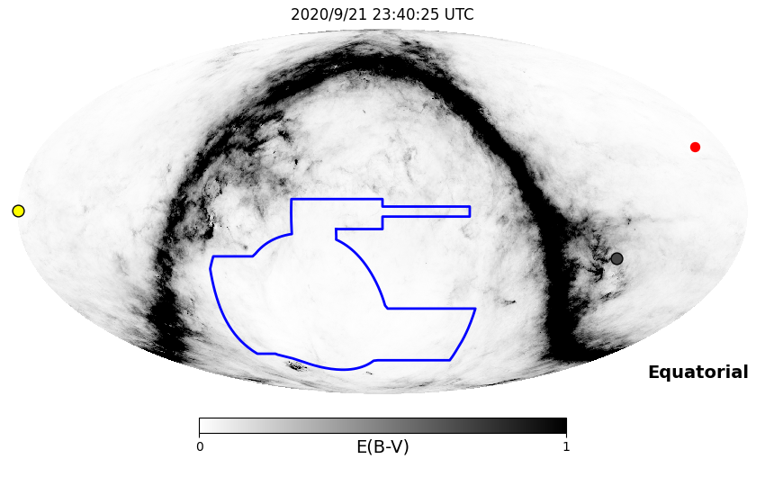
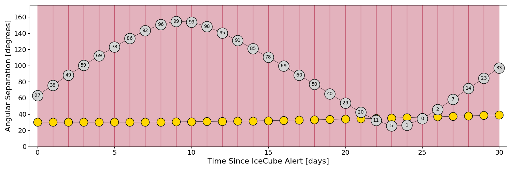
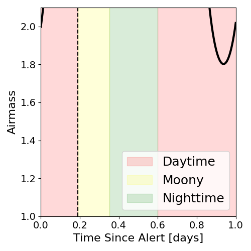
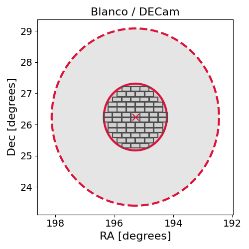
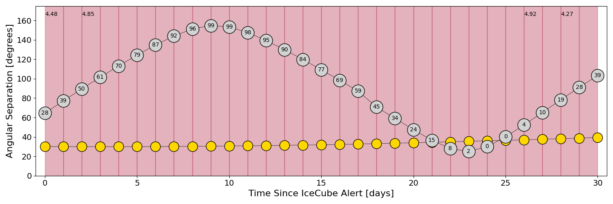
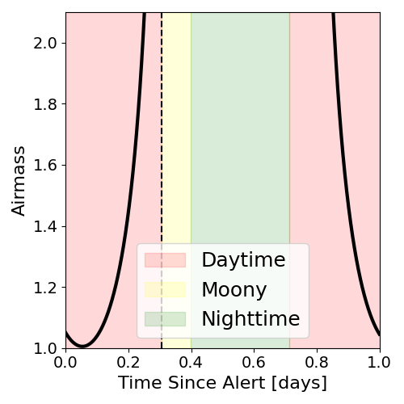
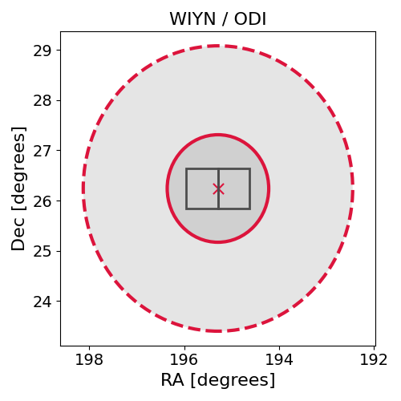

# IC200921A (134512_71996695)

### IceCube Data

| Rev | Type | Time (UTC) | Energy (TeV) | Signalness | FAR (#/yr) | 90% Area (sq. deg.) |
| --- | --- | --- | --- | --- | --- | --- |
| 1 | BRONZE | 09/21/2020  19:07:12 | 117.170 | 0.409 | 1.585300 | 25.34 |

<a href="https://gcn.gsfc.nasa.gov/gcn/notices_amon_g_b/134512_71996695.amon" target="_blank">Link to IceCube Alert Details</a>

<a href="https://rmorgan10.github.io/AlertMonitoring/IC200921A_1/CTIO_skymap.png" target="_blank">
  
</a>


## CTIO Report

*Observations Start at*  `2020/09/21 18:40:24`  *Madison Time*

### Alert Diagnostics

```Event
  Event ID = IC200921A
  (ra, dec) = (195.2899, 26.2399)
Date
  Now = 2020/10/19 18:52:13 (UTC)
  Search time = 2020/9/21 19:07:13 (UTC)
  Optimal time = 2020/9/21 23:40:25 (UTC)
  Airmass at optimal time = 999.00
Sun
  Angular separation = 30.15 (deg)
  Next rising = 2020/9/22 10:31:49 (UTC)
  Next setting = 2020/9/21 22:39:30 (UTC)
Moon
  Illumination = 0.27
  Angular separation = 63.11 (deg)
  Next rising = 2020/9/22 14:23:31 (UTC)
  Next setting = 2020/9/22 03:37:02 (UTC)
  Next new moon = 2020/11/15 05:07:09 (UTC)
  Next full moon = 2020/10/31 14:49:07 (UTC)
Galactic
  (l, b) = (11.2324, 87.6538)
  E(B-V) = 0.87
```
### Observability Plots

<a href="https://rmorgan10.github.io/AlertMonitoring/IC200921A_1/CTIO_forecast.png" target="_blank">
  
</a>

<a href="https://rmorgan10.github.io/AlertMonitoring/IC200921A_1/CTIO_airmass.png" target="_blank">
  
</a>
<a href="https://rmorgan10.github.io/AlertMonitoring/IC200921A_1/CTIO_fov.png" target="_blank">
  
</a>


## KPNO Report

*Observations Start at*  `2020/09/21 21:25:52`  *Madison Time*

### Alert Diagnostics

```Event
  Event ID = IC200921A
  (ra, dec) = (195.2899, 26.2399)
Date
  Now = 2020/10/19 18:52:13 (UTC)
  Search time = 2020/9/21 19:07:13 (UTC)
  Optimal time = 2020/9/22 02:25:53 (UTC)
  Airmass at optimal time = 4.48
Sun
  Angular separation = 30.13 (deg)
  Next rising = 2020/9/22 13:14:44 (UTC)
  Next setting = 2020/9/22 01:23:45 (UTC)
Moon
  Illumination = 0.29
  Angular separation = 64.56 (deg)
  Next rising = 2020/9/22 19:06:15 (UTC)
  Next setting = 2020/9/22 04:43:49 (UTC)
  Next new moon = 2020/11/15 05:07:09 (UTC)
  Next full moon = 2020/10/31 14:49:07 (UTC)
Galactic
  (l, b) = (11.2324, 87.6538)
  E(B-V) = 0.87
```
### Observability Plots

<a href="https://rmorgan10.github.io/AlertMonitoring/IC200921A_1/KPNO_forecast.png" target="_blank">
  
</a>

<a href="https://rmorgan10.github.io/AlertMonitoring/IC200921A_1/KPNO_airmass.png" target="_blank">
  
</a>
<a href="https://rmorgan10.github.io/AlertMonitoring/IC200921A_1/KPNO_fov.png" target="_blank">
  
</a>

