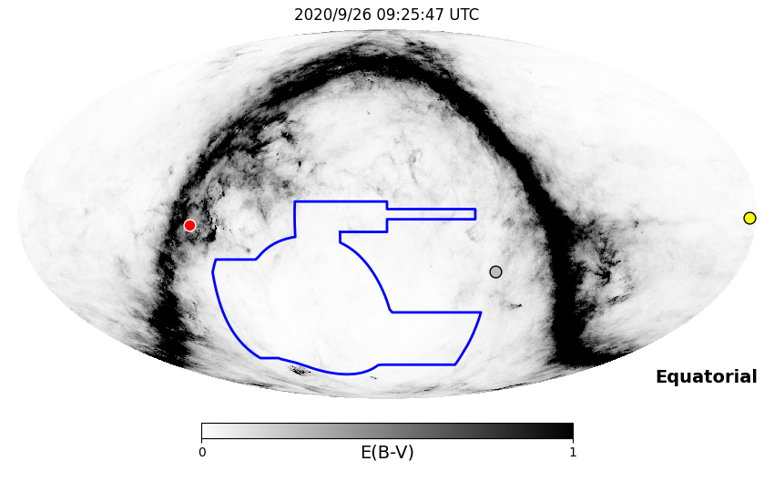

# IC200926A (134533_53384881)

### IceCube Data

| Rev | Type | Time (UTC) | Energy (TeV) | Signalness | FAR (#/yr) | 90% Area (sq. deg.) |
| --- | --- | --- | --- | --- | --- | --- |
| 0 | GOLD | 09/26/2020  07:54:11 | 670.500 | 0.441 | 0.536300 | 0.83 |

<a href="https://gcn.gsfc.nasa.gov/gcn/notices_amon_g_b/134533_53384881.amon" target="_blank">Link to IceCube Alert Details</a>

<a href="https://rmorgan10.github.io/AlertMonitoring/IC200926A_0/CTIO_skymap.png" target="_blank">
  
</a>


## CTIO Report

**Observations Start at**  `2020/09/26 04:25:47`  **Madison Time**

<a href="https://github.com/rmorgan10/AlertMonitoring/blob/main/IC200926A_0/CTIO.json" target="_blank">Link to Observing Scripts

### Alert Diagnostics

```Event
  Event ID = IC200926A
  (ra, dec) = (96.5731, -4.2048)
Date
  Now = 2020/10/20 19:27:14 (UTC)
  Search time = 2020/9/26 07:54:12 (UTC)
  Optimal time = 2020/9/26 09:25:47 (UTC)
  Airmass at optimal time = 1.18
Sun
  Angular separation = 86.77 (deg)
  Next rising = 2020/9/26 10:26:49 (UTC)
  Next setting = 2020/9/26 22:42:18 (UTC)
Moon
  Illumination = 0.74
  Angular separation = 141.46 (deg)
  Next rising = 2020/9/26 18:03:46 (UTC)
  Next setting = 2020/9/27 08:16:14 (UTC)
  Next new moon = 2020/11/15 05:07:09 (UTC)
  Next full moon = 2020/10/31 14:49:07 (UTC)
Galactic
  (l, b) = (213.8254, -7.5056)
  E(B-V) = 0.58
```
### Observability Plots

<a href="https://rmorgan10.github.io/AlertMonitoring/IC200926A_0/CTIO_forecast.png" target="_blank">
  
</a>

<a href="https://rmorgan10.github.io/AlertMonitoring/IC200926A_0/CTIO_airmass.png" target="_blank">
  
</a>
<a href="https://rmorgan10.github.io/AlertMonitoring/IC200926A_0/CTIO_fov.png" target="_blank">
  
</a>


## KPNO Report

**Observations Start at**  `2020/09/26 07:15:08`  **Madison Time**

<a href="https://github.com/rmorgan10/AlertMonitoring/blob/main/IC200926A_0/KPNO.json" target="_blank">Link to Observing Scripts

### Alert Diagnostics

```Event
  Event ID = IC200926A
  (ra, dec) = (96.5731, -4.2048)
Date
  Now = 2020/10/20 19:27:14 (UTC)
  Search time = 2020/9/26 07:54:12 (UTC)
  Optimal time = 2020/9/26 12:15:09 (UTC)
  Airmass at optimal time = 1.31
Sun
  Angular separation = 86.87 (deg)
  Next rising = 2020/9/26 13:17:14 (UTC)
  Next setting = 2020/9/27 01:17:10 (UTC)
Moon
  Illumination = 0.75
  Angular separation = 140.48 (deg)
  Next rising = 2020/9/26 22:47:48 (UTC)
  Next setting = 2020/9/26 08:19:04 (UTC)
  Next new moon = 2020/11/15 05:07:09 (UTC)
  Next full moon = 2020/10/31 14:49:07 (UTC)
Galactic
  (l, b) = (213.8254, -7.5056)
  E(B-V) = 0.58
```
### Observability Plots

<a href="https://rmorgan10.github.io/AlertMonitoring/IC200926A_0/KPNO_forecast.png" target="_blank">
  
</a>

<a href="https://rmorgan10.github.io/AlertMonitoring/IC200926A_0/KPNO_airmass.png" target="_blank">
  
</a>
<a href="https://rmorgan10.github.io/AlertMonitoring/IC200926A_0/KPNO_fov.png" target="_blank">
  
</a>

