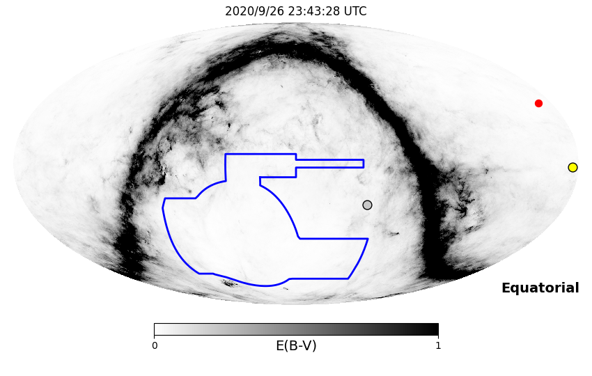
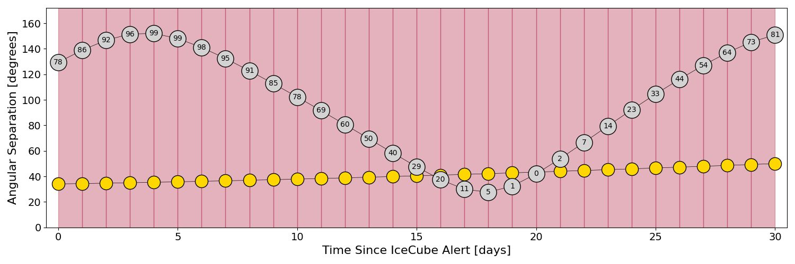
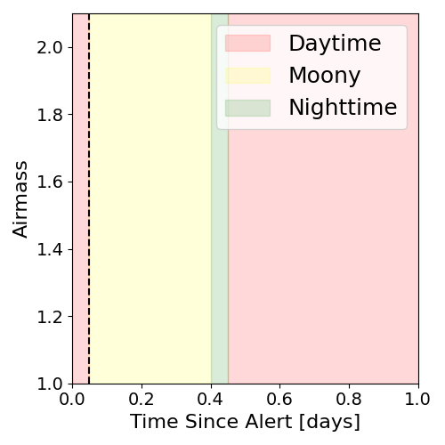
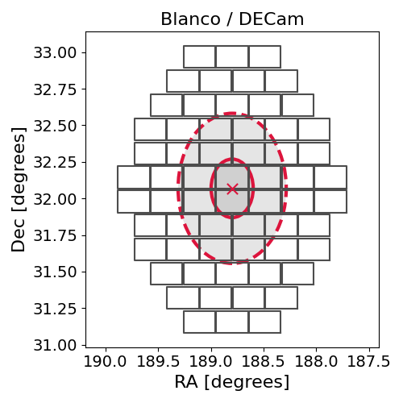
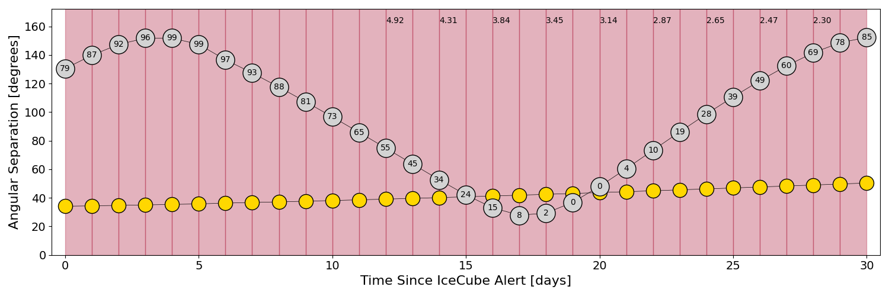
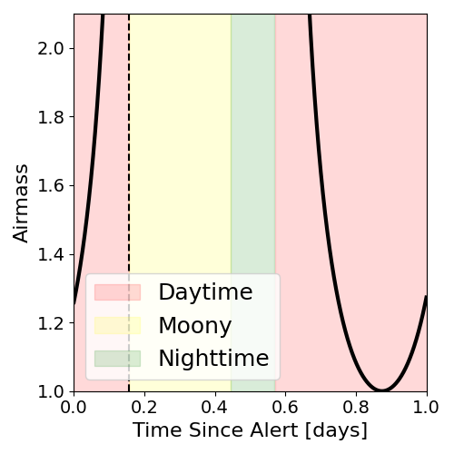
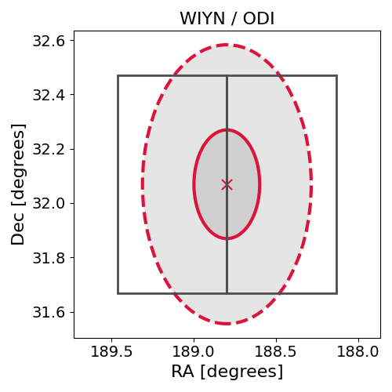

# IC200926B (134535_41069485)

### IceCube Data

| Rev | Type | Time (UTC) | Energy (TeV) | Signalness | FAR (#/yr) | 90% Area (sq. deg.) |
| --- | --- | --- | --- | --- | --- | --- |
| 0 | BRONZE | 09/26/2020  22:35:29 | 121.420 | 0.434 | 1.290000 | 0.83 |

<a href="https://gcn.gsfc.nasa.gov/gcn/notices_amon_g_b/134535_41069485.amon" target="_blank">Link to IceCube Alert Details</a>

<a href="https://rmorgan10.github.io/AlertMonitoring/IC200926B_0/CTIO_skymap.png" target="_blank">
  
</a>


## CTIO Report

**Observations Start at**  `2020/09/26 18:43:27`  **Madison Time**

<a href="https://github.com/rmorgan10/AlertMonitoring/blob/main/IC200926B_0/CTIO.json" target="_blank">Link to Observing Scripts

### Alert Diagnostics

```Event
  Event ID = IC200926B
  (ra, dec) = (188.7990, 32.0690)
Date
  Now = 2020/10/20 19:52:16 (UTC)
  Search time = 2020/9/26 22:35:29 (UTC)
  Optimal time = 2020/9/26 23:43:28 (UTC)
  Airmass at optimal time = 999.00
Sun
  Angular separation = 34.10 (deg)
  Next rising = 2020/9/27 10:25:34 (UTC)
  Next setting = 2020/9/26 22:42:18 (UTC)
Moon
  Illumination = 0.79
  Angular separation = 129.38 (deg)
  Next rising = 2020/9/27 19:02:09 (UTC)
  Next setting = 2020/9/27 08:16:14 (UTC)
  Next new moon = 2020/11/15 05:07:09 (UTC)
  Next full moon = 2020/10/31 14:49:07 (UTC)
Galactic
  (l, b) = (157.4969, 83.9288)
  E(B-V) = 0.32
```
### Observability Plots

<a href="https://rmorgan10.github.io/AlertMonitoring/IC200926B_0/CTIO_forecast.png" target="_blank">
  
</a>

<a href="https://rmorgan10.github.io/AlertMonitoring/IC200926B_0/CTIO_airmass.png" target="_blank">
  
</a>
<a href="https://rmorgan10.github.io/AlertMonitoring/IC200926B_0/CTIO_fov.png" target="_blank">
  
</a>


## KPNO Report

**Observations Start at**  `2020/09/26 21:19:08`  **Madison Time**

<a href="https://github.com/rmorgan10/AlertMonitoring/blob/main/IC200926B_0/KPNO.json" target="_blank">Link to Observing Scripts

### Alert Diagnostics

```Event
  Event ID = IC200926B
  (ra, dec) = (188.7990, 32.0690)
Date
  Now = 2020/10/20 19:52:16 (UTC)
  Search time = 2020/9/26 22:35:29 (UTC)
  Optimal time = 2020/9/27 02:19:08 (UTC)
  Airmass at optimal time = 6.70
Sun
  Angular separation = 34.13 (deg)
  Next rising = 2020/9/27 13:17:52 (UTC)
  Next setting = 2020/9/27 01:17:10 (UTC)
Moon
  Illumination = 0.80
  Angular separation = 130.47 (deg)
  Next rising = 2020/9/26 22:47:48 (UTC)
  Next setting = 2020/9/27 09:18:24 (UTC)
  Next new moon = 2020/11/15 05:07:09 (UTC)
  Next full moon = 2020/10/31 14:49:07 (UTC)
Galactic
  (l, b) = (157.4969, 83.9288)
  E(B-V) = 0.32
```
### Observability Plots

<a href="https://rmorgan10.github.io/AlertMonitoring/IC200926B_0/KPNO_forecast.png" target="_blank">
  
</a>

<a href="https://rmorgan10.github.io/AlertMonitoring/IC200926B_0/KPNO_airmass.png" target="_blank">
  
</a>
<a href="https://rmorgan10.github.io/AlertMonitoring/IC200926B_0/KPNO_fov.png" target="_blank">
  
</a>

