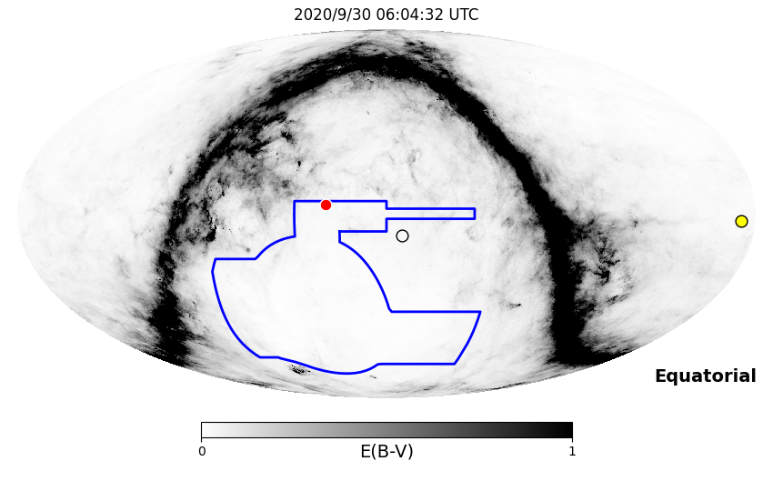
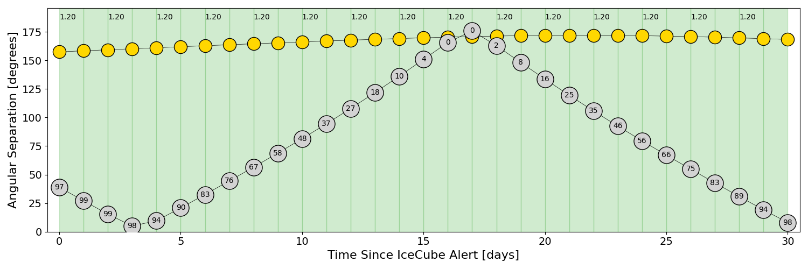
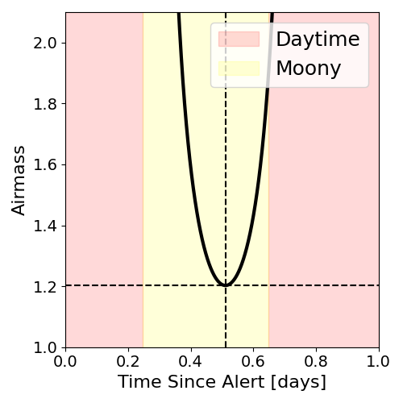
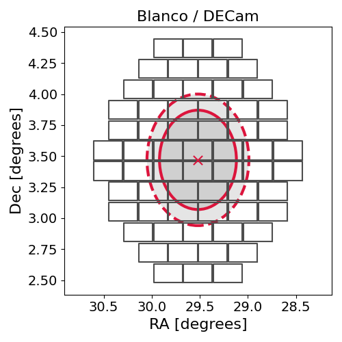
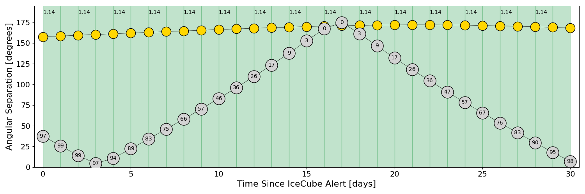
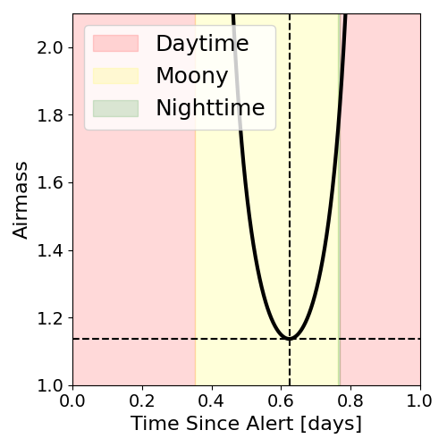
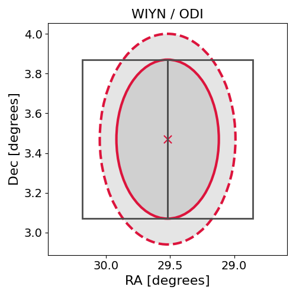

# IC200929A (134552_68615710)

### IceCube Data

| Rev | Type | Time (UTC) | Energy (TeV) | Signalness | FAR (#/yr) | 90% Area (sq. deg.) |
| --- | --- | --- | --- | --- | --- | --- |
| 1 | GOLD | 09/29/2020  17:48:36 | 182.890 | 0.475 | 1.410900 | 0.88 |

<a href="https://gcn.gsfc.nasa.gov/gcn/notices_amon_g_b/134552_68615710.amon" target="_blank">Link to IceCube Alert Details</a>

<a href="https://rmorgan10.github.io/AlertMonitoring/IC200929A_1/CTIO_skymap.png" target="_blank">
  
</a>


## CTIO Report

*Observations Start at*  `2020/09/30 01:04:31`  *Madison Time*

### Alert Diagnostics

```Event
  Event ID = IC200929A
  (ra, dec) = (29.5199, 3.4700)
Date
  Now = 2020/10/19 15:36:53 (UTC)
  Search time = 2020/9/29 17:48:37 (UTC)
  Optimal time = 2020/9/30 06:04:32 (UTC)
  Airmass at optimal time = 1.20
Sun
  Angular separation = 157.44 (deg)
  Next rising = 2020/9/30 10:21:51 (UTC)
  Next setting = 2020/9/29 22:44:01 (UTC)
Moon
  Illumination = 0.97
  Angular separation = 38.95 (deg)
  Next rising = 2020/9/29 20:54:49 (UTC)
  Next setting = 2020/9/30 10:00:11 (UTC)
  Next new moon = 2020/11/15 05:07:09 (UTC)
  Next full moon = 2020/10/31 14:49:07 (UTC)
Galactic
  (l, b) = (153.2227, -55.4332)
  E(B-V) = 0.13
```
### Observability Plots

<a href="https://rmorgan10.github.io/AlertMonitoring/IC200929A_1/CTIO_forecast.png" target="_blank">
  
</a>

<a href="https://rmorgan10.github.io/AlertMonitoring/IC200929A_1/CTIO_airmass.png" target="_blank">
  
</a>
<a href="https://rmorgan10.github.io/AlertMonitoring/IC200929A_1/CTIO_fov.png" target="_blank">
  
</a>


## KPNO Report

*Observations Start at*  `2020/09/30 03:47:15`  *Madison Time*

### Alert Diagnostics

```Event
  Event ID = IC200929A
  (ra, dec) = (29.5199, 3.4700)
Date
  Now = 2020/10/19 15:36:53 (UTC)
  Search time = 2020/9/29 17:48:37 (UTC)
  Optimal time = 2020/9/30 08:47:16 (UTC)
  Airmass at optimal time = 1.14
Sun
  Angular separation = 157.54 (deg)
  Next rising = 2020/9/30 13:19:47 (UTC)
  Next setting = 2020/9/30 01:13:15 (UTC)
Moon
  Illumination = 0.98
  Angular separation = 37.59 (deg)
  Next rising = 2020/9/30 00:33:43 (UTC)
  Next setting = 2020/9/30 12:09:31 (UTC)
  Next new moon = 2020/11/15 05:07:09 (UTC)
  Next full moon = 2020/10/31 14:49:07 (UTC)
Galactic
  (l, b) = (153.2227, -55.4332)
  E(B-V) = 0.13
```
### Observability Plots

<a href="https://rmorgan10.github.io/AlertMonitoring/IC200929A_1/KPNO_forecast.png" target="_blank">
  
</a>

<a href="https://rmorgan10.github.io/AlertMonitoring/IC200929A_1/KPNO_airmass.png" target="_blank">
  
</a>
<a href="https://rmorgan10.github.io/AlertMonitoring/IC200929A_1/KPNO_fov.png" target="_blank">
  
</a>

