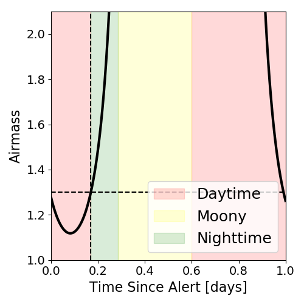

# IC201007A (134577_31638233)

### IceCube Data

| Rev | Type | Time (UTC) | Energy (TeV) | Signalness | FAR (#/yr) | 90% Area (sq. deg.) |
| --- | --- | --- | --- | --- | --- | --- |
| 0 | GOLD | 10/07/2020  22:01:49 | 682.650 | 0.886 | 0.262400 | 0.83 |

<a href="https://gcn.gsfc.nasa.gov/gcn/notices_amon_g_b/134577_31638233.amon" target="_blank">Link to IceCube Alert Details</a>

<a href="https://rmorgan10.github.io/AlertMonitoring/IC201007A_0/CTIO_skymap.png" target="_blank">
  
</a>


## CTIO Report

*Observations Start at*  `2020/10/07 18:50:50`  *Madison Time*

### Alert Diagnostics

```Event
  Event ID = IC201007A
  (ra, dec) = (265.0580, 5.3820)
Date
  Now = 2020/10/18 21:22:54 (UTC)
  Search time = 2020/10/7 22:01:49 (UTC)
  Optimal time = 2020/10/7 23:50:50 (UTC)
  Airmass at optimal time = 1.60
Sun
  Angular separation = 71.88 (deg)
  Next rising = 2020/10/8 10:12:11 (UTC)
  Next setting = 2020/10/7 22:48:48 (UTC)
Moon
  Illumination = 0.70
  Angular separation = 151.21 (deg)
  Next rising = 2020/10/8 04:07:02 (UTC)
  Next setting = 2020/10/8 14:29:11 (UTC)
  Next new moon = 2020/11/15 05:07:09 (UTC)
  Next full moon = 2020/10/31 14:49:07 (UTC)
Galactic
  (l, b) = (29.5925, 18.2797)
  E(B-V) = 0.19
```
### Observability Plots

<a href="https://rmorgan10.github.io/AlertMonitoring/IC201007A_0/CTIO_forecast.png" target="_blank">
  
</a>

<a href="https://rmorgan10.github.io/AlertMonitoring/IC201007A_0/CTIO_airmass.png" target="_blank">
  
</a>
<a href="https://rmorgan10.github.io/AlertMonitoring/IC201007A_0/CTIO_fov.png" target="_blank">
  
</a>


## KPNO Report

*Observations Start at*  `2020/10/07 21:05:03`  *Madison Time*

### Alert Diagnostics

```Event
  Event ID = IC201007A
  (ra, dec) = (265.0580, 5.3820)
Date
  Now = 2020/10/18 21:22:54 (UTC)
  Search time = 2020/10/7 22:01:49 (UTC)
  Optimal time = 2020/10/8 02:05:04 (UTC)
  Airmass at optimal time = 1.30
Sun
  Angular separation = 71.80 (deg)
  Next rising = 2020/10/8 13:25:04 (UTC)
  Next setting = 2020/10/8 01:03:06 (UTC)
Moon
  Illumination = 0.69
  Angular separation = 151.18 (deg)
  Next rising = 2020/10/8 04:50:12 (UTC)
  Next setting = 2020/10/8 19:28:19 (UTC)
  Next new moon = 2020/11/15 05:07:09 (UTC)
  Next full moon = 2020/10/31 14:49:07 (UTC)
Galactic
  (l, b) = (29.5925, 18.2797)
  E(B-V) = 0.19
```
### Observability Plots

<a href="https://rmorgan10.github.io/AlertMonitoring/IC201007A_0/KPNO_forecast.png" target="_blank">
  
</a>

<a href="https://rmorgan10.github.io/AlertMonitoring/IC201007A_0/KPNO_airmass.png" target="_blank">
  
</a>
<a href="https://rmorgan10.github.io/AlertMonitoring/IC201007A_0/KPNO_fov.png" target="_blank">
  
</a>

