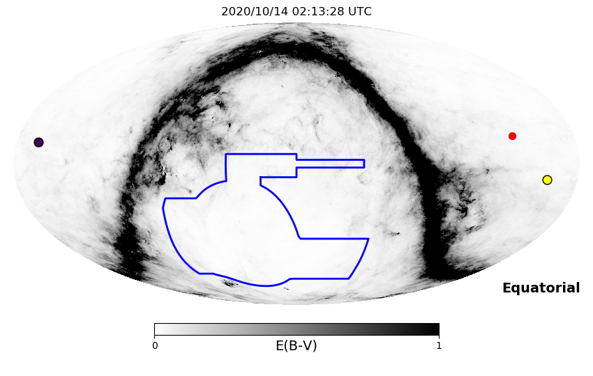
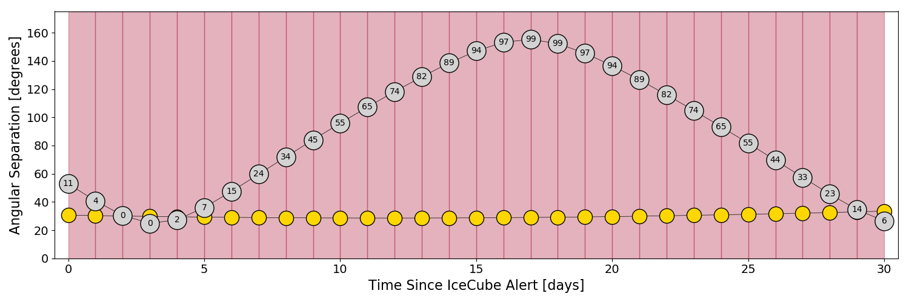
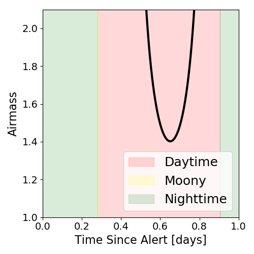
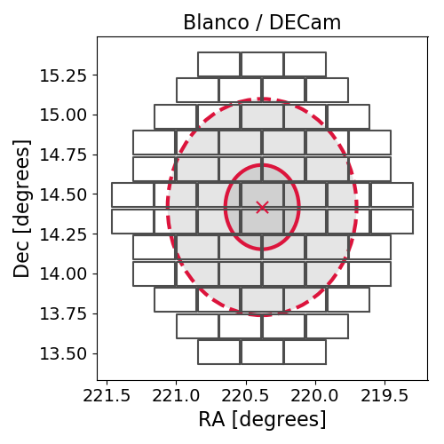
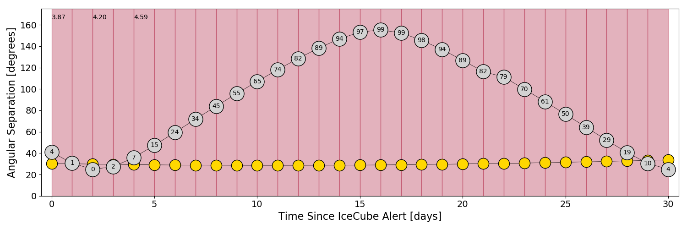
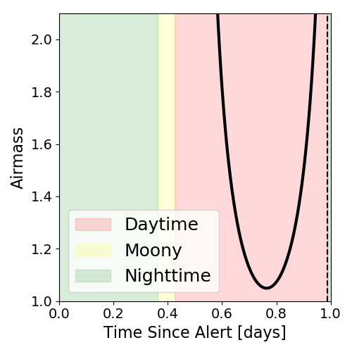
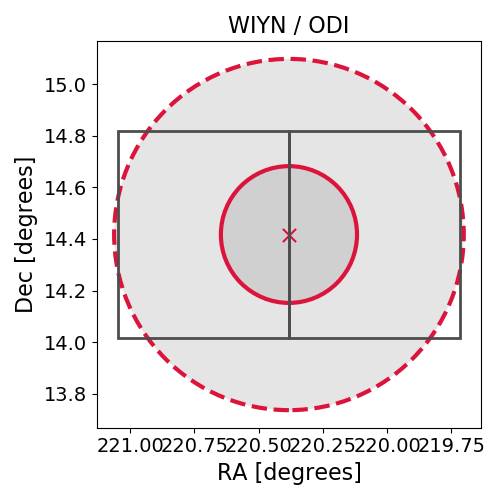

# IC201014A (134599_66310113)

### IceCube Data

| Rev | Type | Time (UTC) | Energy (TeV) | Signalness | FAR (#/yr) | 90% Area (sq. deg.) |
| --- | --- | --- | --- | --- | --- | --- |
| 0 | BRONZE | 10/14/2020  02:13:27 | 146.930 | 0.414 | 1.706900 | 1.45 |

[Link to IceCube Alert Details](https://gcn.gsfc.nasa.gov/gcn/notices_amon_g_b/134599_66310113.amon)

<a href="https://rmorgan10.github.io/AlertMonitoring/IC201014A/CTIO_skymap.png" target="_blank">
  
</a>


## CTIO Report

### Observations Start at 2020/10/13 21:13:27 Madison Time### Alert Diagnostics

```Event
  Event ID = IC201014A
  (ra, dec) = (220.3816, 14.4172)
Date
  Now = 2020/10/18 19:05:53 (UTC)
  Search time = 2020/10/14 02:13:28 (UTC)
  Optimal time = 2020/10/14 02:13:28 (UTC)
  Airmass at optimal time = 999.00
Sun
  Angular separation = 30.66 (deg)
  Next rising = 2020/10/14 10:05:18 (UTC)
  Next setting = 2020/10/14 22:53:19 (UTC)
Moon
  Illumination = 0.11
  Angular separation = 52.86 (deg)
  Next rising = 2020/10/14 08:53:13 (UTC)
  Next setting = 2020/10/14 20:37:50 (UTC)
  Next new moon = 2020/11/15 05:07:09 (UTC)
  Next full moon = 2020/10/31 14:49:07 (UTC)
Galactic
  (l, b) = (12.1260, 61.3956)
  E(B-V) = 0.03
```
### Observability Plots

<a href="https://rmorgan10.github.io/AlertMonitoring/IC201014A/CTIO_forecast.png" target="_blank">
  
</a>

<a href="https://rmorgan10.github.io/AlertMonitoring/IC201014A/CTIO_airmass.png" target="_blank">
  
</a>
<a href="https://rmorgan10.github.io/AlertMonitoring/IC201014A/CTIO_fov.png" target="_blank">
  
</a>


## KPNO Report

### Observations Start at 2020/10/14 20:56:53 Madison Time### Alert Diagnostics

```Event
  Event ID = IC201014A
  (ra, dec) = (220.3816, 14.4172)
Date
  Now = 2020/10/18 19:05:53 (UTC)
  Search time = 2020/10/14 02:13:28 (UTC)
  Optimal time = 2020/10/15 01:56:54 (UTC)
  Airmass at optimal time = 3.87
Sun
  Angular separation = 30.33 (deg)
  Next rising = 2020/10/14 13:29:16 (UTC)
  Next setting = 2020/10/15 00:54:41 (UTC)
Moon
  Illumination = 0.05
  Angular separation = 40.91 (deg)
  Next rising = 2020/10/14 10:54:02 (UTC)
  Next setting = 2020/10/14 23:59:44 (UTC)
  Next new moon = 2020/11/15 05:07:09 (UTC)
  Next full moon = 2020/10/31 14:49:07 (UTC)
Galactic
  (l, b) = (12.1260, 61.3956)
  E(B-V) = 0.03
```
### Observability Plots

<a href="https://rmorgan10.github.io/AlertMonitoring/IC201014A/KPNO_forecast.png" target="_blank">
  
</a>

<a href="https://rmorgan10.github.io/AlertMonitoring/IC201014A/KPNO_airmass.png" target="_blank">
  
</a>
<a href="https://rmorgan10.github.io/AlertMonitoring/IC201014A/KPNO_fov.png" target="_blank">
  
</a>

