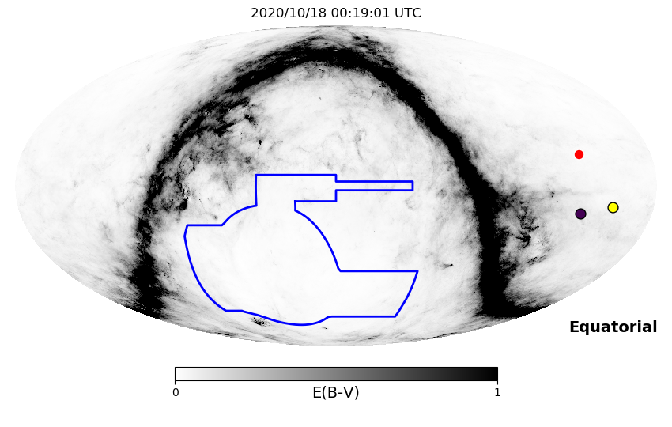
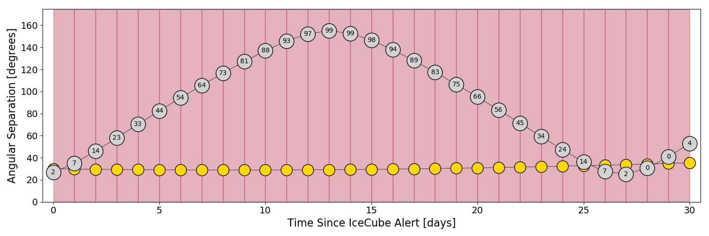
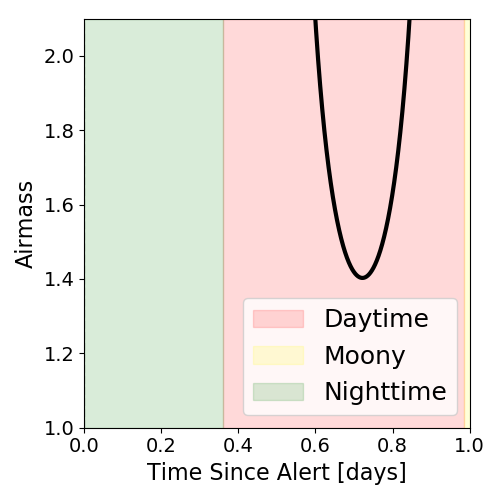
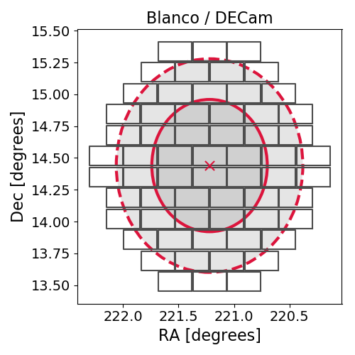
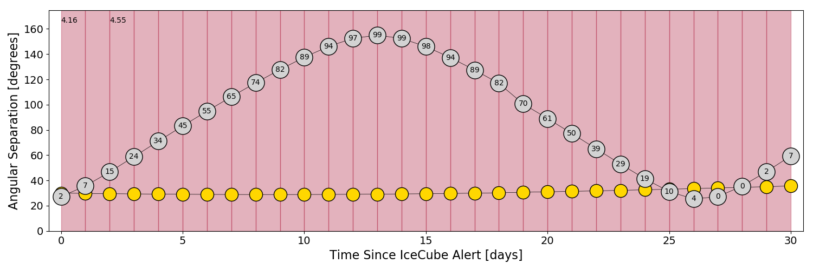
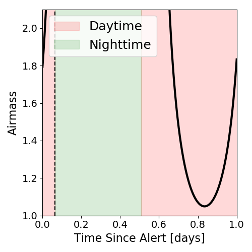
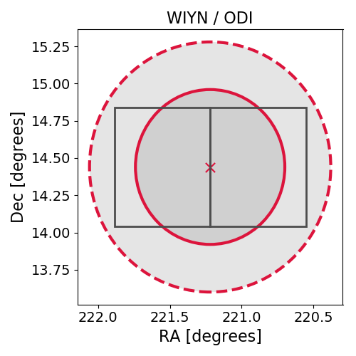

# IC201014A (66310113_134599)

### IceCube Data

| Rev | Type | Time (UTC) | Energy (TeV) | Signalness | FAR (#/yr) | 90% Area (sq. deg.) |
| --- | --- | --- | --- | --- | --- | --- |
| 1 | BRONZE | 10/14/2020  02:13:27 | 146.930 | 0.414 | 1.706900 | 2.22 |

a href="https://rmorgan10.github.io/AlertMonitoring/IC201014A_1/CTIO_skymap.png" target="_blank">
  
</a> 

CTIO Report

### Alert Diagnostics

```Event
  Event ID = IC201014A
  (ra, dec) = (221.2199, 14.4399)
Date
  Now = 2020/10/18 00:19:48 (UTC)
  Search time = 2020/10/18 00:19:01 (UTC)
  Optimal time = 2020/10/18 00:19:01 (UTC)
  Airmass at optimal time = 999.00
Sun
  Angular separation = 30.02 (deg)
  Next rising = 2020/10/18 10:00:56 (UTC)
  Next setting = 2020/10/18 22:56:02 (UTC)
Moon
  Illumination = 0.02
  Angular separation = 26.87 (deg)
  Next rising = 2020/10/18 11:28:47 (UTC)
  Next setting = 2020/10/19 01:17:57 (UTC)
  Next new moon = 2020/11/15 05:07:09 (UTC)
  Next full moon = 2020/10/31 14:49:07 (UTC)
Galactic
  (l, b) = (13.0180, 60.7076)
  E(B-V) = 0.03
```
### Observability Plots

<a href="https://rmorgan10.github.io/AlertMonitoring/IC201014A_1/CTIO_forecast.png" target="_blank">
  
</a> 

<a href="https://rmorgan10.github.io/AlertMonitoring/IC201014A_1/CTIO_airmass.png" target="_blank">
  
</a> 
<a href="https://rmorgan10.github.io/AlertMonitoring/IC201014A_1/CTIO_fov.png" target="_blank">
  
</a> 

KPNO Report

### Alert Diagnostics

```Event
  Event ID = IC201014A
  (ra, dec) = (221.2199, 14.4399)
Date
  Now = 2020/10/18 00:19:48 (UTC)
  Search time = 2020/10/18 00:19:24 (UTC)
  Optimal time = 2020/10/18 01:53:35 (UTC)
  Airmass at optimal time = 4.16
Sun
  Angular separation = 30.00 (deg)
  Next rising = 2020/10/18 13:32:12 (UTC)
  Next setting = 2020/10/18 00:51:16 (UTC)
Moon
  Illumination = 0.02
  Angular separation = 27.24 (deg)
  Next rising = 2020/10/18 15:37:47 (UTC)
  Next setting = 2020/10/18 01:52:05 (UTC)
  Next new moon = 2020/11/15 05:07:09 (UTC)
  Next full moon = 2020/10/31 14:49:07 (UTC)
Galactic
  (l, b) = (13.0180, 60.7076)
  E(B-V) = 0.03
```
### Observability Plots





