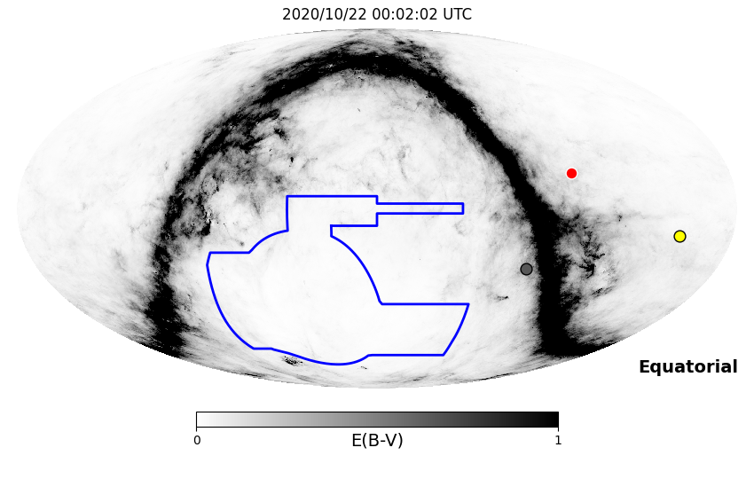
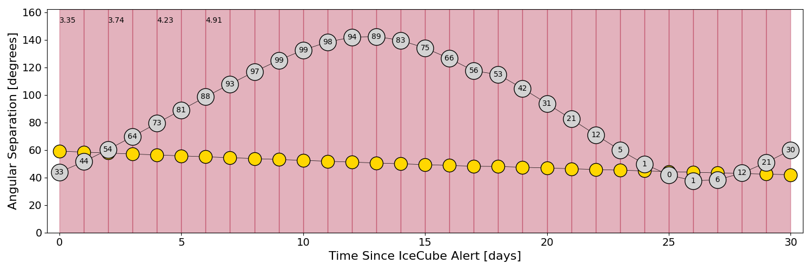
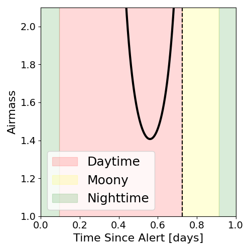
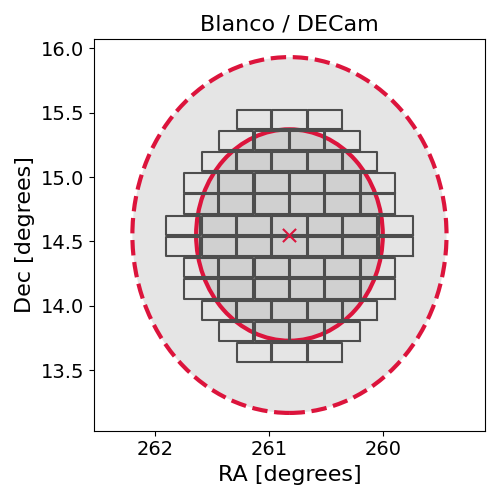
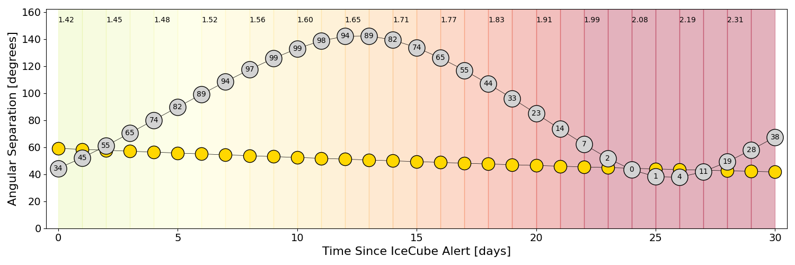
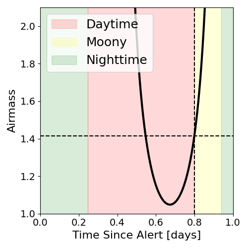
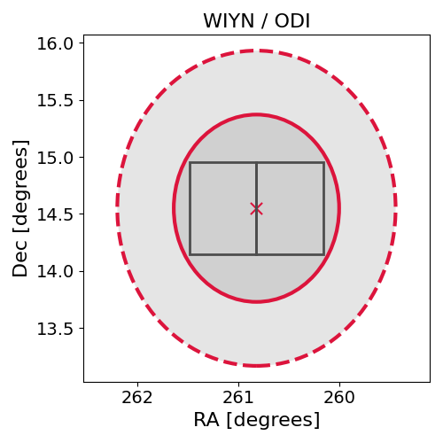

# IC201021A (134621_31008065)

### IceCube Data

| Rev | Type | Time (UTC) | Energy (TeV) | Signalness | FAR (#/yr) | 90% Area (sq. deg.) |
| --- | --- | --- | --- | --- | --- | --- |
| 2 | BRONZE | 10/21/2020  06:37:47 | 105.270 | 0.297 | 2.986800 | 5.98 |

<a href="https://gcn.gsfc.nasa.gov/gcn/notices_amon_g_b/134621_31008065.amon" target="_blank">Link to IceCube Alert Details</a>

<a href="https://rmorgan10.github.io/AlertMonitoring/IC201021A_2/CTIO_skymap.png" target="_blank">
  
</a>


## CTIO Report

**Observations Start at**  `2020/10/21 19:02:02`  **Madison Time**

<a href="https://github.com/rmorgan10/AlertMonitoring/blob/main/IC201021A_2/CTIO.json" target="_blank">Link to Observing Scripts

### Alert Diagnostics

```Event
  Event ID = IC201021A
  (ra, dec) = (260.8199, 14.5500)
Date
  Now = 2020/10/21 13:32:14 (UTC)
  Search time = 2020/10/21 06:37:47 (UTC)
  Optimal time = 2020/10/22 00:02:02 (UTC)
  Airmass at optimal time = 3.35
Sun
  Angular separation = 59.19 (deg)
  Next rising = 2020/10/21 09:57:48 (UTC)
  Next setting = 2020/10/21 22:58:09 (UTC)
Moon
  Illumination = 0.34
  Angular separation = 43.89 (deg)
  Next rising = 2020/10/21 13:58:44 (UTC)
  Next setting = 2020/10/22 04:35:39 (UTC)
  Next new moon = 2020/11/15 05:07:09 (UTC)
  Next full moon = 2020/10/31 14:49:07 (UTC)
Galactic
  (l, b) = (36.6287, 25.9642)
  E(B-V) = 0.04
```
### Observability Plots

<a href="https://rmorgan10.github.io/AlertMonitoring/IC201021A_2/CTIO_forecast.png" target="_blank">
  
</a>

<a href="https://rmorgan10.github.io/AlertMonitoring/IC201021A_2/CTIO_airmass.png" target="_blank">
  
</a>
<a href="https://rmorgan10.github.io/AlertMonitoring/IC201021A_2/CTIO_fov.png" target="_blank">
  
</a>


## KPNO Report

**Observations Start at**  `2020/10/21 20:49:28`  **Madison Time**

<a href="https://github.com/rmorgan10/AlertMonitoring/blob/main/IC201021A_2/KPNO.json" target="_blank">Link to Observing Scripts

### Alert Diagnostics

```Event
  Event ID = IC201021A
  (ra, dec) = (260.8199, 14.5500)
Date
  Now = 2020/10/21 13:32:14 (UTC)
  Search time = 2020/10/21 06:37:47 (UTC)
  Optimal time = 2020/10/22 01:49:28 (UTC)
  Airmass at optimal time = 1.42
Sun
  Angular separation = 59.14 (deg)
  Next rising = 2020/10/21 13:34:27 (UTC)
  Next setting = 2020/10/22 00:46:54 (UTC)
Moon
  Illumination = 0.35
  Angular separation = 44.39 (deg)
  Next rising = 2020/10/21 19:01:50 (UTC)
  Next setting = 2020/10/22 05:11:29 (UTC)
  Next new moon = 2020/11/15 05:07:09 (UTC)
  Next full moon = 2020/10/31 14:49:07 (UTC)
Galactic
  (l, b) = (36.6287, 25.9642)
  E(B-V) = 0.04
```
### Observability Plots

<a href="https://rmorgan10.github.io/AlertMonitoring/IC201021A_2/KPNO_forecast.png" target="_blank">
  
</a>

<a href="https://rmorgan10.github.io/AlertMonitoring/IC201021A_2/KPNO_airmass.png" target="_blank">
  
</a>
<a href="https://rmorgan10.github.io/AlertMonitoring/IC201021A_2/KPNO_fov.png" target="_blank">
  
</a>

