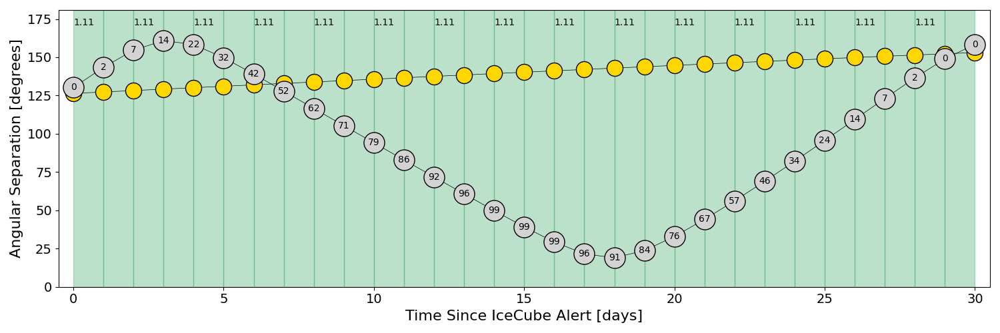

# IC201114A (134698_40735501)

### IceCube Data

| Rev | Type | Time (UTC) | Energy (TeV) | Signalness | FAR (#/yr) | 90% Area (sq. deg.) |
| --- | --- | --- | --- | --- | --- | --- |
| 0 | GOLD | 11/14/2020  15:05:31 | 214.290 | 0.562 | 0.923200 | 0.83 |

<a href="https://gcn.gsfc.nasa.gov/gcn/notices_amon_g_b/134698_40735501.amon" target="_blank">Link to IceCube Alert Details</a>

<a href="https://rmorgan10.github.io/AlertMonitoring/IC201114A_0/CTIO_skymap.png" target="_blank">
  
</a>


## CTIO Report

**Observations Start at**  `2020/11/15 03:03:34`  **Madison Time**

<a href="https://github.com/rmorgan10/AlertMonitoring/blob/main/IC201114A_0/CTIO.json" target="_blank">Link to Observing Scripts

### Alert Diagnostics

```Event
  Event ID = IC201114A
  (ra, dec) = (104.6881, 5.9423)
Date
  Now = 2020/11/14 15:17:16 (UTC)
  Search time = 2020/11/14 15:05:32 (UTC)
  Optimal time = 2020/11/15 08:03:34 (UTC)
  Airmass at optimal time = 1.24
Sun
  Angular separation = 126.27 (deg)
  Next rising = 2020/11/15 09:38:12 (UTC)
  Next setting = 2020/11/14 23:17:10 (UTC)
Moon
  Illumination = 0.00
  Angular separation = 128.66 (deg)
  Next rising = 2020/11/15 10:00:37 (UTC)
  Next setting = 2020/11/14 22:51:01 (UTC)
  Next new moon = 2020/11/15 05:07:09 (UTC)
  Next full moon = 2020/11/30 09:29:40 (UTC)
Galactic
  (l, b) = (208.4648, 4.3273)
  E(B-V) = 0.36
```
### Observability Plots

<a href="https://rmorgan10.github.io/AlertMonitoring/IC201114A_0/CTIO_forecast.png" target="_blank">
  
</a>

<a href="https://rmorgan10.github.io/AlertMonitoring/IC201114A_0/CTIO_airmass.png" target="_blank">
  
</a>
<a href="https://rmorgan10.github.io/AlertMonitoring/IC201114A_0/CTIO_fov.png" target="_blank">
  
</a>


## KPNO Report

**Observations Start at**  `2020/11/15 05:46:18`  **Madison Time**

<a href="https://github.com/rmorgan10/AlertMonitoring/blob/main/IC201114A_0/KPNO.json" target="_blank">Link to Observing Scripts

### Alert Diagnostics

```Event
  Event ID = IC201114A
  (ra, dec) = (104.6881, 5.9423)
Date
  Now = 2020/11/14 15:17:16 (UTC)
  Search time = 2020/11/14 15:05:32 (UTC)
  Optimal time = 2020/11/15 10:46:18 (UTC)
  Airmass at optimal time = 1.11
Sun
  Angular separation = 126.38 (deg)
  Next rising = 2020/11/15 13:55:16 (UTC)
  Next setting = 2020/11/15 00:27:09 (UTC)
Moon
  Illumination = 0.00
  Angular separation = 130.21 (deg)
  Next rising = 2020/11/15 14:22:57 (UTC)
  Next setting = 2020/11/15 00:22:33 (UTC)
  Next new moon = 2020/11/15 05:07:09 (UTC)
  Next full moon = 2020/11/30 09:29:40 (UTC)
Galactic
  (l, b) = (208.4648, 4.3273)
  E(B-V) = 0.36
```
### Observability Plots

<a href="https://rmorgan10.github.io/AlertMonitoring/IC201114A_0/KPNO_forecast.png" target="_blank">
  
</a>

<a href="https://rmorgan10.github.io/AlertMonitoring/IC201114A_0/KPNO_airmass.png" target="_blank">
  
</a>
<a href="https://rmorgan10.github.io/AlertMonitoring/IC201114A_0/KPNO_fov.png" target="_blank">
  
</a>

