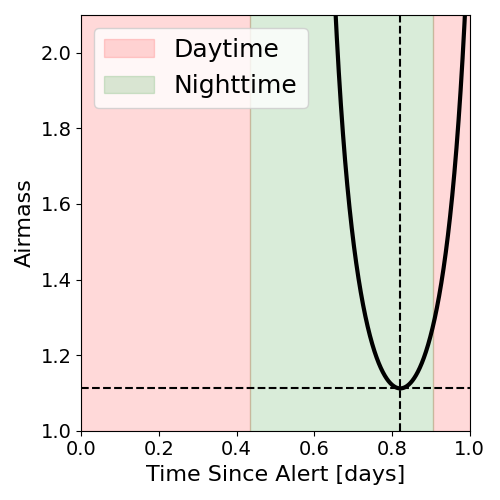

# IC201114A (134698_40735501)

### IceCube Data

| Rev | Type | Time (UTC) | Energy (TeV) | Signalness | FAR (#/yr) | 90% Area (sq. deg.) |
| --- | --- | --- | --- | --- | --- | --- |
| 1 | GOLD | 11/14/2020  15:05:31 | 214.290 | 0.562 | 0.923200 | 3.66 |

<a href="https://gcn.gsfc.nasa.gov/gcn/notices_amon_g_b/134698_40735501.amon" target="_blank">Link to IceCube Alert Details</a>

<a href="https://rmorgan10.github.io/AlertMonitoring/IC201114A_1/CTIO_skymap.png" target="_blank">
  
</a>


## CTIO Report

**Observations Start at**  `2020/11/15 03:05:52`  **Madison Time**

<a href="https://github.com/rmorgan10/AlertMonitoring/blob/main/IC201114A_1/CTIO.json" target="_blank">Link to Observing Scripts

### Alert Diagnostics

```Event
  Event ID = IC201114A
  (ra, dec) = (105.2500, 6.0499)
Date
  Now = 2020/11/14 20:12:17 (UTC)
  Search time = 2020/11/14 15:05:32 (UTC)
  Optimal time = 2020/11/15 08:05:52 (UTC)
  Airmass at optimal time = 1.24
Sun
  Angular separation = 125.78 (deg)
  Next rising = 2020/11/15 09:38:12 (UTC)
  Next setting = 2020/11/14 23:17:10 (UTC)
Moon
  Illumination = 0.00
  Angular separation = 128.18 (deg)
  Next rising = 2020/11/15 10:00:37 (UTC)
  Next setting = 2020/11/14 22:51:01 (UTC)
  Next new moon = 2020/11/15 05:07:09 (UTC)
  Next full moon = 2020/11/30 09:29:40 (UTC)
Galactic
  (l, b) = (208.6216, 4.8745)
  E(B-V) = 0.99
```
### Observability Plots

<a href="https://rmorgan10.github.io/AlertMonitoring/IC201114A_1/CTIO_forecast.png" target="_blank">
  
</a>

<a href="https://rmorgan10.github.io/AlertMonitoring/IC201114A_1/CTIO_airmass.png" target="_blank">
  
</a>
<a href="https://rmorgan10.github.io/AlertMonitoring/IC201114A_1/CTIO_fov.png" target="_blank">
  
</a>


## KPNO Report

**Observations Start at**  `2020/11/15 05:48:36`  **Madison Time**

<a href="https://github.com/rmorgan10/AlertMonitoring/blob/main/IC201114A_1/KPNO.json" target="_blank">Link to Observing Scripts

### Alert Diagnostics

```Event
  Event ID = IC201114A
  (ra, dec) = (105.2500, 6.0499)
Date
  Now = 2020/11/14 20:12:17 (UTC)
  Search time = 2020/11/14 15:05:32 (UTC)
  Optimal time = 2020/11/15 10:48:37 (UTC)
  Airmass at optimal time = 1.11
Sun
  Angular separation = 125.88 (deg)
  Next rising = 2020/11/15 13:55:16 (UTC)
  Next setting = 2020/11/15 00:27:09 (UTC)
Moon
  Illumination = 0.00
  Angular separation = 129.74 (deg)
  Next rising = 2020/11/15 14:22:57 (UTC)
  Next setting = 2020/11/15 00:22:33 (UTC)
  Next new moon = 2020/11/15 05:07:09 (UTC)
  Next full moon = 2020/11/30 09:29:40 (UTC)
Galactic
  (l, b) = (208.6216, 4.8745)
  E(B-V) = 0.99
```
### Observability Plots

<a href="https://rmorgan10.github.io/AlertMonitoring/IC201114A_1/KPNO_forecast.png" target="_blank">
  
</a>

<a href="https://rmorgan10.github.io/AlertMonitoring/IC201114A_1/KPNO_airmass.png" target="_blank">
  
</a>
<a href="https://rmorgan10.github.io/AlertMonitoring/IC201114A_1/KPNO_fov.png" target="_blank">
  
</a>

