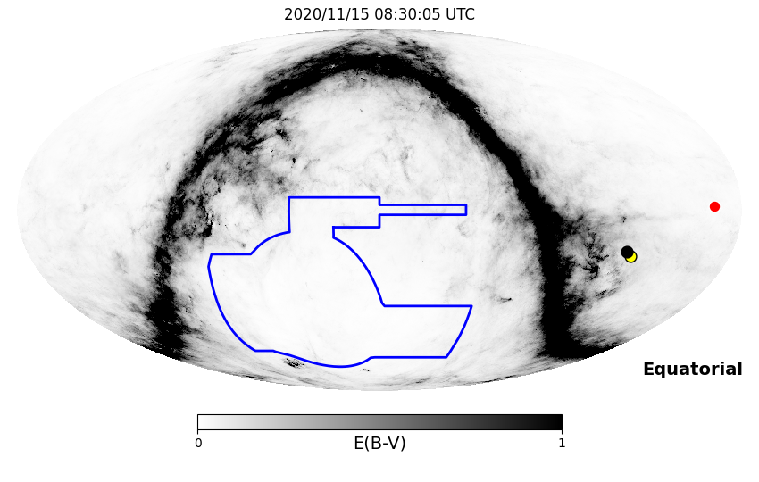
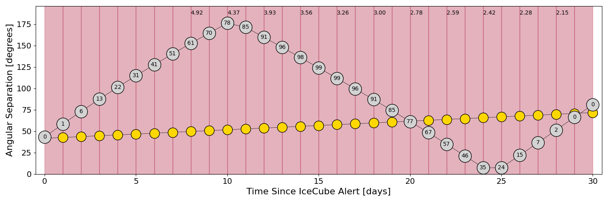
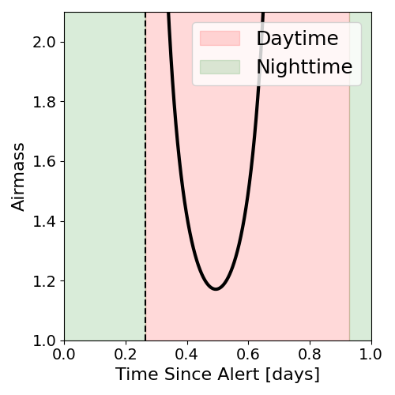
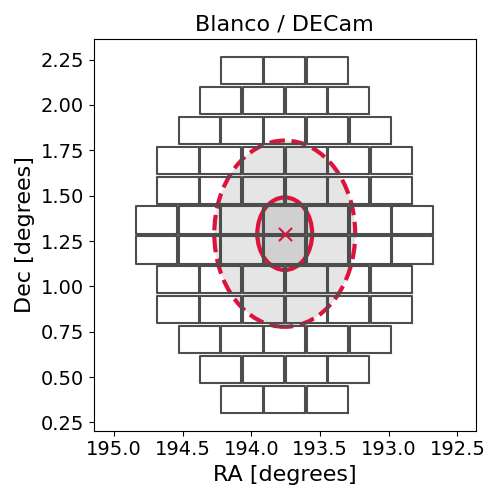
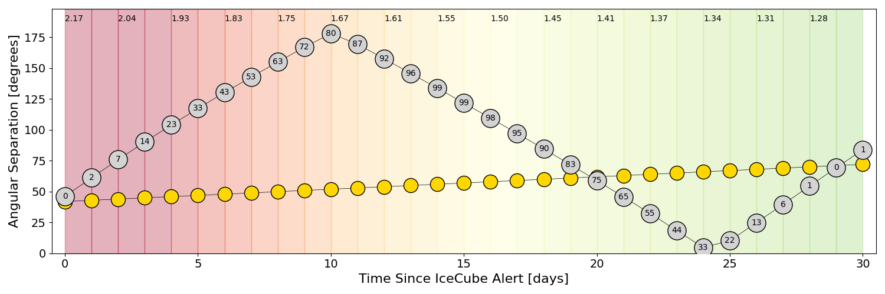
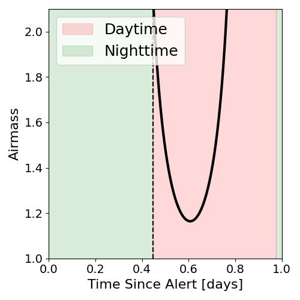
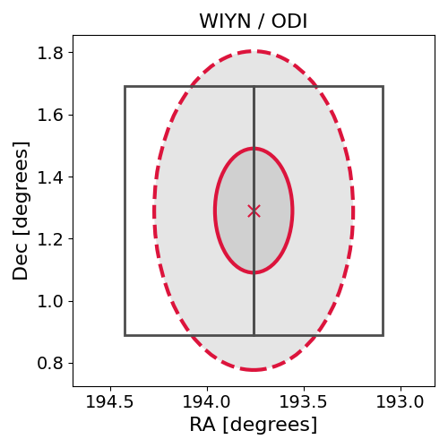

# IC201115A (134699_70289682)

### IceCube Data

| Rev | Type | Time (UTC) | Energy (TeV) | Signalness | FAR (#/yr) | 90% Area (sq. deg.) |
| --- | --- | --- | --- | --- | --- | --- |
| 0 | GOLD | 11/15/2020  02:07:26 | 177.380 | 0.460 | 1.522600 | 0.83 |

<a href="https://gcn.gsfc.nasa.gov/gcn/notices_amon_g_b/134699_70289682.amon" target="_blank">Link to IceCube Alert Details</a>

<a href="https://rmorgan10.github.io/AlertMonitoring/IC201115A_0/CTIO_skymap.png" target="_blank">
  
</a>


## CTIO Report

**Observations Start at**  `2020/11/15 03:30:04`  **Madison Time**

<a href="https://github.com/rmorgan10/AlertMonitoring/blob/main/IC201115A_0/CTIO.json" target="_blank">Link to Observing Scripts

### Alert Diagnostics

```Event
  Event ID = IC201115A
  (ra, dec) = (193.7576, 1.2903)
Date
  Now = 2020/11/15 02:17:14 (UTC)
  Search time = 2020/11/15 02:07:26 (UTC)
  Optimal time = 2020/11/15 08:30:05 (UTC)
  Airmass at optimal time = 9.65
Sun
  Angular separation = 41.71 (deg)
  Next rising = 2020/11/15 09:38:12 (UTC)
  Next setting = 2020/11/15 23:18:01 (UTC)
Moon
  Illumination = 0.00
  Angular separation = 43.35 (deg)
  Next rising = 2020/11/15 10:00:37 (UTC)
  Next setting = 2020/11/16 00:02:58 (UTC)
  Next new moon = 2020/11/15 05:07:09 (UTC)
  Next full moon = 2020/11/30 09:29:40 (UTC)
Galactic
  (l, b) = (304.9914, 64.1477)
  E(B-V) = 0.06
```
### Observability Plots

<a href="https://rmorgan10.github.io/AlertMonitoring/IC201115A_0/CTIO_forecast.png" target="_blank">
  
</a>

<a href="https://rmorgan10.github.io/AlertMonitoring/IC201115A_0/CTIO_airmass.png" target="_blank">
  
</a>
<a href="https://rmorgan10.github.io/AlertMonitoring/IC201115A_0/CTIO_fov.png" target="_blank">
  
</a>


## KPNO Report

**Observations Start at**  `2020/11/15 07:50:19`  **Madison Time**

<a href="https://github.com/rmorgan10/AlertMonitoring/blob/main/IC201115A_0/KPNO.json" target="_blank">Link to Observing Scripts

### Alert Diagnostics

```Event
  Event ID = IC201115A
  (ra, dec) = (193.7576, 1.2903)
Date
  Now = 2020/11/15 02:17:14 (UTC)
  Search time = 2020/11/15 02:07:26 (UTC)
  Optimal time = 2020/11/15 12:50:19 (UTC)
  Airmass at optimal time = 2.17
Sun
  Angular separation = 41.89 (deg)
  Next rising = 2020/11/15 13:55:16 (UTC)
  Next setting = 2020/11/16 00:26:37 (UTC)
Moon
  Illumination = 0.00
  Angular separation = 46.08 (deg)
  Next rising = 2020/11/15 14:22:57 (UTC)
  Next setting = 2020/11/16 01:07:46 (UTC)
  Next new moon = 2020/11/15 05:07:09 (UTC)
  Next full moon = 2020/11/30 09:29:40 (UTC)
Galactic
  (l, b) = (304.9914, 64.1477)
  E(B-V) = 0.06
```
### Observability Plots

<a href="https://rmorgan10.github.io/AlertMonitoring/IC201115A_0/KPNO_forecast.png" target="_blank">
  
</a>

<a href="https://rmorgan10.github.io/AlertMonitoring/IC201115A_0/KPNO_airmass.png" target="_blank">
  
</a>
<a href="https://rmorgan10.github.io/AlertMonitoring/IC201115A_0/KPNO_fov.png" target="_blank">
  
</a>

