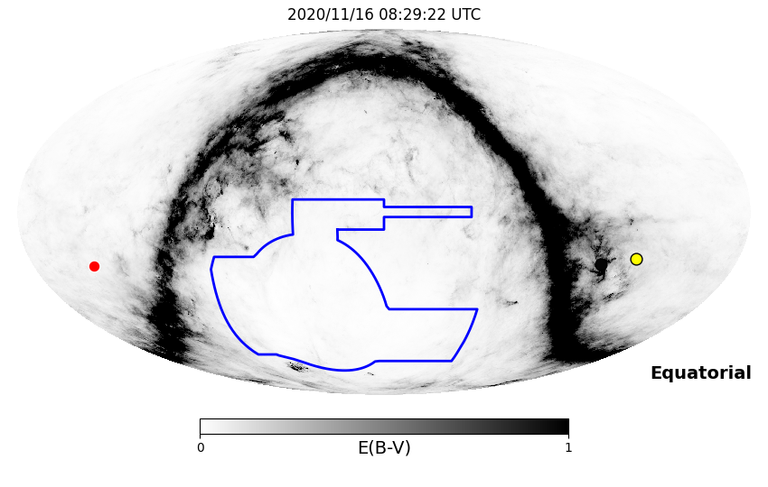
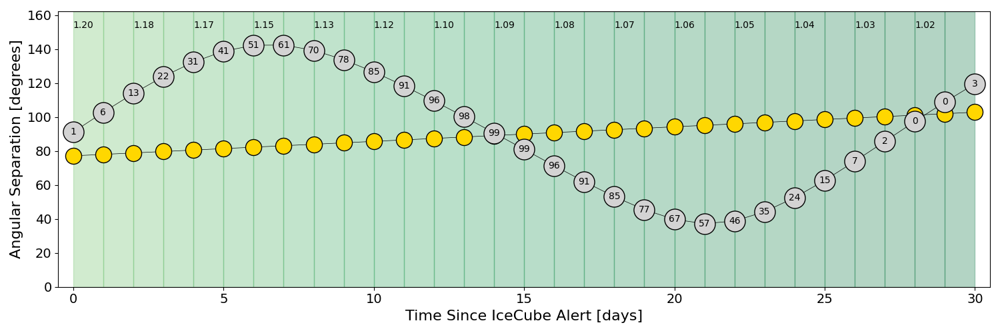
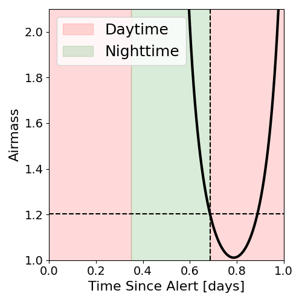
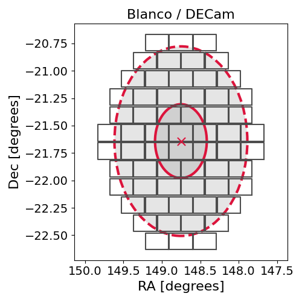
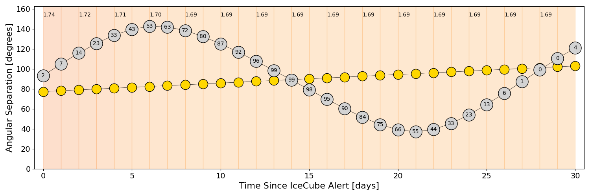
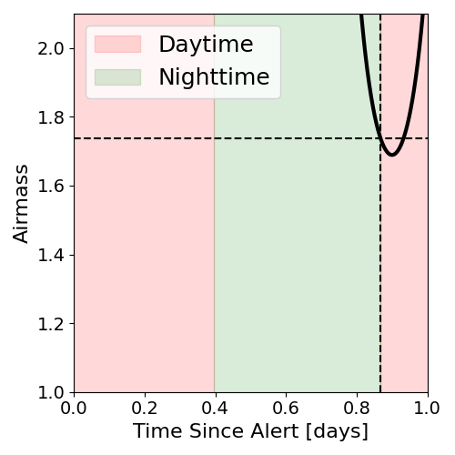
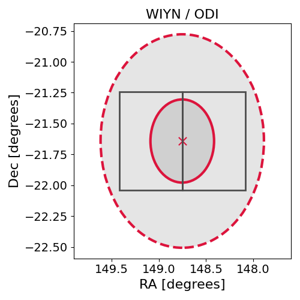

# IC201115B (134701_49508272)

### IceCube Data

| Rev | Type | Time (UTC) | Energy (TeV) | Signalness | FAR (#/yr) | 90% Area (sq. deg.) |
| --- | --- | --- | --- | --- | --- | --- |
| 0 | GOLD | 11/15/2020  16:01:42 | 26182.000 | 0.493 | 0.068100 | 2.35 |

<a href="https://gcn.gsfc.nasa.gov/gcn/notices_amon_g_b/134701_49508272.amon" target="_blank">Link to IceCube Alert Details</a>

<a href="https://rmorgan10.github.io/AlertMonitoring/IC201115B_0/CTIO_skymap.png" target="_blank">
  
</a>


## CTIO Report

**Observations Start at**  `2020/11/16 03:29:22`  **Madison Time**

<a href="https://github.com/rmorgan10/AlertMonitoring/blob/main/IC201115B_0/CTIO.json" target="_blank">Link to Observing Scripts

### Alert Diagnostics

```Event
  Event ID = IC201115B
  (ra, dec) = (148.7519, -21.6418)
Date
  Now = 2020/11/15 16:12:15 (UTC)
  Search time = 2020/11/15 16:01:43 (UTC)
  Optimal time = 2020/11/16 08:29:22 (UTC)
  Airmass at optimal time = 1.20
Sun
  Angular separation = 77.20 (deg)
  Next rising = 2020/11/16 09:37:43 (UTC)
  Next setting = 2020/11/15 23:18:01 (UTC)
Moon
  Illumination = 0.02
  Angular separation = 91.18 (deg)
  Next rising = 2020/11/16 10:48:55 (UTC)
  Next setting = 2020/11/16 00:02:58 (UTC)
  Next new moon = 2020/12/14 16:16:33 (UTC)
  Next full moon = 2020/11/30 09:29:40 (UTC)
Galactic
  (l, b) = (257.2879, 25.2030)
  E(B-V) = 0.05
```
### Observability Plots

<a href="https://rmorgan10.github.io/AlertMonitoring/IC201115B_0/CTIO_forecast.png" target="_blank">
  
</a>

<a href="https://rmorgan10.github.io/AlertMonitoring/IC201115B_0/CTIO_airmass.png" target="_blank">
  
</a>
<a href="https://rmorgan10.github.io/AlertMonitoring/IC201115B_0/CTIO_fov.png" target="_blank">
  
</a>


## KPNO Report

**Observations Start at**  `2020/11/16 07:51:02`  **Madison Time**

<a href="https://github.com/rmorgan10/AlertMonitoring/blob/main/IC201115B_0/KPNO.json" target="_blank">Link to Observing Scripts

### Alert Diagnostics

```Event
  Event ID = IC201115B
  (ra, dec) = (148.7519, -21.6418)
Date
  Now = 2020/11/15 16:12:15 (UTC)
  Search time = 2020/11/15 16:01:43 (UTC)
  Optimal time = 2020/11/16 12:51:02 (UTC)
  Airmass at optimal time = 1.74
Sun
  Angular separation = 77.35 (deg)
  Next rising = 2020/11/16 13:56:09 (UTC)
  Next setting = 2020/11/16 00:26:37 (UTC)
Moon
  Illumination = 0.03
  Angular separation = 93.33 (deg)
  Next rising = 2020/11/16 15:35:19 (UTC)
  Next setting = 2020/11/16 01:07:46 (UTC)
  Next new moon = 2020/12/14 16:16:33 (UTC)
  Next full moon = 2020/11/30 09:29:40 (UTC)
Galactic
  (l, b) = (257.2879, 25.2030)
  E(B-V) = 0.05
```
### Observability Plots

<a href="https://rmorgan10.github.io/AlertMonitoring/IC201115B_0/KPNO_forecast.png" target="_blank">
  
</a>

<a href="https://rmorgan10.github.io/AlertMonitoring/IC201115B_0/KPNO_airmass.png" target="_blank">
  
</a>
<a href="https://rmorgan10.github.io/AlertMonitoring/IC201115B_0/KPNO_fov.png" target="_blank">
  
</a>

