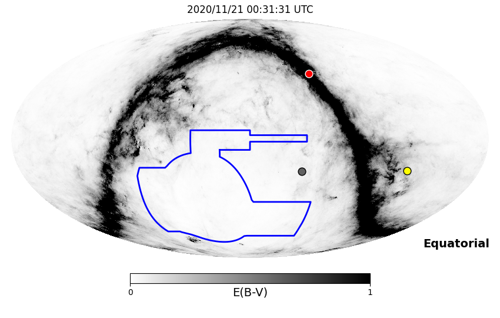
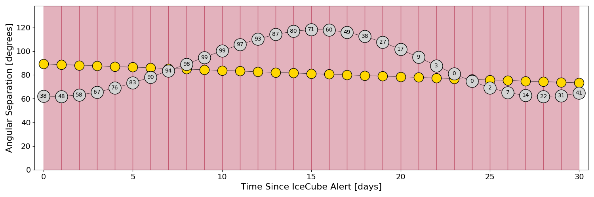
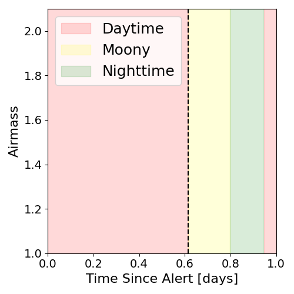
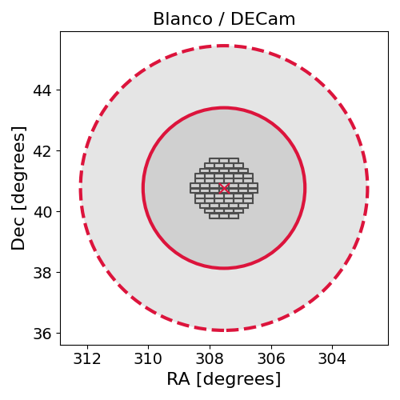
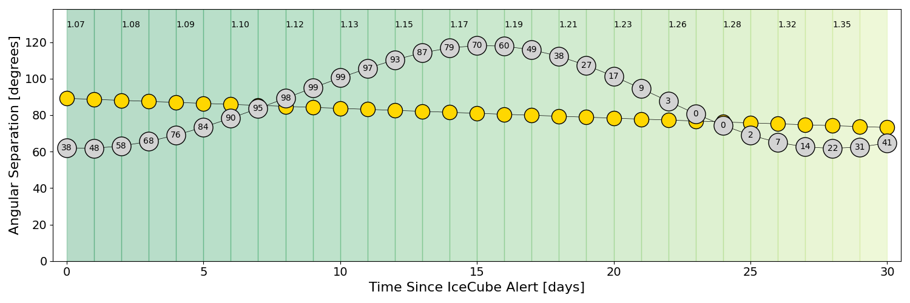
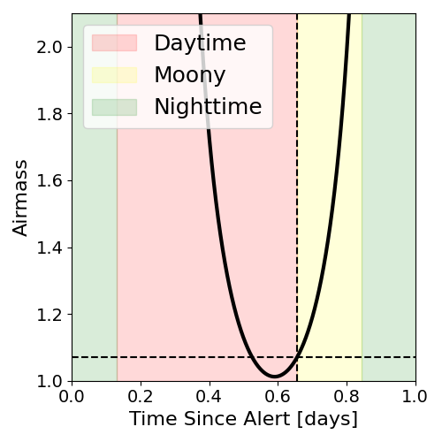
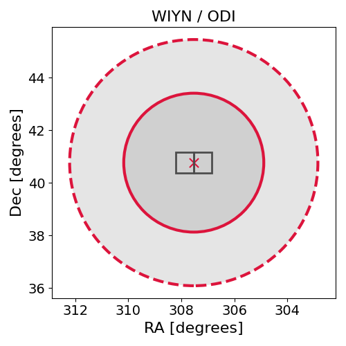

# IC201120A (134715_65785778)

### IceCube Data

| Rev | Type | Time (UTC) | Energy (TeV) | Signalness | FAR (#/yr) | 90% Area (sq. deg.) |
| --- | --- | --- | --- | --- | --- | --- |
| 1 | BRONZE | 11/20/2020  09:44:40 | 153.960 | 0.503 | 0.294700 | 68.80 |

<a href="https://gcn.gsfc.nasa.gov/gcn/notices_amon_g_b/134715_65785778.amon" target="_blank">Link to IceCube Alert Details</a>

<a href="https://rmorgan10.github.io/AlertMonitoring/IC201120A_1/CTIO_skymap.png" target="_blank">
  
</a>


## CTIO Report

**Observations Start at**  `2020/11/20 19:31:30`  **Madison Time**

<a href="https://github.com/rmorgan10/AlertMonitoring/blob/main/IC201120A_1/CTIO.json" target="_blank">Link to Observing Scripts

### Alert Diagnostics

```Event
  Event ID = IC201120A
  (ra, dec) = (307.5299, 40.7700)
Date
  Now = 2020/11/20 14:22:13 (UTC)
  Search time = 2020/11/20 09:44:41 (UTC)
  Optimal time = 2020/11/21 00:31:31 (UTC)
  Airmass at optimal time = 10.72
Sun
  Angular separation = 89.22 (deg)
  Next rising = 2020/11/21 09:35:42 (UTC)
  Next setting = 2020/11/20 23:22:18 (UTC)
Moon
  Illumination = 0.38
  Angular separation = 62.08 (deg)
  Next rising = 2020/11/20 14:45:00 (UTC)
  Next setting = 2020/11/21 04:55:01 (UTC)
  Next new moon = 2020/12/14 16:16:33 (UTC)
  Next full moon = 2020/11/30 09:29:40 (UTC)
Galactic
  (l, b) = (79.4360, 0.9416)
  E(B-V) = 0.08
```
### Observability Plots

<a href="https://rmorgan10.github.io/AlertMonitoring/IC201120A_1/CTIO_forecast.png" target="_blank">
  
</a>

<a href="https://rmorgan10.github.io/AlertMonitoring/IC201120A_1/CTIO_airmass.png" target="_blank">
  
</a>
<a href="https://rmorgan10.github.io/AlertMonitoring/IC201120A_1/CTIO_fov.png" target="_blank">
  
</a>


## KPNO Report

**Observations Start at**  `2020/11/20 20:29:50`  **Madison Time**

<a href="https://github.com/rmorgan10/AlertMonitoring/blob/main/IC201120A_1/KPNO.json" target="_blank">Link to Observing Scripts

### Alert Diagnostics

```Event
  Event ID = IC201120A
  (ra, dec) = (307.5299, 40.7700)
Date
  Now = 2020/11/20 14:22:13 (UTC)
  Search time = 2020/11/20 09:44:41 (UTC)
  Optimal time = 2020/11/21 01:29:51 (UTC)
  Airmass at optimal time = 1.07
Sun
  Angular separation = 89.20 (deg)
  Next rising = 2020/11/20 13:59:41 (UTC)
  Next setting = 2020/11/21 00:24:25 (UTC)
Moon
  Illumination = 0.39
  Angular separation = 62.04 (deg)
  Next rising = 2020/11/20 19:26:42 (UTC)
  Next setting = 2020/11/21 06:00:57 (UTC)
  Next new moon = 2020/12/14 16:16:33 (UTC)
  Next full moon = 2020/11/30 09:29:40 (UTC)
Galactic
  (l, b) = (79.4360, 0.9416)
  E(B-V) = 0.08
```
### Observability Plots

<a href="https://rmorgan10.github.io/AlertMonitoring/IC201120A_1/KPNO_forecast.png" target="_blank">
  
</a>

<a href="https://rmorgan10.github.io/AlertMonitoring/IC201120A_1/KPNO_airmass.png" target="_blank">
  
</a>
<a href="https://rmorgan10.github.io/AlertMonitoring/IC201120A_1/KPNO_fov.png" target="_blank">
  
</a>

