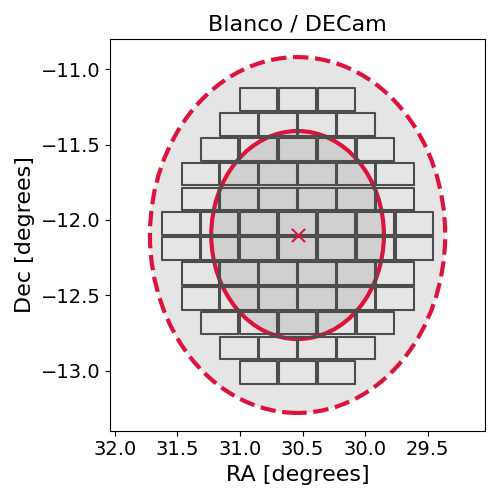
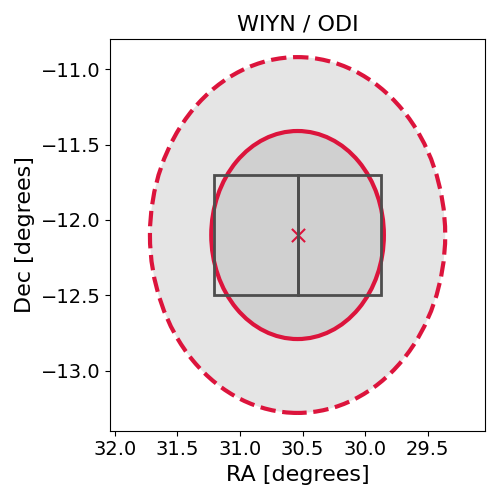

# IC201130A (134751_31476488)

### IceCube Data

| Rev | Type | Time (UTC) | Energy (TeV) | Signalness | FAR (#/yr) | 90% Area (sq. deg.) |
| --- | --- | --- | --- | --- | --- | --- |
| 1 | GOLD | 11/30/2020  20:21:46 | 203.470 | 0.147 | 1.322200 | 4.37 |

<a href="https://gcn.gsfc.nasa.gov/gcn/notices_amon_g_b/134751_31476488.amon" target="_blank">Link to IceCube Alert Details</a>

<a href="https://rmorgan10.github.io/AlertMonitoring/IC201130A_1/CTIO_skymap.png" target="_blank">
  
</a>


## CTIO Report

**Observations Start at**  `2020/11/30 21:04:49`  **Madison Time**

<a href="https://github.com/rmorgan10/AlertMonitoring/blob/main/IC201130A_1/CTIO.json" target="_blank">Link to Observing Scripts

### Alert Diagnostics

```Event
  Event ID = IC201130A
  (ra, dec) = (30.5399, -12.0999)
Date
  Now = 2020/11/30 23:07:17 (UTC)
  Search time = 2020/11/30 20:21:46 (UTC)
  Optimal time = 2020/12/1 02:04:49 (UTC)
  Airmass at optimal time = 1.05
Sun
  Angular separation = 130.22 (deg)
  Next rising = 2020/12/1 09:33:45 (UTC)
  Next setting = 2020/11/30 23:30:39 (UTC)
Moon
  Illumination = 1.00
  Angular separation = 56.35 (deg)
  Next rising = 2020/11/30 23:56:31 (UTC)
  Next setting = 2020/12/1 10:23:55 (UTC)
  Next new moon = 2020/12/14 16:16:33 (UTC)
  Next full moon = 2020/12/30 03:28:11 (UTC)
Galactic
  (l, b) = (174.1935, -67.6222)
  E(B-V) = 0.03
```
### Observability Plots

<a href="https://rmorgan10.github.io/AlertMonitoring/IC201130A_1/CTIO_forecast.png" target="_blank">
  
</a>

<a href="https://rmorgan10.github.io/AlertMonitoring/IC201130A_1/CTIO_airmass.png" target="_blank">
  
</a>
<a href="https://rmorgan10.github.io/AlertMonitoring/IC201130A_1/CTIO_fov.png" target="_blank">
  
</a>


## KPNO Report

**Observations Start at**  `2020/11/30 23:47:33`  **Madison Time**

<a href="https://github.com/rmorgan10/AlertMonitoring/blob/main/IC201130A_1/KPNO.json" target="_blank">Link to Observing Scripts

### Alert Diagnostics

```Event
  Event ID = IC201130A
  (ra, dec) = (30.5399, -12.0999)
Date
  Now = 2020/11/30 23:07:17 (UTC)
  Search time = 2020/11/30 20:21:46 (UTC)
  Optimal time = 2020/12/1 04:47:33 (UTC)
  Airmass at optimal time = 1.39
Sun
  Angular separation = 130.12 (deg)
  Next rising = 2020/12/1 14:09:07 (UTC)
  Next setting = 2020/12/1 00:22:08 (UTC)
Moon
  Illumination = 0.99
  Angular separation = 57.63 (deg)
  Next rising = 2020/12/1 00:46:28 (UTC)
  Next setting = 2020/12/1 15:18:23 (UTC)
  Next new moon = 2020/12/14 16:16:33 (UTC)
  Next full moon = 2020/12/30 03:28:11 (UTC)
Galactic
  (l, b) = (174.1935, -67.6222)
  E(B-V) = 0.03
```
### Observability Plots

<a href="https://rmorgan10.github.io/AlertMonitoring/IC201130A_1/KPNO_forecast.png" target="_blank">
  
</a>

<a href="https://rmorgan10.github.io/AlertMonitoring/IC201130A_1/KPNO_airmass.png" target="_blank">
  
</a>
<a href="https://rmorgan10.github.io/AlertMonitoring/IC201130A_1/KPNO_fov.png" target="_blank">
  
</a>

