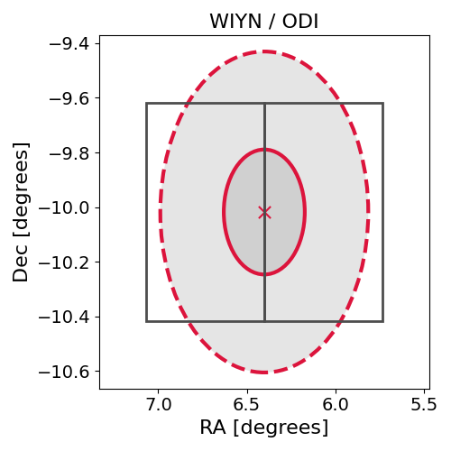

# IC201209A (134777_8912764)

### IceCube Data

| Rev | Type | Time (UTC) | Energy (TeV) | Signalness | FAR (#/yr) | 90% Area (sq. deg.) |
| --- | --- | --- | --- | --- | --- | --- |
| 0 | GOLD | 12/09/2020  10:15:43 | 418.600 | 0.192 | 0.769800 | 1.08 |

<a href="https://gcn.gsfc.nasa.gov/gcn/notices_amon_g_b/134777_8912764.amon" target="_blank">Link to IceCube Alert Details</a>

<a href="https://rmorgan10.github.io/AlertMonitoring/IC201209A_0/CTIO_skymap.png" target="_blank">
  
</a>


## CTIO Report

**Observations Start at**  `2020/12/09 19:49:28`  **Madison Time**

<a href="https://github.com/rmorgan10/AlertMonitoring/blob/main/IC201209A_0/CTIO.json" target="_blank">Link to Observing Scripts

### Alert Diagnostics

```Event
  Event ID = IC201209A
  (ra, dec) = (6.4010, -10.0181)
Date
  Now = 2020/12/9 14:02:18 (UTC)
  Search time = 2020/12/9 10:15:44 (UTC)
  Optimal time = 2020/12/10 00:49:28 (UTC)
  Airmass at optimal time = 1.10
Sun
  Angular separation = 103.15 (deg)
  Next rising = 2020/12/10 09:34:30 (UTC)
  Next setting = 2020/12/9 23:37:31 (UTC)
Moon
  Illumination = 0.28
  Angular separation = 165.48 (deg)
  Next rising = 2020/12/10 06:33:37 (UTC)
  Next setting = 2020/12/9 18:13:48 (UTC)
  Next new moon = 2020/12/14 16:16:33 (UTC)
  Next full moon = 2020/12/30 03:28:11 (UTC)
Galactic
  (l, b) = (102.1163, -71.8380)
  E(B-V) = 0.09
```
### Observability Plots

<a href="https://rmorgan10.github.io/AlertMonitoring/IC201209A_0/CTIO_forecast.png" target="_blank">
  
</a>

<a href="https://rmorgan10.github.io/AlertMonitoring/IC201209A_0/CTIO_airmass.png" target="_blank">
  
</a>
<a href="https://rmorgan10.github.io/AlertMonitoring/IC201209A_0/CTIO_fov.png" target="_blank">
  
</a>


## KPNO Report

**Observations Start at**  `2020/12/09 21:35:53`  **Madison Time**

<a href="https://github.com/rmorgan10/AlertMonitoring/blob/main/IC201209A_0/KPNO.json" target="_blank">Link to Observing Scripts

### Alert Diagnostics

```Event
  Event ID = IC201209A
  (ra, dec) = (6.4010, -10.0181)
Date
  Now = 2020/12/9 14:02:18 (UTC)
  Search time = 2020/12/9 10:15:44 (UTC)
  Optimal time = 2020/12/10 02:35:54 (UTC)
  Airmass at optimal time = 1.34
Sun
  Angular separation = 103.07 (deg)
  Next rising = 2020/12/9 14:15:20 (UTC)
  Next setting = 2020/12/10 00:22:38 (UTC)
Moon
  Illumination = 0.27
  Angular separation = 164.53 (deg)
  Next rising = 2020/12/10 09:38:36 (UTC)
  Next setting = 2020/12/9 21:02:09 (UTC)
  Next new moon = 2020/12/14 16:16:33 (UTC)
  Next full moon = 2020/12/30 03:28:11 (UTC)
Galactic
  (l, b) = (102.1163, -71.8380)
  E(B-V) = 0.09
```
### Observability Plots

<a href="https://rmorgan10.github.io/AlertMonitoring/IC201209A_0/KPNO_forecast.png" target="_blank">
  
</a>

<a href="https://rmorgan10.github.io/AlertMonitoring/IC201209A_0/KPNO_airmass.png" target="_blank">
  
</a>
<a href="https://rmorgan10.github.io/AlertMonitoring/IC201209A_0/KPNO_fov.png" target="_blank">
  
</a>

