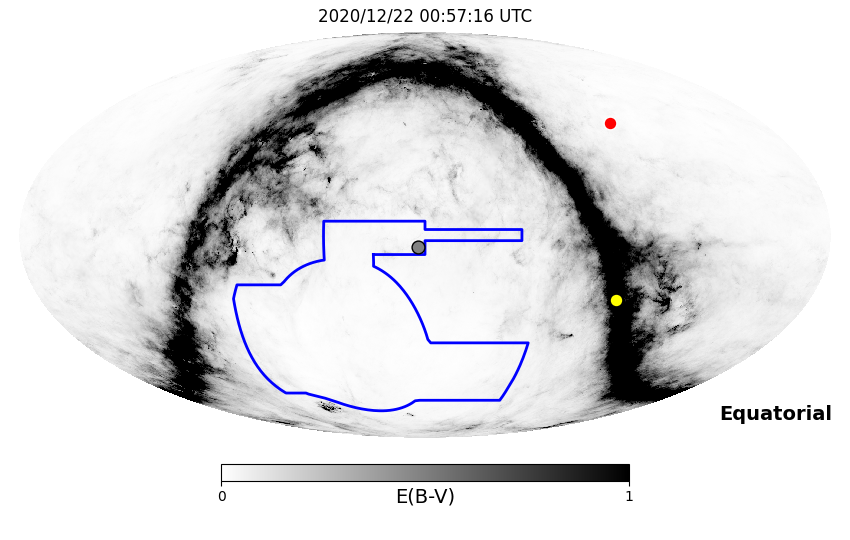
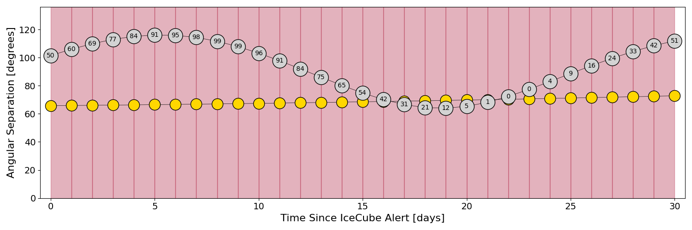
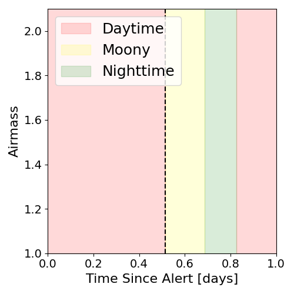
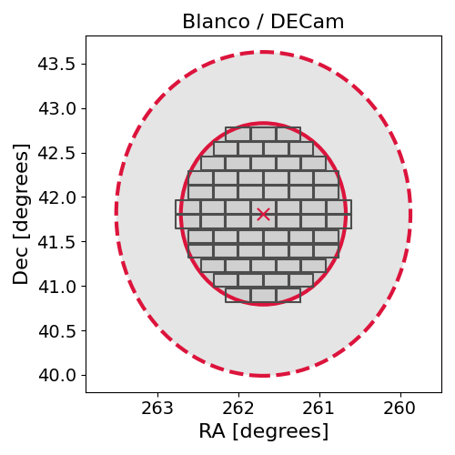
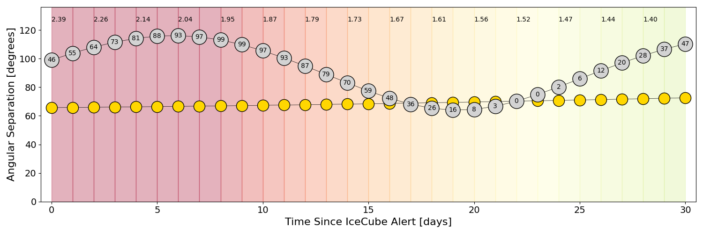
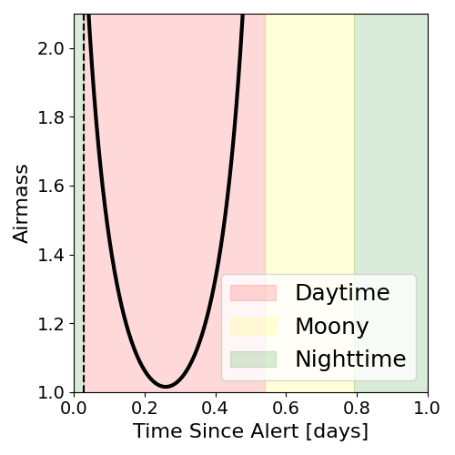
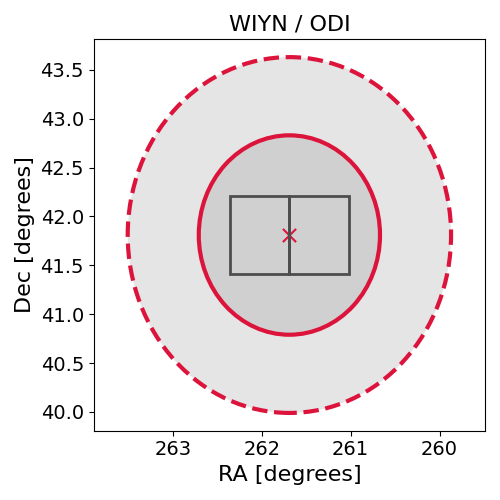

# IC201221A (134817_29175858)

### IceCube Data

| Rev | Type | Time (UTC) | Energy (TeV) | Signalness | FAR (#/yr) | 90% Area (sq. deg.) |
| --- | --- | --- | --- | --- | --- | --- |
| 1 | GOLD | 12/21/2020  12:36:53 | 174.540 | 0.564 | 0.147200 | 10.41 |

<a href="https://gcn.gsfc.nasa.gov/gcn/notices_amon_g_b/134817_29175858.amon" target="_blank">Link to IceCube Alert Details</a>

<a href="https://rmorgan10.github.io/AlertMonitoring/IC201221A_1/CTIO_skymap.png" target="_blank">
  
</a>


## CTIO Report

**Observations Start at**  `2020/12/21 19:57:16`  **Madison Time**

<a href="https://github.com/rmorgan10/AlertMonitoring/blob/main/IC201221A_1/CTIO.json" target="_blank">Link to Observing Scripts

### Alert Diagnostics

```Event
  Event ID = IC201221A
  (ra, dec) = (261.6899, 41.8100)
Date
  Now = 2020/12/21 17:22:35 (UTC)
  Search time = 2020/12/21 12:36:53 (UTC)
  Optimal time = 2020/12/22 00:57:16 (UTC)
  Airmass at optimal time = 999.00
Sun
  Angular separation = 65.78 (deg)
  Next rising = 2020/12/22 09:38:57 (UTC)
  Next setting = 2020/12/21 23:44:48 (UTC)
Moon
  Illumination = 0.51
  Angular separation = 101.40 (deg)
  Next rising = 2020/12/21 16:23:31 (UTC)
  Next setting = 2020/12/22 05:06:23 (UTC)
  Next new moon = 2021/1/13 05:00:09 (UTC)
  Next full moon = 2020/12/30 03:28:11 (UTC)
Galactic
  (l, b) = (67.0315, 32.9254)
  E(B-V) = 0.01
```
### Observability Plots

<a href="https://rmorgan10.github.io/AlertMonitoring/IC201221A_1/CTIO_forecast.png" target="_blank">
  
</a>

<a href="https://rmorgan10.github.io/AlertMonitoring/IC201221A_1/CTIO_airmass.png" target="_blank">
  
</a>
<a href="https://rmorgan10.github.io/AlertMonitoring/IC201221A_1/CTIO_fov.png" target="_blank">
  
</a>


## KPNO Report

**Observations Start at**  `2020/12/21 08:15:20`  **Madison Time**

<a href="https://github.com/rmorgan10/AlertMonitoring/blob/main/IC201221A_1/KPNO.json" target="_blank">Link to Observing Scripts

### Alert Diagnostics

```Event
  Event ID = IC201221A
  (ra, dec) = (261.6899, 41.8100)
Date
  Now = 2020/12/21 17:22:35 (UTC)
  Search time = 2020/12/21 12:36:53 (UTC)
  Optimal time = 2020/12/21 13:15:21 (UTC)
  Airmass at optimal time = 2.39
Sun
  Angular separation = 65.72 (deg)
  Next rising = 2020/12/21 14:22:46 (UTC)
  Next setting = 2020/12/22 00:26:56 (UTC)
Moon
  Illumination = 0.46
  Angular separation = 98.99 (deg)
  Next rising = 2020/12/21 19:39:45 (UTC)
  Next setting = 2020/12/22 07:38:38 (UTC)
  Next new moon = 2021/1/13 05:00:09 (UTC)
  Next full moon = 2020/12/30 03:28:11 (UTC)
Galactic
  (l, b) = (67.0315, 32.9254)
  E(B-V) = 0.01
```
### Observability Plots

<a href="https://rmorgan10.github.io/AlertMonitoring/IC201221A_1/KPNO_forecast.png" target="_blank">
  
</a>

<a href="https://rmorgan10.github.io/AlertMonitoring/IC201221A_1/KPNO_airmass.png" target="_blank">
  
</a>
<a href="https://rmorgan10.github.io/AlertMonitoring/IC201221A_1/KPNO_fov.png" target="_blank">
  
</a>

