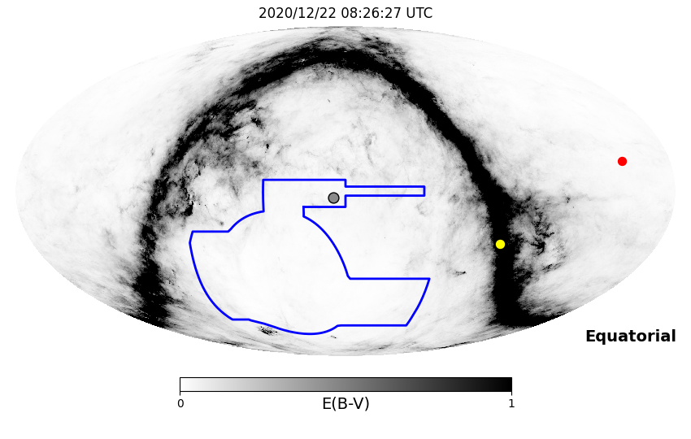
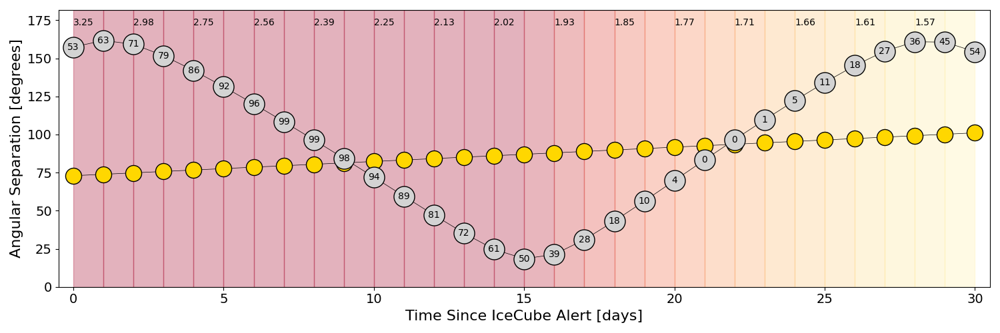
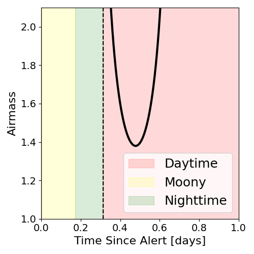
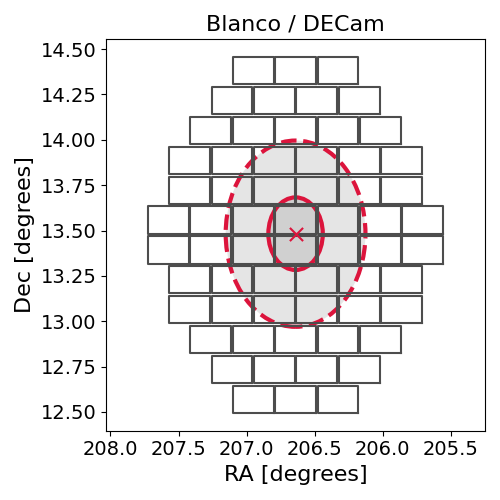
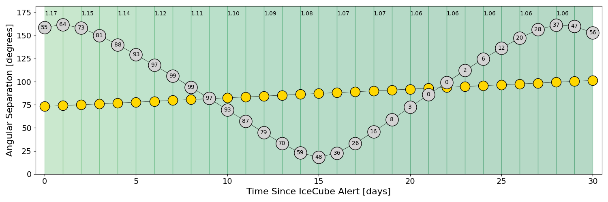
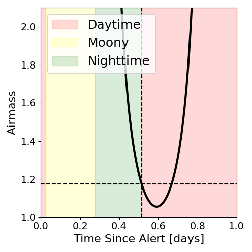
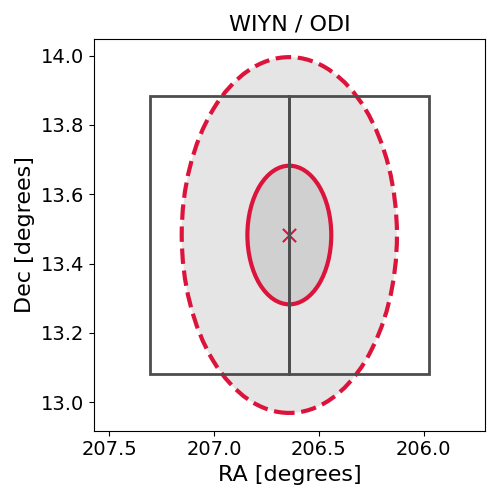

# IC201222A (134818_73718836)

### IceCube Data

| Rev | Type | Time (UTC) | Energy (TeV) | Signalness | FAR (#/yr) | 90% Area (sq. deg.) |
| --- | --- | --- | --- | --- | --- | --- |
| 0 | GOLD | 12/22/2020  00:56:16 | 185.780 | 0.534 | 1.008100 | 0.83 |

<a href="https://gcn.gsfc.nasa.gov/gcn/notices_amon_g_b/134818_73718836.amon" target="_blank">Link to IceCube Alert Details</a>

<a href="https://rmorgan10.github.io/AlertMonitoring/IC201222A_0/CTIO_skymap.png" target="_blank">
  
</a>


## CTIO Report

**Observations Start at**  `2020/12/22 03:26:27`  **Madison Time**

<a href="https://github.com/rmorgan10/AlertMonitoring/blob/main/IC201222A_0/CTIO.json" target="_blank">Link to Observing Scripts

### Alert Diagnostics

```Event
  Event ID = IC201222A
  (ra, dec) = (206.6403, 13.4825)
Date
  Now = 2020/12/22 01:07:17 (UTC)
  Search time = 2020/12/22 00:56:16 (UTC)
  Optimal time = 2020/12/22 08:26:27 (UTC)
  Airmass at optimal time = 3.25
Sun
  Angular separation = 72.97 (deg)
  Next rising = 2020/12/22 09:38:57 (UTC)
  Next setting = 2020/12/22 23:45:17 (UTC)
Moon
  Illumination = 0.54
  Angular separation = 157.45 (deg)
  Next rising = 2020/12/22 17:16:56 (UTC)
  Next setting = 2020/12/22 05:06:23 (UTC)
  Next new moon = 2021/1/13 05:00:09 (UTC)
  Next full moon = 2020/12/30 03:28:11 (UTC)
Galactic
  (l, b) = (349.0013, 71.2375)
  E(B-V) = 0.03
```
### Observability Plots

<a href="https://rmorgan10.github.io/AlertMonitoring/IC201222A_0/CTIO_forecast.png" target="_blank">
  
</a>

<a href="https://rmorgan10.github.io/AlertMonitoring/IC201222A_0/CTIO_airmass.png" target="_blank">
  
</a>
<a href="https://rmorgan10.github.io/AlertMonitoring/IC201222A_0/CTIO_fov.png" target="_blank">
  
</a>


## KPNO Report

**Observations Start at**  `2020/12/22 08:15:55`  **Madison Time**

<a href="https://github.com/rmorgan10/AlertMonitoring/blob/main/IC201222A_0/KPNO.json" target="_blank">Link to Observing Scripts

### Alert Diagnostics

```Event
  Event ID = IC201222A
  (ra, dec) = (206.6403, 13.4825)
Date
  Now = 2020/12/22 01:07:17 (UTC)
  Search time = 2020/12/22 00:56:16 (UTC)
  Optimal time = 2020/12/22 13:15:56 (UTC)
  Airmass at optimal time = 1.17
Sun
  Angular separation = 73.16 (deg)
  Next rising = 2020/12/22 14:23:15 (UTC)
  Next setting = 2020/12/23 00:27:27 (UTC)
Moon
  Illumination = 0.56
  Angular separation = 158.76 (deg)
  Next rising = 2020/12/22 20:07:24 (UTC)
  Next setting = 2020/12/22 07:38:38 (UTC)
  Next new moon = 2021/1/13 05:00:09 (UTC)
  Next full moon = 2020/12/30 03:28:11 (UTC)
Galactic
  (l, b) = (349.0013, 71.2375)
  E(B-V) = 0.03
```
### Observability Plots

<a href="https://rmorgan10.github.io/AlertMonitoring/IC201222A_0/KPNO_forecast.png" target="_blank">
  
</a>

<a href="https://rmorgan10.github.io/AlertMonitoring/IC201222A_0/KPNO_airmass.png" target="_blank">
  
</a>
<a href="https://rmorgan10.github.io/AlertMonitoring/IC201222A_0/KPNO_fov.png" target="_blank">
  
</a>

