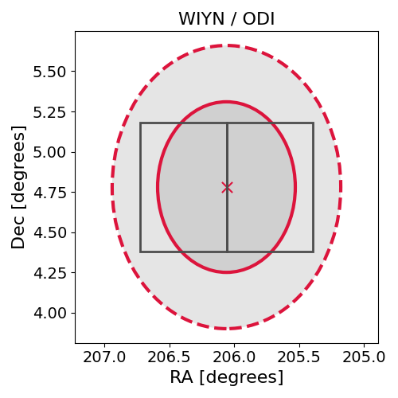

# IC210210A (134979_17138286)

### IceCube Data

| Rev | Type | Time (UTC) | Energy (TeV) | Signalness | FAR (#/yr) | 90% Area (sq. deg.) |
| --- | --- | --- | --- | --- | --- | --- |
| 1 | GOLD | 02/10/2021  11:53:55 | 287.410 | 0.655 | 0.464500 | 2.43 |

<a href="https://gcn.gsfc.nasa.gov/gcn/notices_amon_g_b/134979_17138286.amon" target="_blank">Link to IceCube Alert Details</a>

<a href="https://rmorgan10.github.io/AlertMonitoring/IC210210A_1/CTIO_skymap.png" target="_blank">
  
</a>


## CTIO Report

**Observations Start at**  `2021/02/11 04:01:58`  **Madison Time**

<a href="https://github.com/rmorgan10/AlertMonitoring/blob/main/IC210210A_1/CTIO.json" target="_blank">Link to Observing Scripts

### Alert Diagnostics

```Event
  Event ID = IC210210A
  (ra, dec) = (206.0600, 4.7800)
Date
  Now = 2021/2/10 14:52:18 (UTC)
  Search time = 2021/2/10 11:53:56 (UTC)
  Optimal time = 2021/2/11 09:01:58 (UTC)
  Airmass at optimal time = 1.22
Sun
  Angular separation = 119.41 (deg)
  Next rising = 2021/2/11 10:20:07 (UTC)
  Next setting = 2021/2/10 23:35:08 (UTC)
Moon
  Illumination = 0.00
  Angular separation = 115.62 (deg)
  Next rising = 2021/2/11 09:57:42 (UTC)
  Next setting = 2021/2/10 23:13:30 (UTC)
  Next new moon = 2021/2/11 19:05:38 (UTC)
  Next full moon = 2021/2/27 08:17:17 (UTC)
Galactic
  (l, b) = (334.6480, 64.3500)
  E(B-V) = 0.07
```
### Observability Plots

<a href="https://rmorgan10.github.io/AlertMonitoring/IC210210A_1/CTIO_forecast.png" target="_blank">
  
</a>

<a href="https://rmorgan10.github.io/AlertMonitoring/IC210210A_1/CTIO_airmass.png" target="_blank">
  
</a>
<a href="https://rmorgan10.github.io/AlertMonitoring/IC210210A_1/CTIO_fov.png" target="_blank">
  
</a>


## KPNO Report

**Observations Start at**  `2021/02/11 06:44:42`  **Madison Time**

<a href="https://github.com/rmorgan10/AlertMonitoring/blob/main/IC210210A_1/KPNO.json" target="_blank">Link to Observing Scripts

### Alert Diagnostics

```Event
  Event ID = IC210210A
  (ra, dec) = (206.0600, 4.7800)
Date
  Now = 2021/2/10 14:52:18 (UTC)
  Search time = 2021/2/10 11:53:56 (UTC)
  Optimal time = 2021/2/11 11:44:43 (UTC)
  Airmass at optimal time = 1.13
Sun
  Angular separation = 119.52 (deg)
  Next rising = 2021/2/10 14:12:26 (UTC)
  Next setting = 2021/2/11 01:09:09 (UTC)
Moon
  Illumination = 0.00
  Angular separation = 117.09 (deg)
  Next rising = 2021/2/10 13:44:05 (UTC)
  Next setting = 2021/2/11 00:11:49 (UTC)
  Next new moon = 2021/2/11 19:05:38 (UTC)
  Next full moon = 2021/2/27 08:17:17 (UTC)
Galactic
  (l, b) = (334.6480, 64.3500)
  E(B-V) = 0.07
```
### Observability Plots

<a href="https://rmorgan10.github.io/AlertMonitoring/IC210210A_1/KPNO_forecast.png" target="_blank">
  
</a>

<a href="https://rmorgan10.github.io/AlertMonitoring/IC210210A_1/KPNO_airmass.png" target="_blank">
  
</a>
<a href="https://rmorgan10.github.io/AlertMonitoring/IC210210A_1/KPNO_fov.png" target="_blank">
  
</a>

