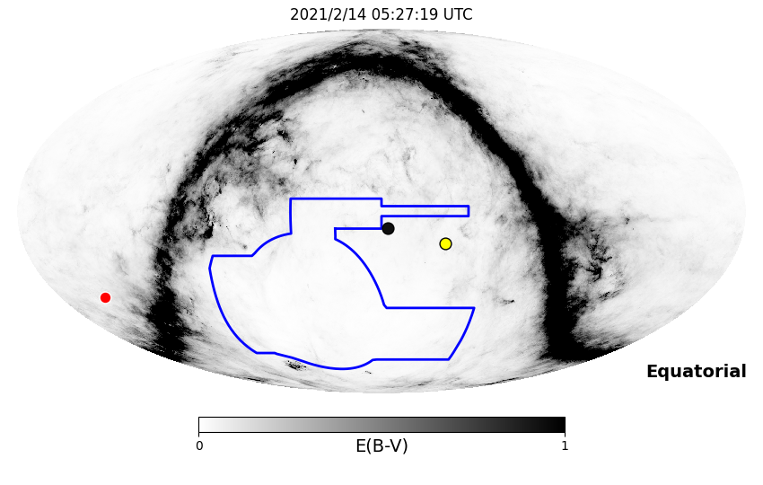
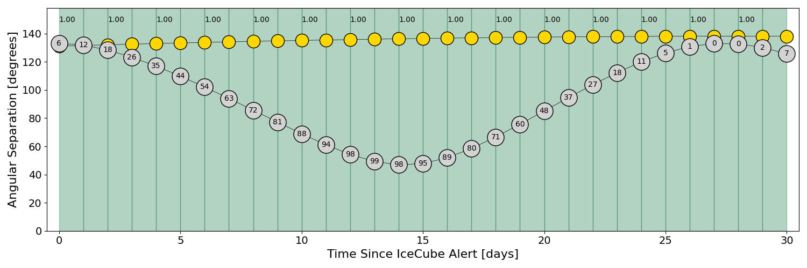
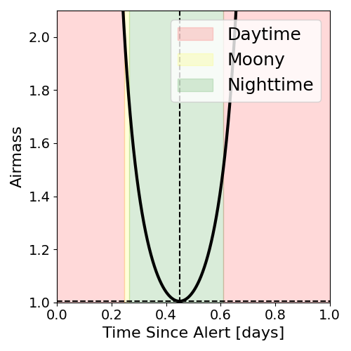
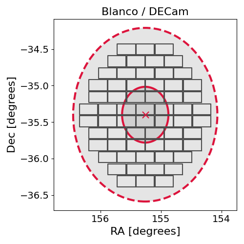
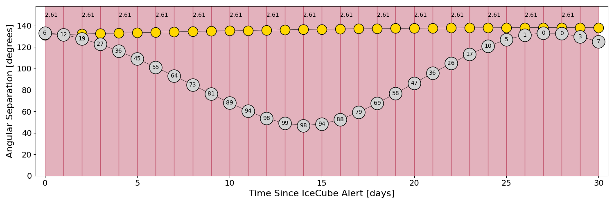
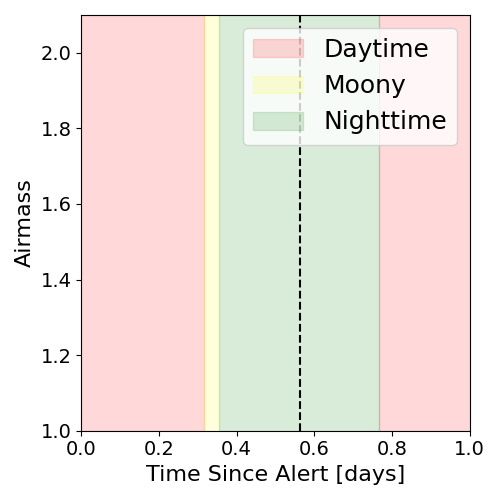
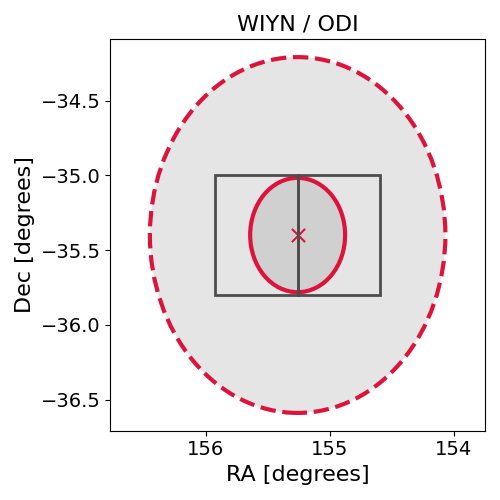

# IC210213A (134994_1103075)

### IceCube Data

| Rev | Type | Time (UTC) | Energy (TeV) | Signalness | FAR (#/yr) | 90% Area (sq. deg.) |
| --- | --- | --- | --- | --- | --- | --- |
| 0 | GOLD | 02/13/2021  18:40:24 | 1450.400 | 0.607 | 0.436200 | 4.45 |

<a href="https://gcn.gsfc.nasa.gov/gcn/notices_amon_g_b/134994_1103075.amon" target="_blank">Link to IceCube Alert Details</a>

<a href="https://rmorgan10.github.io/AlertMonitoring/IC210213A_0/CTIO_skymap.png" target="_blank">
  
</a>


## CTIO Report

**Observations Start at**  `2021/02/14 00:27:19`  **Madison Time**

<a href="https://github.com/rmorgan10/AlertMonitoring/blob/main/IC210213A_0/CTIO.json" target="_blank">Link to Observing Scripts

### Alert Diagnostics

```Event
  Event ID = IC210213A
  (ra, dec) = (155.2582, -35.3994)
Date
  Now = 2021/2/13 18:52:33 (UTC)
  Search time = 2021/2/13 18:40:25 (UTC)
  Optimal time = 2021/2/14 05:27:19 (UTC)
  Airmass at optimal time = 1.00
Sun
  Angular separation = 131.17 (deg)
  Next rising = 2021/2/14 10:22:35 (UTC)
  Next setting = 2021/2/13 23:32:34 (UTC)
Moon
  Illumination = 0.06
  Angular separation = 133.15 (deg)
  Next rising = 2021/2/14 12:54:36 (UTC)
  Next setting = 2021/2/14 01:03:24 (UTC)
  Next new moon = 2021/3/13 10:21:07 (UTC)
  Next full moon = 2021/2/27 08:17:17 (UTC)
Galactic
  (l, b) = (271.3815, 18.0969)
  E(B-V) = 0.06
```
### Observability Plots

<a href="https://rmorgan10.github.io/AlertMonitoring/IC210213A_0/CTIO_forecast.png" target="_blank">
  
</a>

<a href="https://rmorgan10.github.io/AlertMonitoring/IC210213A_0/CTIO_airmass.png" target="_blank">
  
</a>
<a href="https://rmorgan10.github.io/AlertMonitoring/IC210213A_0/CTIO_fov.png" target="_blank">
  
</a>


## KPNO Report

**Observations Start at**  `2021/02/14 03:10:03`  **Madison Time**

<a href="https://github.com/rmorgan10/AlertMonitoring/blob/main/IC210213A_0/KPNO.json" target="_blank">Link to Observing Scripts

### Alert Diagnostics

```Event
  Event ID = IC210213A
  (ra, dec) = (155.2582, -35.3994)
Date
  Now = 2021/2/13 18:52:33 (UTC)
  Search time = 2021/2/13 18:40:25 (UTC)
  Optimal time = 2021/2/14 08:10:03 (UTC)
  Airmass at optimal time = 2.61
Sun
  Angular separation = 131.23 (deg)
  Next rising = 2021/2/14 14:08:50 (UTC)
  Next setting = 2021/2/14 01:11:46 (UTC)
Moon
  Illumination = 0.07
  Angular separation = 133.12 (deg)
  Next rising = 2021/2/14 16:06:26 (UTC)
  Next setting = 2021/2/14 03:14:19 (UTC)
  Next new moon = 2021/3/13 10:21:07 (UTC)
  Next full moon = 2021/2/27 08:17:17 (UTC)
Galactic
  (l, b) = (271.3815, 18.0969)
  E(B-V) = 0.06
```
### Observability Plots

<a href="https://rmorgan10.github.io/AlertMonitoring/IC210213A_0/KPNO_forecast.png" target="_blank">
  
</a>

<a href="https://rmorgan10.github.io/AlertMonitoring/IC210213A_0/KPNO_airmass.png" target="_blank">
  
</a>
<a href="https://rmorgan10.github.io/AlertMonitoring/IC210213A_0/KPNO_fov.png" target="_blank">
  
</a>

