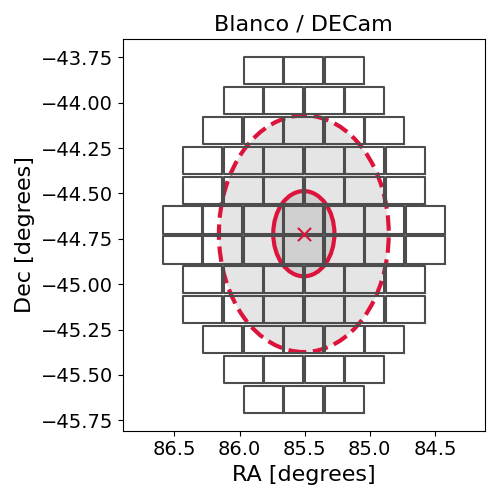

# IC210322A (135113_19489408)

### IceCube Data

| Rev | Type | Time (UTC) | Energy (TeV) | Signalness | FAR (#/yr) | 90% Area (sq. deg.) |
| --- | --- | --- | --- | --- | --- | --- |
| 0 | BRONZE | 03/22/2021  02:34:09 | 54.853 | 0.459 | 1.382300 | 1.34 |

<a href="https://gcn.gsfc.nasa.gov/gcn/notices_amon_g_b/135113_19489408.amon" target="_blank">Link to IceCube Alert Details</a>

<a href="https://rmorgan10.github.io/AlertMonitoring/IC210322A_0/CTIO_skymap.png" target="_blank">
  
</a>


## CTIO Report

**Observations Start at**  `2021/03/22 18:52:25`  **Madison Time**

<a href="https://github.com/rmorgan10/AlertMonitoring/blob/main/IC210322A_0/CTIO.json" target="_blank">Link to Observing Scripts

### Alert Diagnostics

```Event
  Event ID = IC210322A
  (ra, dec) = (85.5066, -44.7217)
Date
  Now = 2021/3/22 02:47:16 (UTC)
  Search time = 2021/3/22 02:34:09 (UTC)
  Optimal time = 2021/3/22 23:52:25 (UTC)
  Airmass at optimal time = 1.08
Sun
  Angular separation = 85.86 (deg)
  Next rising = 2021/3/22 10:47:50 (UTC)
  Next setting = 2021/3/22 22:51:40 (UTC)
Moon
  Illumination = 0.64
  Angular separation = 73.33 (deg)
  Next rising = 2021/3/22 18:54:29 (UTC)
  Next setting = 2021/3/22 04:15:31 (UTC)
  Next new moon = 2021/4/12 02:30:48 (UTC)
  Next full moon = 2021/3/28 18:48:08 (UTC)
Galactic
  (l, b) = (250.9192, -30.6283)
  E(B-V) = 0.02
```
### Observability Plots

<a href="https://rmorgan10.github.io/AlertMonitoring/IC210322A_0/CTIO_forecast.png" target="_blank">
  
</a>

<a href="https://rmorgan10.github.io/AlertMonitoring/IC210322A_0/CTIO_airmass.png" target="_blank">
  
</a>
<a href="https://rmorgan10.github.io/AlertMonitoring/IC210322A_0/CTIO_fov.png" target="_blank">
  
</a>


## KPNO Report

**Observations Start at**  `2021/03/21 21:41:21`  **Madison Time**

<a href="https://github.com/rmorgan10/AlertMonitoring/blob/main/IC210322A_0/KPNO.json" target="_blank">Link to Observing Scripts

### Alert Diagnostics

```Event
  Event ID = IC210322A
  (ra, dec) = (85.5066, -44.7217)
Date
  Now = 2021/3/22 02:47:16 (UTC)
  Search time = 2021/3/22 02:34:09 (UTC)
  Optimal time = 2021/3/22 02:41:21 (UTC)
  Airmass at optimal time = 5.46
Sun
  Angular separation = 86.18 (deg)
  Next rising = 2021/3/22 13:26:53 (UTC)
  Next setting = 2021/3/23 01:39:50 (UTC)
Moon
  Illumination = 0.55
  Angular separation = 70.93 (deg)
  Next rising = 2021/3/22 19:27:07 (UTC)
  Next setting = 2021/3/22 09:21:51 (UTC)
  Next new moon = 2021/4/12 02:30:48 (UTC)
  Next full moon = 2021/3/28 18:48:08 (UTC)
Galactic
  (l, b) = (250.9192, -30.6283)
  E(B-V) = 0.02
```
### Observability Plots

<a href="https://rmorgan10.github.io/AlertMonitoring/IC210322A_0/KPNO_forecast.png" target="_blank">
  
</a>

<a href="https://rmorgan10.github.io/AlertMonitoring/IC210322A_0/KPNO_airmass.png" target="_blank">
  
</a>
<a href="https://rmorgan10.github.io/AlertMonitoring/IC210322A_0/KPNO_fov.png" target="_blank">
  
</a>

