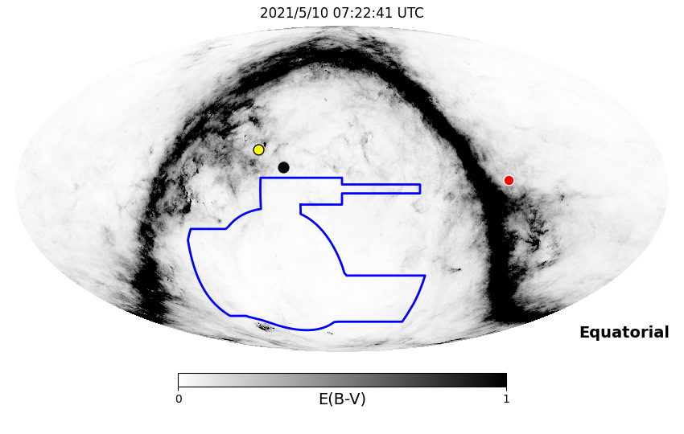
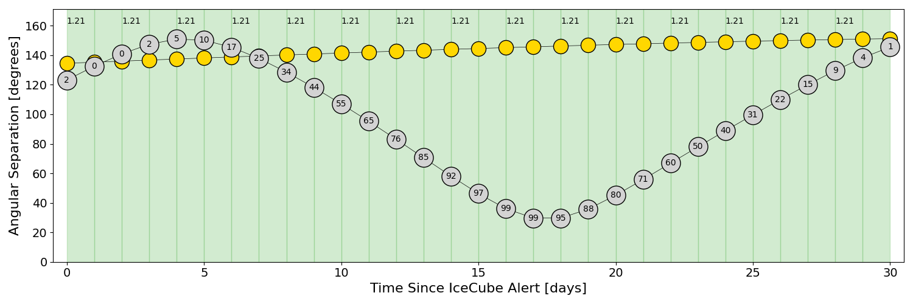
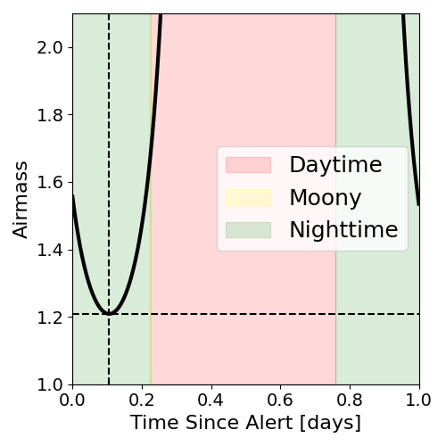
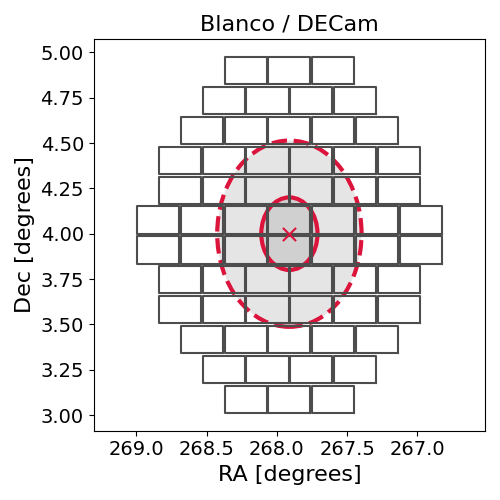
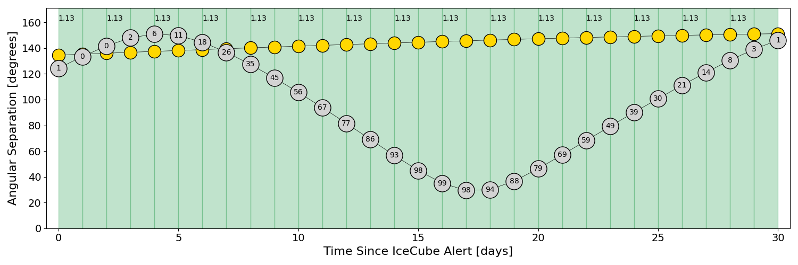
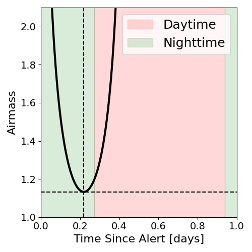
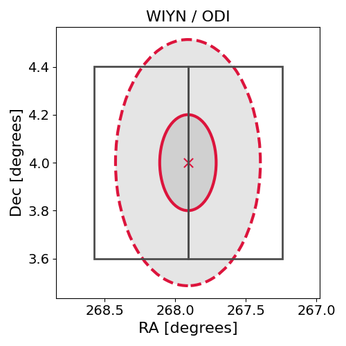

# IC210510A (135270_69188496)

### IceCube Data

| Rev | Type | Time (UTC) | Energy (TeV) | Signalness | FAR (#/yr) | 90% Area (sq. deg.) |
| --- | --- | --- | --- | --- | --- | --- |
| 0 | BRONZE | 05/10/2021  04:50:10 | 113.030 | 0.282 | 3.943700 | 0.83 |

<a href="https://gcn.gsfc.nasa.gov/gcn/notices_amon_g_b/135270_69188496.amon" target="_blank">Link to IceCube Alert Details</a>

<a href="https://rmorgan10.github.io/AlertMonitoring/IC210510A_0/CTIO_skymap.png" target="_blank">
  
</a>


## CTIO Report

**Observations Start at**  `2021/05/10 02:22:41`  **Madison Time**

<a href="https://github.com/rmorgan10/AlertMonitoring/blob/main/IC210510A_0/CTIO.json" target="_blank">Link to Observing Scripts

### Alert Diagnostics

```Event
  Event ID = IC210510A
  (ra, dec) = (267.9106, 4.0004)
Date
  Now = 2021/5/10 05:02:45 (UTC)
  Search time = 2021/5/10 04:50:11 (UTC)
  Optimal time = 2021/5/10 07:22:41 (UTC)
  Airmass at optimal time = 1.21
Sun
  Angular separation = 134.55 (deg)
  Next rising = 2021/5/10 11:18:10 (UTC)
  Next setting = 2021/5/10 22:00:47 (UTC)
Moon
  Illumination = 0.02
  Angular separation = 123.21 (deg)
  Next rising = 2021/5/10 10:09:36 (UTC)
  Next setting = 2021/5/10 21:34:26 (UTC)
  Next new moon = 2021/5/11 18:59:45 (UTC)
  Next full moon = 2021/5/26 11:13:50 (UTC)
Galactic
  (l, b) = (29.6511, 15.1193)
  E(B-V) = 0.55
```
### Observability Plots

<a href="https://rmorgan10.github.io/AlertMonitoring/IC210510A_0/CTIO_forecast.png" target="_blank">
  
</a>

<a href="https://rmorgan10.github.io/AlertMonitoring/IC210510A_0/CTIO_airmass.png" target="_blank">
  
</a>
<a href="https://rmorgan10.github.io/AlertMonitoring/IC210510A_0/CTIO_fov.png" target="_blank">
  
</a>


## KPNO Report

**Observations Start at**  `2021/05/10 05:05:25`  **Madison Time**

<a href="https://github.com/rmorgan10/AlertMonitoring/blob/main/IC210510A_0/KPNO.json" target="_blank">Link to Observing Scripts

### Alert Diagnostics

```Event
  Event ID = IC210510A
  (ra, dec) = (267.9106, 4.0004)
Date
  Now = 2021/5/10 05:02:45 (UTC)
  Search time = 2021/5/10 04:50:11 (UTC)
  Optimal time = 2021/5/10 10:05:26 (UTC)
  Airmass at optimal time = 1.13
Sun
  Angular separation = 134.63 (deg)
  Next rising = 2021/5/10 12:32:13 (UTC)
  Next setting = 2021/5/11 02:13:45 (UTC)
Moon
  Illumination = 0.02
  Angular separation = 124.31 (deg)
  Next rising = 2021/5/10 12:04:30 (UTC)
  Next setting = 2021/5/11 01:27:51 (UTC)
  Next new moon = 2021/5/11 18:59:45 (UTC)
  Next full moon = 2021/5/26 11:13:50 (UTC)
Galactic
  (l, b) = (29.6511, 15.1193)
  E(B-V) = 0.55
```
### Observability Plots

<a href="https://rmorgan10.github.io/AlertMonitoring/IC210510A_0/KPNO_forecast.png" target="_blank">
  
</a>

<a href="https://rmorgan10.github.io/AlertMonitoring/IC210510A_0/KPNO_airmass.png" target="_blank">
  
</a>
<a href="https://rmorgan10.github.io/AlertMonitoring/IC210510A_0/KPNO_fov.png" target="_blank">
  
</a>

