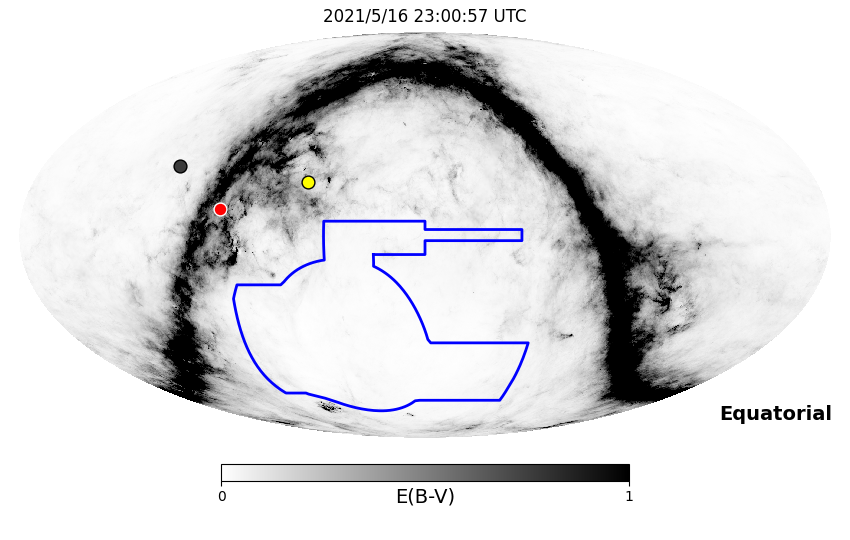
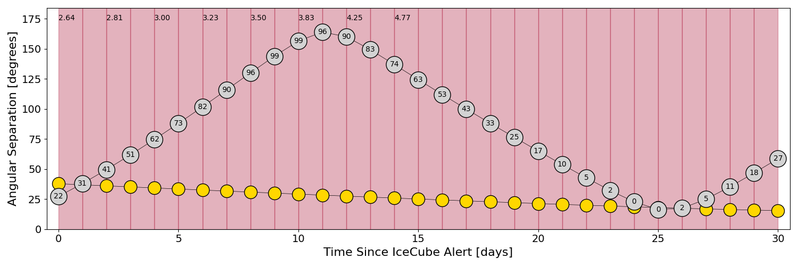
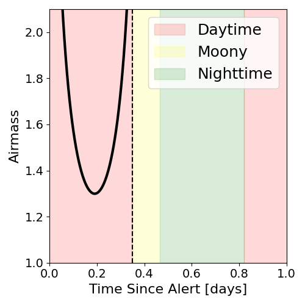
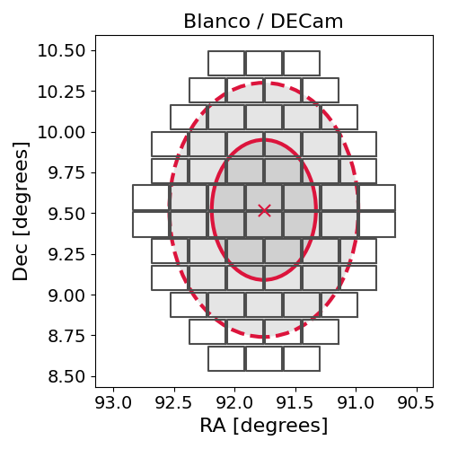
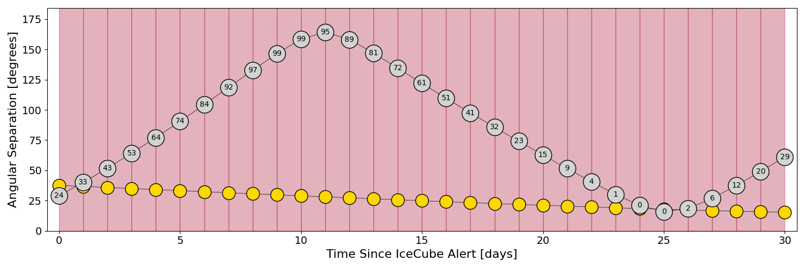
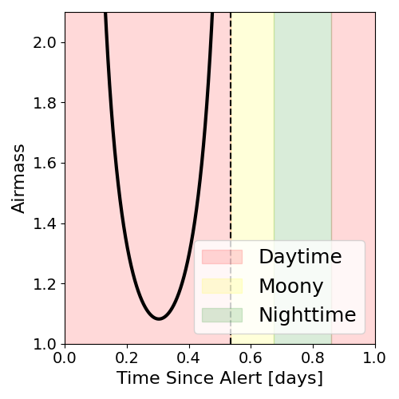
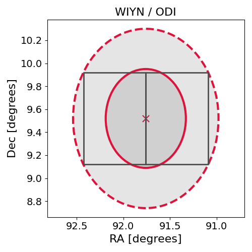

# IC210516A (135292_56063172)

### IceCube Data

| Rev | Type | Time (UTC) | Energy (TeV) | Signalness | FAR (#/yr) | 90% Area (sq. deg.) |
| --- | --- | --- | --- | --- | --- | --- |
| 1 | BRONZE | 05/16/2021  14:38:20 | 109.120 | 0.289 | 3.098800 | 1.91 |

<a href="https://gcn.gsfc.nasa.gov/gcn/notices_amon_g_b/135292_56063172.amon" target="_blank">Link to IceCube Alert Details</a>

<a href="https://rmorgan10.github.io/AlertMonitoring/IC210516A_1/CTIO_skymap.png" target="_blank">
  
</a>


## CTIO Report

**Observations Start at**  `2021/05/16 18:00:56`  **Madison Time**

<a href="https://github.com/rmorgan10/AlertMonitoring/blob/main/IC210516A_1/CTIO.json" target="_blank">Link to Observing Scripts

### Alert Diagnostics

```Event
  Event ID = IC210516A
  (ra, dec) = (91.7600, 9.5199)
Date
  Now = 2021/5/16 16:47:14 (UTC)
  Search time = 2021/5/16 14:38:20 (UTC)
  Optimal time = 2021/5/16 23:00:57 (UTC)
  Airmass at optimal time = 2.64
Sun
  Angular separation = 37.79 (deg)
  Next rising = 2021/5/17 11:22:35 (UTC)
  Next setting = 2021/5/16 21:57:01 (UTC)
Moon
  Illumination = 0.23
  Angular separation = 27.30 (deg)
  Next rising = 2021/5/16 15:34:01 (UTC)
  Next setting = 2021/5/17 01:48:32 (UTC)
  Next new moon = 2021/6/10 10:52:35 (UTC)
  Next full moon = 2021/5/26 11:13:50 (UTC)
Galactic
  (l, b) = (199.3521, -5.3684)
  E(B-V) = 0.86
```
### Observability Plots

<a href="https://rmorgan10.github.io/AlertMonitoring/IC210516A_1/CTIO_forecast.png" target="_blank">
  
</a>

<a href="https://rmorgan10.github.io/AlertMonitoring/IC210516A_1/CTIO_airmass.png" target="_blank">
  
</a>
<a href="https://rmorgan10.github.io/AlertMonitoring/IC210516A_1/CTIO_fov.png" target="_blank">
  
</a>


## KPNO Report

**Observations Start at**  `2021/05/16 22:28:31`  **Madison Time**

<a href="https://github.com/rmorgan10/AlertMonitoring/blob/main/IC210516A_1/KPNO.json" target="_blank">Link to Observing Scripts

### Alert Diagnostics

```Event
  Event ID = IC210516A
  (ra, dec) = (91.7600, 9.5199)
Date
  Now = 2021/5/16 16:47:14 (UTC)
  Search time = 2021/5/16 14:38:20 (UTC)
  Optimal time = 2021/5/17 03:28:32 (UTC)
  Airmass at optimal time = 5.50
Sun
  Angular separation = 37.63 (deg)
  Next rising = 2021/5/17 12:27:23 (UTC)
  Next setting = 2021/5/17 02:17:56 (UTC)
Moon
  Illumination = 0.24
  Angular separation = 29.17 (deg)
  Next rising = 2021/5/16 16:05:48 (UTC)
  Next setting = 2021/5/17 06:50:40 (UTC)
  Next new moon = 2021/6/10 10:52:35 (UTC)
  Next full moon = 2021/5/26 11:13:50 (UTC)
Galactic
  (l, b) = (199.3521, -5.3684)
  E(B-V) = 0.86
```
### Observability Plots

<a href="https://rmorgan10.github.io/AlertMonitoring/IC210516A_1/KPNO_forecast.png" target="_blank">
  
</a>

<a href="https://rmorgan10.github.io/AlertMonitoring/IC210516A_1/KPNO_airmass.png" target="_blank">
  
</a>
<a href="https://rmorgan10.github.io/AlertMonitoring/IC210516A_1/KPNO_fov.png" target="_blank">
  
</a>

