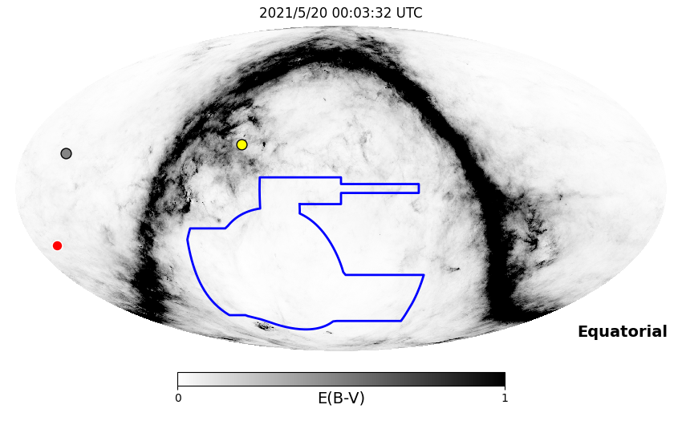
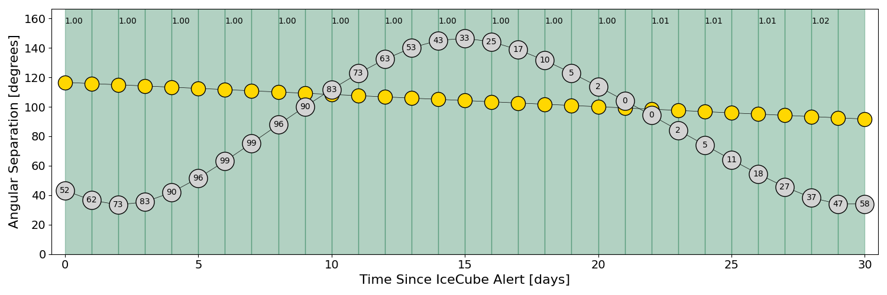
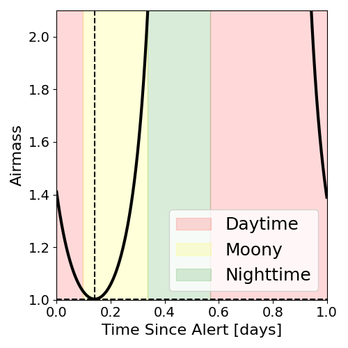
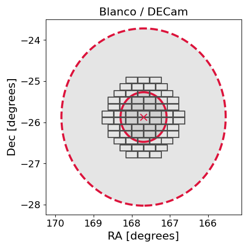
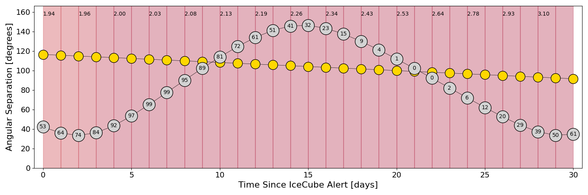
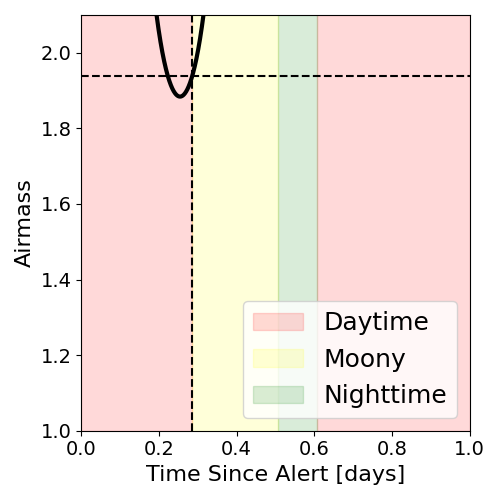
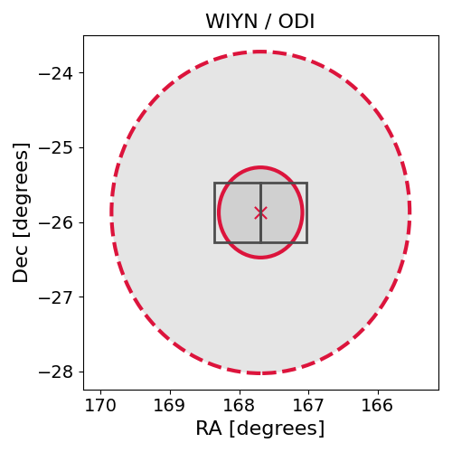

# IC210519A (135302_36915486)

### IceCube Data

| Rev | Type | Time (UTC) | Energy (TeV) | Signalness | FAR (#/yr) | 90% Area (sq. deg.) |
| --- | --- | --- | --- | --- | --- | --- |
| 0 | BRONZE | 05/19/2021  20:40:02 | 320.040 | 0.332 | 0.966900 | 14.54 |

<a href="https://gcn.gsfc.nasa.gov/gcn/notices_amon_g_b/135302_36915486.amon" target="_blank">Link to IceCube Alert Details</a>

<a href="https://rmorgan10.github.io/AlertMonitoring/IC210519A_0/CTIO_skymap.png" target="_blank">
  
</a>


## CTIO Report

**Observations Start at**  `2021/05/19 19:03:32`  **Madison Time**

<a href="https://github.com/rmorgan10/AlertMonitoring/blob/main/IC210519A_0/CTIO.json" target="_blank">Link to Observing Scripts

### Alert Diagnostics

```Event
  Event ID = IC210519A
  (ra, dec) = (167.6902, -25.8725)
Date
  Now = 2021/5/19 20:53:19 (UTC)
  Search time = 2021/5/19 20:40:03 (UTC)
  Optimal time = 2021/5/20 00:03:32 (UTC)
  Airmass at optimal time = 1.00
Sun
  Angular separation = 116.60 (deg)
  Next rising = 2021/5/20 11:24:25 (UTC)
  Next setting = 2021/5/19 21:55:25 (UTC)
Moon
  Illumination = 0.52
  Angular separation = 43.24 (deg)
  Next rising = 2021/5/20 18:18:58 (UTC)
  Next setting = 2021/5/20 04:47:55 (UTC)
  Next new moon = 2021/6/10 10:52:35 (UTC)
  Next full moon = 2021/5/26 11:13:50 (UTC)
Galactic
  (l, b) = (276.1969, 31.7204)
  E(B-V) = 0.02
```
### Observability Plots

<a href="https://rmorgan10.github.io/AlertMonitoring/IC210519A_0/CTIO_forecast.png" target="_blank">
  
</a>

<a href="https://rmorgan10.github.io/AlertMonitoring/IC210519A_0/CTIO_airmass.png" target="_blank">
  
</a>
<a href="https://rmorgan10.github.io/AlertMonitoring/IC210519A_0/CTIO_fov.png" target="_blank">
  
</a>


## KPNO Report

**Observations Start at**  `2021/05/19 22:31:12`  **Madison Time**

<a href="https://github.com/rmorgan10/AlertMonitoring/blob/main/IC210519A_0/KPNO.json" target="_blank">Link to Observing Scripts

### Alert Diagnostics

```Event
  Event ID = IC210519A
  (ra, dec) = (167.6902, -25.8725)
Date
  Now = 2021/5/19 20:53:19 (UTC)
  Search time = 2021/5/19 20:40:03 (UTC)
  Optimal time = 2021/5/20 03:31:13 (UTC)
  Airmass at optimal time = 1.94
Sun
  Angular separation = 116.49 (deg)
  Next rising = 2021/5/20 12:25:38 (UTC)
  Next setting = 2021/5/20 02:19:58 (UTC)
Moon
  Illumination = 0.54
  Angular separation = 42.12 (deg)
  Next rising = 2021/5/20 20:08:01 (UTC)
  Next setting = 2021/5/20 08:50:09 (UTC)
  Next new moon = 2021/6/10 10:52:35 (UTC)
  Next full moon = 2021/5/26 11:13:50 (UTC)
Galactic
  (l, b) = (276.1969, 31.7204)
  E(B-V) = 0.02
```
### Observability Plots

<a href="https://rmorgan10.github.io/AlertMonitoring/IC210519A_0/KPNO_forecast.png" target="_blank">
  
</a>

<a href="https://rmorgan10.github.io/AlertMonitoring/IC210519A_0/KPNO_airmass.png" target="_blank">
  
</a>
<a href="https://rmorgan10.github.io/AlertMonitoring/IC210519A_0/KPNO_fov.png" target="_blank">
  
</a>

