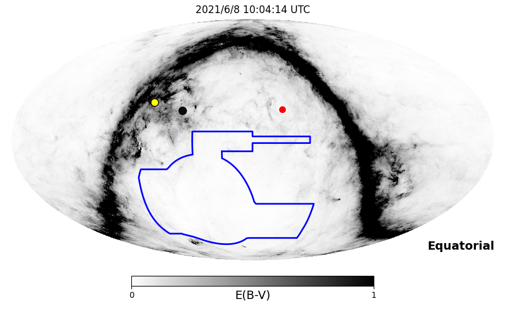
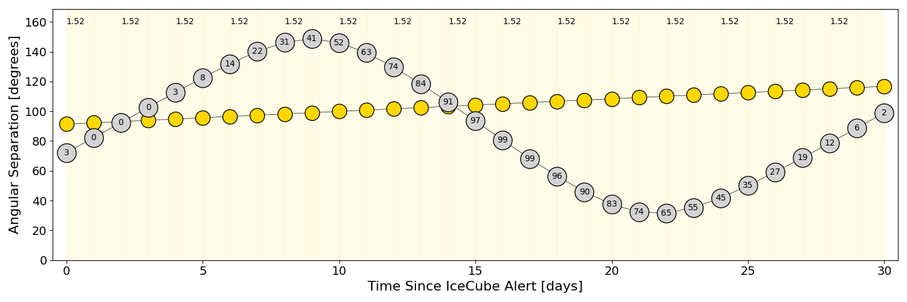
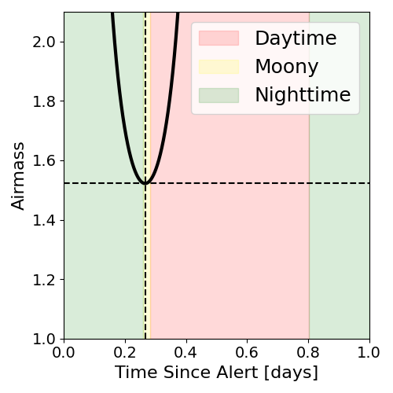
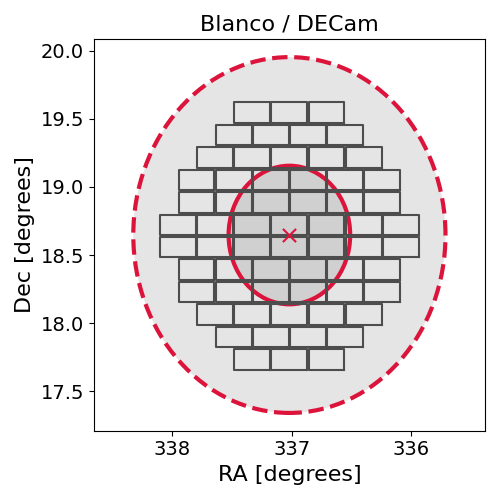
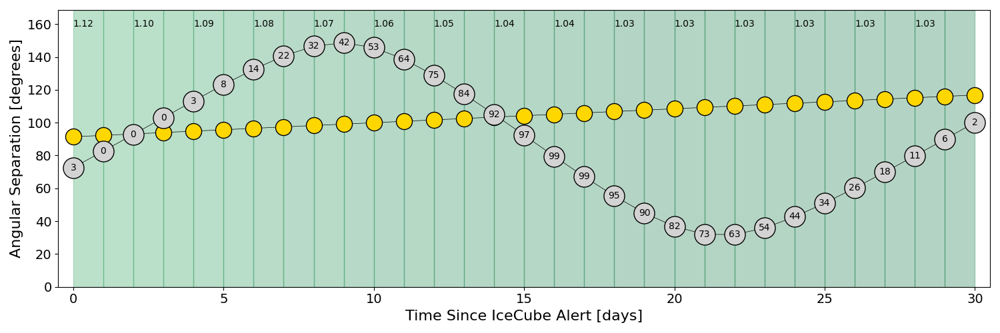
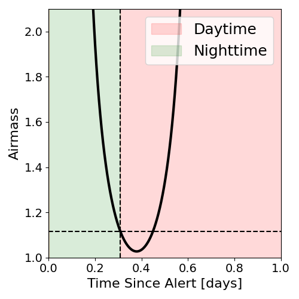
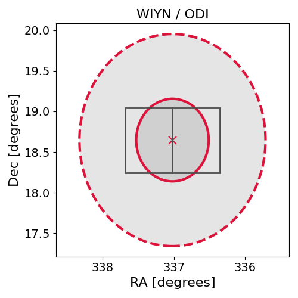

# IC210608A (135363_69917294)

### IceCube Data

| Rev | Type | Time (UTC) | Energy (TeV) | Signalness | FAR (#/yr) | 90% Area (sq. deg.) |
| --- | --- | --- | --- | --- | --- | --- |
| 0 | BRONZE | 06/08/2021  03:41:00 | 105.170 | 0.315 | 3.074700 | 5.36 |

<a href="https://gcn.gsfc.nasa.gov/gcn/notices_amon_g_b/135363_69917294.amon" target="_blank">Link to IceCube Alert Details</a>

<a href="https://rmorgan10.github.io/AlertMonitoring/IC210608A_0/CTIO_skymap.png" target="_blank">
  
</a>


## CTIO Report

**Observations Start at**  `2021/06/08 05:04:14`  **Madison Time**

<a href="https://github.com/rmorgan10/AlertMonitoring/blob/main/IC210608A_0/CTIO.json" target="_blank">Link to Observing Scripts

### Alert Diagnostics

```Event
  Event ID = IC210608A
  (ra, dec) = (337.0182, 18.6470)
Date
  Now = 2021/6/8 03:52:18 (UTC)
  Search time = 2021/6/8 03:41:01 (UTC)
  Optimal time = 2021/6/8 10:04:14 (UTC)
  Airmass at optimal time = 1.52
Sun
  Angular separation = 91.36 (deg)
  Next rising = 2021/6/8 11:34:36 (UTC)
  Next setting = 2021/6/8 21:50:02 (UTC)
Moon
  Illumination = 0.04
  Angular separation = 72.22 (deg)
  Next rising = 2021/6/8 09:53:02 (UTC)
  Next setting = 2021/6/8 20:41:49 (UTC)
  Next new moon = 2021/6/10 10:52:35 (UTC)
  Next full moon = 2021/6/24 18:39:39 (UTC)
Galactic
  (l, b) = (81.7789, -32.5337)
  E(B-V) = 0.04
```
### Observability Plots

<a href="https://rmorgan10.github.io/AlertMonitoring/IC210608A_0/CTIO_forecast.png" target="_blank">
  
</a>

<a href="https://rmorgan10.github.io/AlertMonitoring/IC210608A_0/CTIO_airmass.png" target="_blank">
  
</a>
<a href="https://rmorgan10.github.io/AlertMonitoring/IC210608A_0/CTIO_fov.png" target="_blank">
  
</a>


## KPNO Report

**Observations Start at**  `2021/06/08 06:05:35`  **Madison Time**

<a href="https://github.com/rmorgan10/AlertMonitoring/blob/main/IC210608A_0/KPNO.json" target="_blank">Link to Observing Scripts

### Alert Diagnostics

```Event
  Event ID = IC210608A
  (ra, dec) = (337.0182, 18.6470)
Date
  Now = 2021/6/8 03:52:18 (UTC)
  Search time = 2021/6/8 03:41:01 (UTC)
  Optimal time = 2021/6/8 11:05:35 (UTC)
  Airmass at optimal time = 1.12
Sun
  Angular separation = 91.40 (deg)
  Next rising = 2021/6/8 12:19:44 (UTC)
  Next setting = 2021/6/9 02:31:32 (UTC)
Moon
  Illumination = 0.04
  Angular separation = 72.65 (deg)
  Next rising = 2021/6/8 11:08:34 (UTC)
  Next setting = 2021/6/9 01:13:31 (UTC)
  Next new moon = 2021/6/10 10:52:35 (UTC)
  Next full moon = 2021/6/24 18:39:39 (UTC)
Galactic
  (l, b) = (81.7789, -32.5337)
  E(B-V) = 0.04
```
### Observability Plots

<a href="https://rmorgan10.github.io/AlertMonitoring/IC210608A_0/KPNO_forecast.png" target="_blank">
  
</a>

<a href="https://rmorgan10.github.io/AlertMonitoring/IC210608A_0/KPNO_airmass.png" target="_blank">
  
</a>
<a href="https://rmorgan10.github.io/AlertMonitoring/IC210608A_0/KPNO_fov.png" target="_blank">
  
</a>

