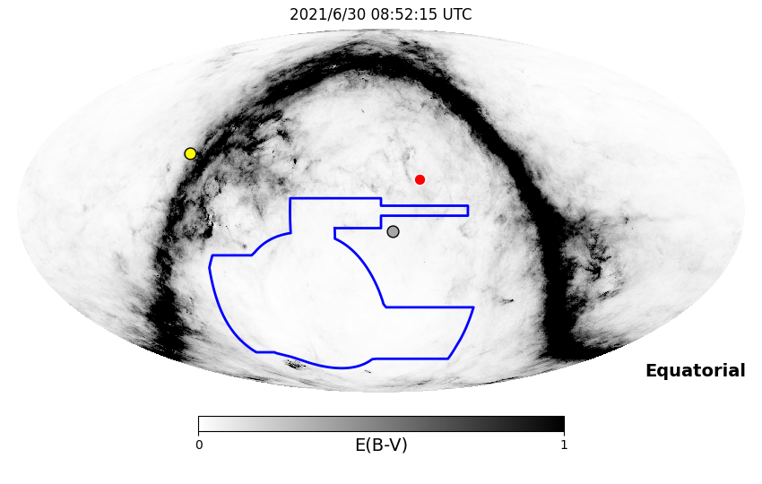
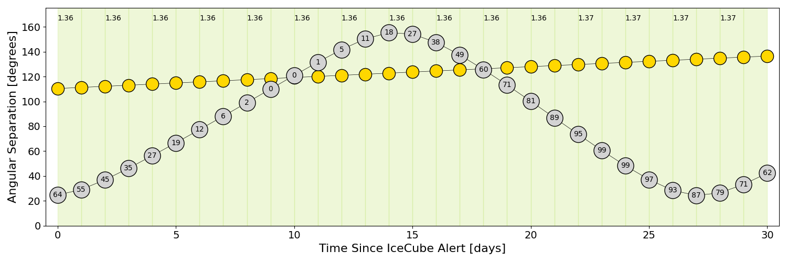
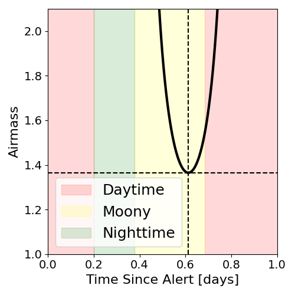
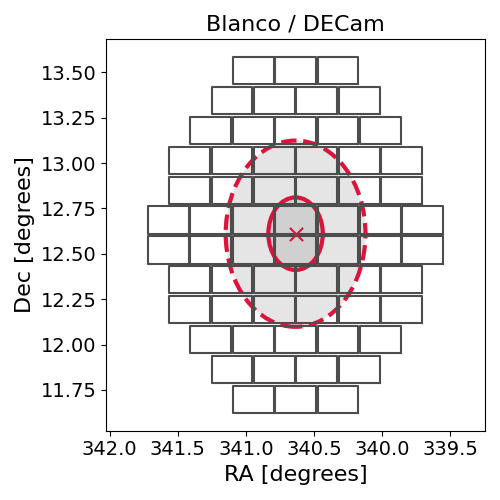
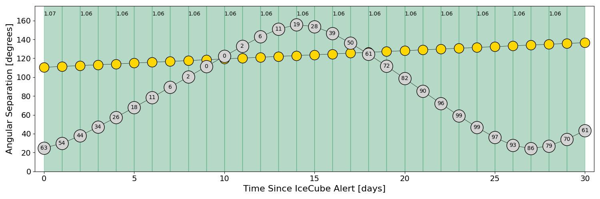
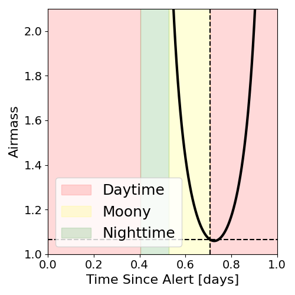
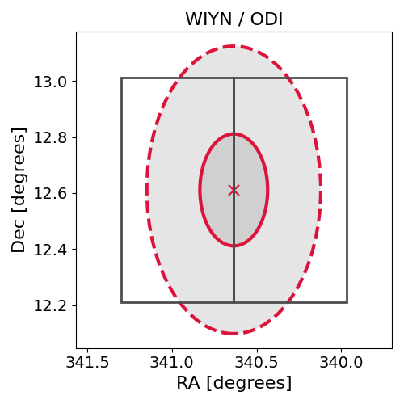

# IC210629A (135440_3139778)

### IceCube Data

| Rev | Type | Time (UTC) | Energy (TeV) | Signalness | FAR (#/yr) | 90% Area (sq. deg.) |
| --- | --- | --- | --- | --- | --- | --- |
| 0 | BRONZE | 06/29/2021  18:09:44 | 120.950 | 0.351 | 2.084500 | 0.83 |

<a href="https://gcn.gsfc.nasa.gov/gcn/notices_amon_g_b/135440_3139778.amon" target="_blank">Link to IceCube Alert Details</a>

<a href="https://rmorgan10.github.io/AlertMonitoring/IC210629A_0/CTIO_skymap.png" target="_blank">
  
</a>


## CTIO Report

**Observations Start at**  `2021/06/30 03:52:15`  **Madison Time**

<a href="https://github.com/rmorgan10/AlertMonitoring/blob/main/IC210629A_0/CTIO.json" target="_blank">Link to Observing Scripts

### Alert Diagnostics

```Event
  Event ID = IC210629A
  (ra, dec) = (340.6350, 12.6111)
Date
  Now = 2021/6/29 18:22:17 (UTC)
  Search time = 2021/6/29 18:09:44 (UTC)
  Optimal time = 2021/6/30 08:52:15 (UTC)
  Airmass at optimal time = 1.36
Sun
  Angular separation = 110.38 (deg)
  Next rising = 2021/6/30 11:39:55 (UTC)
  Next setting = 2021/6/29 21:53:45 (UTC)
Moon
  Illumination = 0.65
  Angular separation = 24.69 (deg)
  Next rising = 2021/6/30 03:12:57 (UTC)
  Next setting = 2021/6/30 16:12:56 (UTC)
  Next new moon = 2021/7/10 01:16:34 (UTC)
  Next full moon = 2021/7/24 02:36:51 (UTC)
Galactic
  (l, b) = (80.5755, -39.4333)
  E(B-V) = 0.04
```
### Observability Plots

<a href="https://rmorgan10.github.io/AlertMonitoring/IC210629A_0/CTIO_forecast.png" target="_blank">
  
</a>

<a href="https://rmorgan10.github.io/AlertMonitoring/IC210629A_0/CTIO_airmass.png" target="_blank">
  
</a>
<a href="https://rmorgan10.github.io/AlertMonitoring/IC210629A_0/CTIO_fov.png" target="_blank">
  
</a>


## KPNO Report

**Observations Start at**  `2021/06/30 06:09:12`  **Madison Time**

<a href="https://github.com/rmorgan10/AlertMonitoring/blob/main/IC210629A_0/KPNO.json" target="_blank">Link to Observing Scripts

### Alert Diagnostics

```Event
  Event ID = IC210629A
  (ra, dec) = (340.6350, 12.6111)
Date
  Now = 2021/6/29 18:22:17 (UTC)
  Search time = 2021/6/29 18:09:44 (UTC)
  Optimal time = 2021/6/30 11:09:13 (UTC)
  Airmass at optimal time = 1.07
Sun
  Angular separation = 110.47 (deg)
  Next rising = 2021/6/30 12:23:35 (UTC)
  Next setting = 2021/6/30 02:36:39 (UTC)
Moon
  Illumination = 0.64
  Angular separation = 24.90 (deg)
  Next rising = 2021/6/30 06:46:19 (UTC)
  Next setting = 2021/6/30 18:29:38 (UTC)
  Next new moon = 2021/7/10 01:16:34 (UTC)
  Next full moon = 2021/7/24 02:36:51 (UTC)
Galactic
  (l, b) = (80.5755, -39.4333)
  E(B-V) = 0.04
```
### Observability Plots

<a href="https://rmorgan10.github.io/AlertMonitoring/IC210629A_0/KPNO_forecast.png" target="_blank">
  
</a>

<a href="https://rmorgan10.github.io/AlertMonitoring/IC210629A_0/KPNO_airmass.png" target="_blank">
  
</a>
<a href="https://rmorgan10.github.io/AlertMonitoring/IC210629A_0/KPNO_fov.png" target="_blank">
  
</a>

