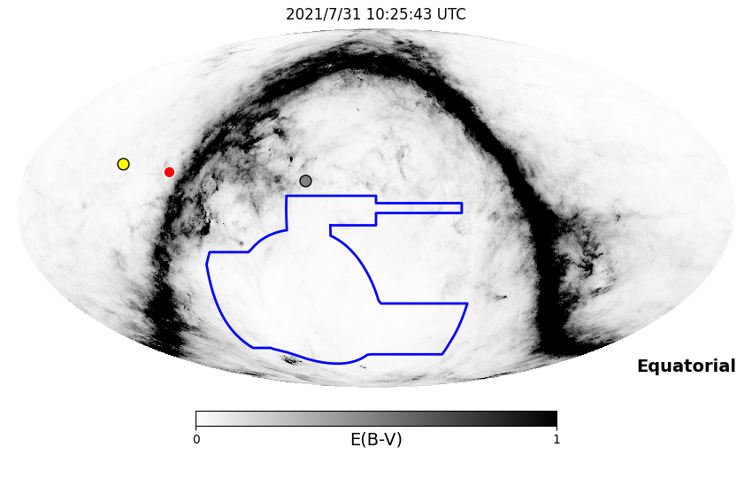
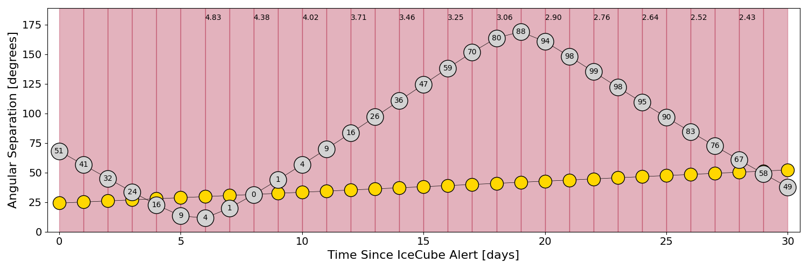
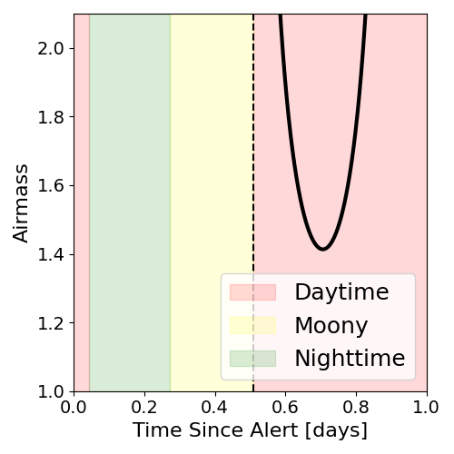
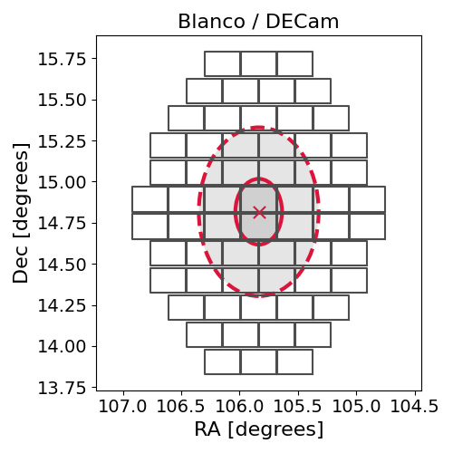
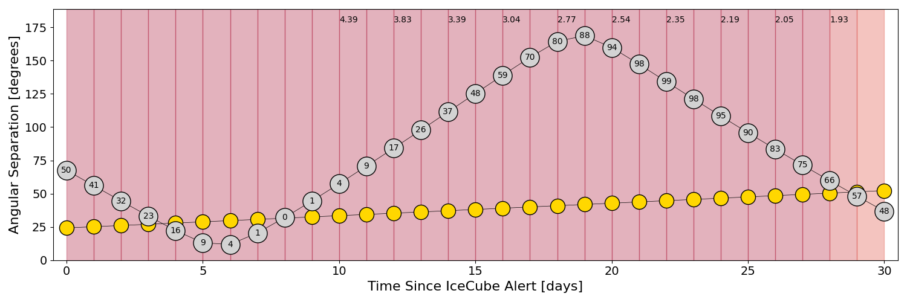
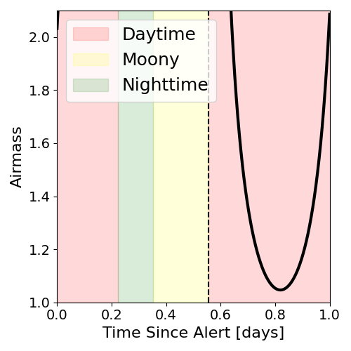
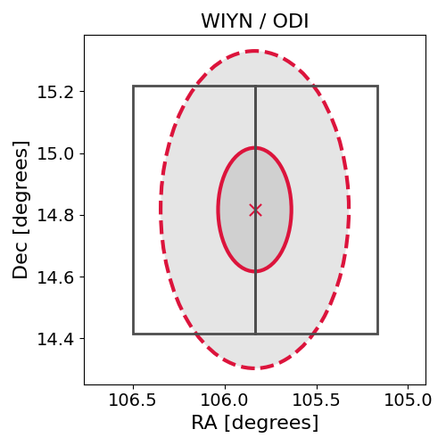

# IC210730A (135553_7213992)

### IceCube Data

| Rev | Type | Time (UTC) | Energy (TeV) | Signalness | FAR (#/yr) | 90% Area (sq. deg.) |
| --- | --- | --- | --- | --- | --- | --- |
| 0 | BRONZE | 07/30/2021  22:12:40 | 109.420 | 0.319 | 2.542100 | 0.83 |

<a href="https://gcn.gsfc.nasa.gov/gcn/notices_amon_g_b/135553_7213992.amon" target="_blank">Link to IceCube Alert Details</a>

<a href="https://rmorgan10.github.io/AlertMonitoring/IC210730A_0/CTIO_skymap.png" target="_blank">
  
</a>


## CTIO Report

**Observations Start at**  `2021/07/31 05:25:42`  **Madison Time**

<a href="https://github.com/rmorgan10/AlertMonitoring/blob/main/IC210730A_0/CTIO.json" target="_blank">Link to Observing Scripts

### Alert Diagnostics

```Event
  Event ID = IC210730A
  (ra, dec) = (105.8360, 14.8168)
Date
  Now = 2021/7/30 22:22:14 (UTC)
  Search time = 2021/7/30 22:12:41 (UTC)
  Optimal time = 2021/7/31 10:25:43 (UTC)
  Airmass at optimal time = 7.12
Sun
  Angular separation = 24.21 (deg)
  Next rising = 2021/7/31 11:29:10 (UTC)
  Next setting = 2021/7/31 22:10:18 (UTC)
Moon
  Illumination = 0.51
  Angular separation = 68.14 (deg)
  Next rising = 2021/7/31 04:43:31 (UTC)
  Next setting = 2021/7/31 16:09:00 (UTC)
  Next new moon = 2021/8/8 13:50:04 (UTC)
  Next full moon = 2021/8/22 12:01:54 (UTC)
Galactic
  (l, b) = (200.9607, 9.2815)
  E(B-V) = 0.05
```
### Observability Plots

<a href="https://rmorgan10.github.io/AlertMonitoring/IC210730A_0/CTIO_forecast.png" target="_blank">
  
</a>

<a href="https://rmorgan10.github.io/AlertMonitoring/IC210730A_0/CTIO_airmass.png" target="_blank">
  
</a>
<a href="https://rmorgan10.github.io/AlertMonitoring/IC210730A_0/CTIO_fov.png" target="_blank">
  
</a>


## KPNO Report

**Observations Start at**  `2021/07/31 06:31:31`  **Madison Time**

<a href="https://github.com/rmorgan10/AlertMonitoring/blob/main/IC210730A_0/KPNO.json" target="_blank">Link to Observing Scripts

### Alert Diagnostics

```Event
  Event ID = IC210730A
  (ra, dec) = (105.8360, 14.8168)
Date
  Now = 2021/7/30 22:22:14 (UTC)
  Search time = 2021/7/30 22:12:41 (UTC)
  Optimal time = 2021/7/31 11:31:31 (UTC)
  Airmass at optimal time = 17.93
Sun
  Angular separation = 24.25 (deg)
  Next rising = 2021/7/31 12:41:09 (UTC)
  Next setting = 2021/7/31 02:24:42 (UTC)
Moon
  Illumination = 0.51
  Angular separation = 67.61 (deg)
  Next rising = 2021/7/31 06:39:05 (UTC)
  Next setting = 2021/7/31 20:01:59 (UTC)
  Next new moon = 2021/8/8 13:50:04 (UTC)
  Next full moon = 2021/8/22 12:01:54 (UTC)
Galactic
  (l, b) = (200.9607, 9.2815)
  E(B-V) = 0.05
```
### Observability Plots

<a href="https://rmorgan10.github.io/AlertMonitoring/IC210730A_0/KPNO_forecast.png" target="_blank">
  
</a>

<a href="https://rmorgan10.github.io/AlertMonitoring/IC210730A_0/KPNO_airmass.png" target="_blank">
  
</a>
<a href="https://rmorgan10.github.io/AlertMonitoring/IC210730A_0/KPNO_fov.png" target="_blank">
  
</a>

