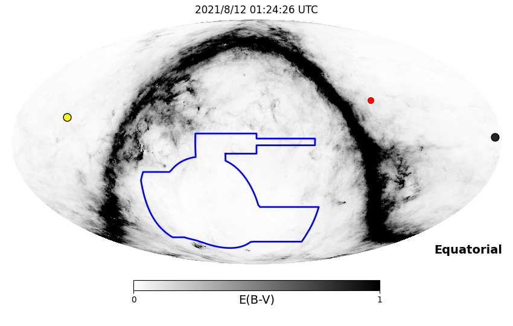
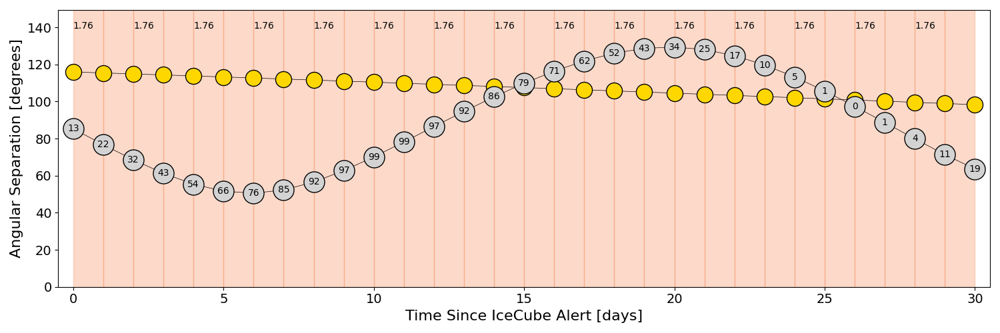
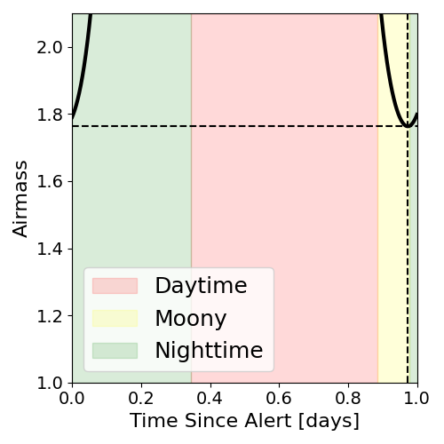
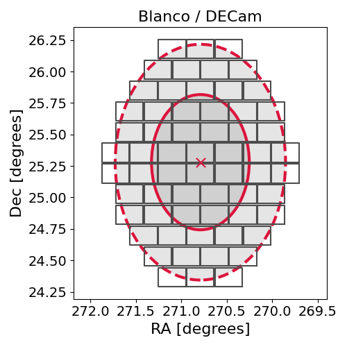
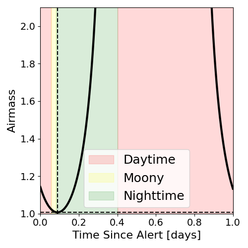
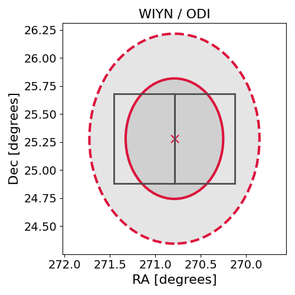

# IC210811A (135591_36044887)

### IceCube Data

| Rev | Type | Time (UTC) | Energy (TeV) | Signalness | FAR (#/yr) | 90% Area (sq. deg.) |
| --- | --- | --- | --- | --- | --- | --- |
| 1 | GOLD | 08/11/2021  02:02:44 | 217.670 | 0.658 | 0.693900 | 2.75 |

<a href="https://gcn.gsfc.nasa.gov/gcn/notices_amon_g_b/135591_36044887.amon" target="_blank">Link to IceCube Alert Details</a>

<a href="https://rmorgan10.github.io/AlertMonitoring/IC210811A_1/CTIO_skymap.png" target="_blank">
  
</a>


## CTIO Report

**Observations Start at**  `2021/08/11 20:24:25`  **Madison Time**

<a href="https://github.com/rmorgan10/AlertMonitoring/blob/main/IC210811A_1/CTIO.json" target="_blank">Link to Observing Scripts

### Alert Diagnostics

```Event
  Event ID = IC210811A
  (ra, dec) = (270.7900, 25.2800)
Date
  Now = 2021/8/11 04:12:15 (UTC)
  Search time = 2021/8/11 02:02:44 (UTC)
  Optimal time = 2021/8/12 01:24:26 (UTC)
  Airmass at optimal time = 1.76
Sun
  Angular separation = 115.93 (deg)
  Next rising = 2021/8/11 11:20:18 (UTC)
  Next setting = 2021/8/11 22:16:47 (UTC)
Moon
  Illumination = 0.14
  Angular separation = 85.29 (deg)
  Next rising = 2021/8/11 13:30:10 (UTC)
  Next setting = 2021/8/12 01:31:39 (UTC)
  Next new moon = 2021/9/7 00:51:42 (UTC)
  Next full moon = 2021/8/22 12:01:54 (UTC)
Galactic
  (l, b) = (51.3144, 21.2844)
  E(B-V) = 0.03
```
### Observability Plots

<a href="https://rmorgan10.github.io/AlertMonitoring/IC210811A_1/CTIO_forecast.png" target="_blank">
  
</a>

<a href="https://rmorgan10.github.io/AlertMonitoring/IC210811A_1/CTIO_airmass.png" target="_blank">
  
</a>
<a href="https://rmorgan10.github.io/AlertMonitoring/IC210811A_1/CTIO_fov.png" target="_blank">
  
</a>


## KPNO Report

**Observations Start at**  `2021/08/10 23:11:03`  **Madison Time**

<a href="https://github.com/rmorgan10/AlertMonitoring/blob/main/IC210811A_1/KPNO.json" target="_blank">Link to Observing Scripts

### Alert Diagnostics

```Event
  Event ID = IC210811A
  (ra, dec) = (270.7900, 25.2800)
Date
  Now = 2021/8/11 04:12:15 (UTC)
  Search time = 2021/8/11 02:02:44 (UTC)
  Optimal time = 2021/8/11 04:11:03 (UTC)
  Airmass at optimal time = 1.01
Sun
  Angular separation = 116.39 (deg)
  Next rising = 2021/8/11 12:48:25 (UTC)
  Next setting = 2021/8/11 02:15:08 (UTC)
Moon
  Illumination = 0.08
  Angular separation = 92.97 (deg)
  Next rising = 2021/8/11 15:50:42 (UTC)
  Next setting = 2021/8/11 04:01:11 (UTC)
  Next new moon = 2021/9/7 00:51:42 (UTC)
  Next full moon = 2021/8/22 12:01:54 (UTC)
Galactic
  (l, b) = (51.3144, 21.2844)
  E(B-V) = 0.03
```
### Observability Plots

<a href="https://rmorgan10.github.io/AlertMonitoring/IC210811A_1/KPNO_forecast.png" target="_blank">
  
</a>

<a href="https://rmorgan10.github.io/AlertMonitoring/IC210811A_1/KPNO_airmass.png" target="_blank">
  
</a>
<a href="https://rmorgan10.github.io/AlertMonitoring/IC210811A_1/KPNO_fov.png" target="_blank">
  
</a>

