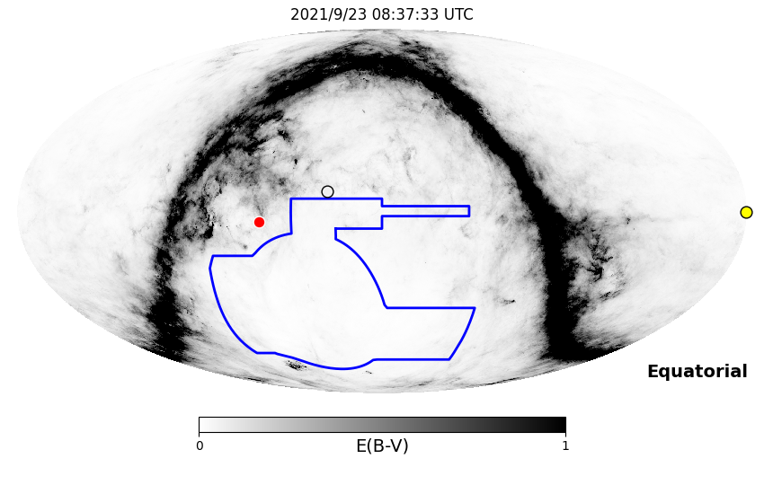
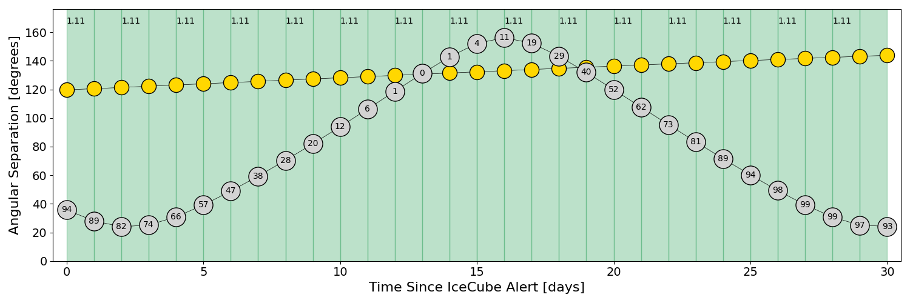
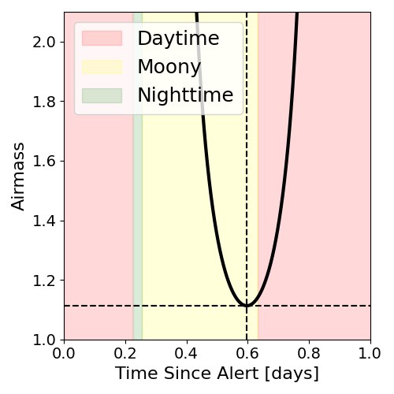
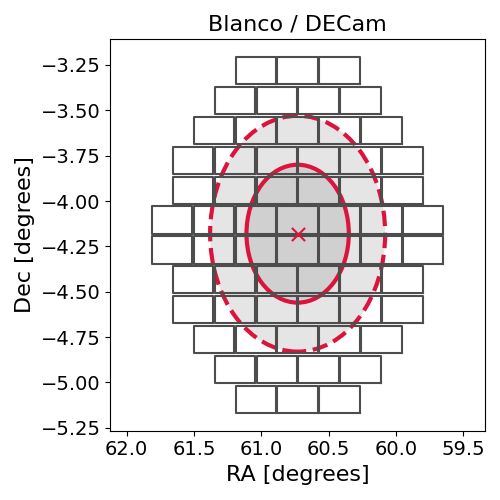
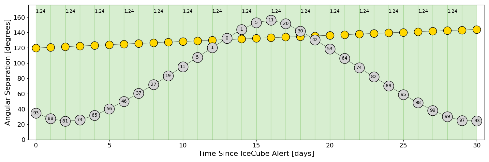
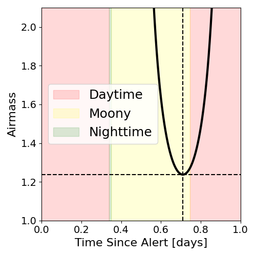
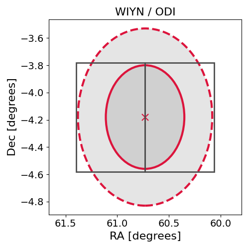

# IC210922A (135736_30987826)

### IceCube Data

| Rev | Type | Time (UTC) | Energy (TeV) | Signalness | FAR (#/yr) | 90% Area (sq. deg.) |
| --- | --- | --- | --- | --- | --- | --- |
| 1 | GOLD | 09/22/2021  18:17:20 | 750.760 | 0.925 | 0.147200 | 1.33 |

<a href="https://gcn.gsfc.nasa.gov/gcn/notices_amon_g_b/135736_30987826.amon" target="_blank">Link to IceCube Alert Details</a>

<a href="https://rmorgan10.github.io/AlertMonitoring/IC210922A_1/CTIO_skymap.png" target="_blank">
  
</a>


## CTIO Report

**Observations Start at**  `2021/09/23 03:37:32`  **Madison Time**

<a href="https://github.com/rmorgan10/AlertMonitoring/blob/main/IC210922A_1/CTIO.json" target="_blank">Link to Observing Scripts

### Alert Diagnostics

```Event
  Event ID = IC210922A
  (ra, dec) = (60.7299, -4.1799)
Date
  Now = 2021/9/22 19:52:17 (UTC)
  Search time = 2021/9/22 18:17:21 (UTC)
  Optimal time = 2021/9/23 08:37:33 (UTC)
  Airmass at optimal time = 1.11
Sun
  Angular separation = 119.66 (deg)
  Next rising = 2021/9/23 10:30:52 (UTC)
  Next setting = 2021/9/22 22:39:55 (UTC)
Moon
  Illumination = 0.94
  Angular separation = 35.75 (deg)
  Next rising = 2021/9/23 00:22:14 (UTC)
  Next setting = 2021/9/23 12:06:57 (UTC)
  Next new moon = 2021/10/6 11:05:20 (UTC)
  Next full moon = 2021/10/20 14:56:38 (UTC)
Galactic
  (l, b) = (194.9413, -38.9514)
  E(B-V) = 0.06
```
### Observability Plots

<a href="https://rmorgan10.github.io/AlertMonitoring/IC210922A_1/CTIO_forecast.png" target="_blank">
  
</a>

<a href="https://rmorgan10.github.io/AlertMonitoring/IC210922A_1/CTIO_airmass.png" target="_blank">
  
</a>
<a href="https://rmorgan10.github.io/AlertMonitoring/IC210922A_1/CTIO_fov.png" target="_blank">
  
</a>


## KPNO Report

**Observations Start at**  `2021/09/23 06:20:16`  **Madison Time**

<a href="https://github.com/rmorgan10/AlertMonitoring/blob/main/IC210922A_1/KPNO.json" target="_blank">Link to Observing Scripts

### Alert Diagnostics

```Event
  Event ID = IC210922A
  (ra, dec) = (60.7299, -4.1799)
Date
  Now = 2021/9/22 19:52:17 (UTC)
  Search time = 2021/9/22 18:17:21 (UTC)
  Optimal time = 2021/9/23 11:20:17 (UTC)
  Airmass at optimal time = 1.24
Sun
  Angular separation = 119.76 (deg)
  Next rising = 2021/9/23 13:15:12 (UTC)
  Next setting = 2021/9/23 01:22:44 (UTC)
Moon
  Illumination = 0.94
  Angular separation = 34.76 (deg)
  Next rising = 2021/9/23 02:38:05 (UTC)
  Next setting = 2021/9/23 15:40:38 (UTC)
  Next new moon = 2021/10/6 11:05:20 (UTC)
  Next full moon = 2021/10/20 14:56:38 (UTC)
Galactic
  (l, b) = (194.9413, -38.9514)
  E(B-V) = 0.06
```
### Observability Plots

<a href="https://rmorgan10.github.io/AlertMonitoring/IC210922A_1/KPNO_forecast.png" target="_blank">
  
</a>

<a href="https://rmorgan10.github.io/AlertMonitoring/IC210922A_1/KPNO_airmass.png" target="_blank">
  
</a>
<a href="https://rmorgan10.github.io/AlertMonitoring/IC210922A_1/KPNO_fov.png" target="_blank">
  
</a>

