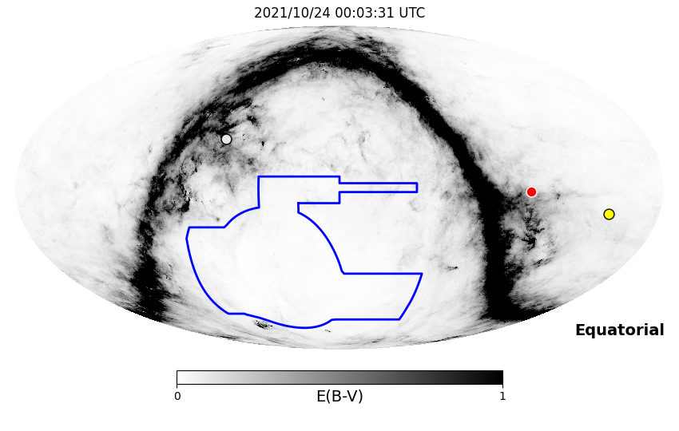
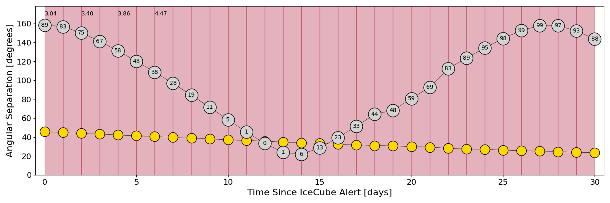
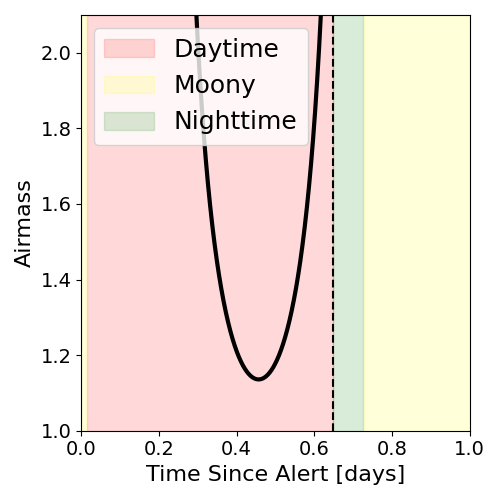
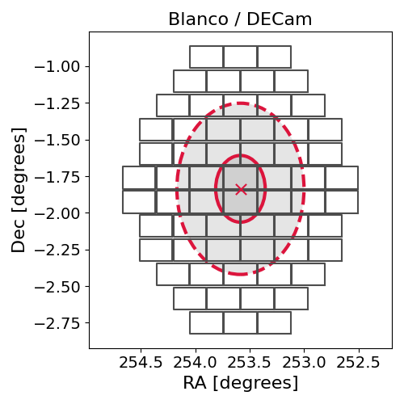
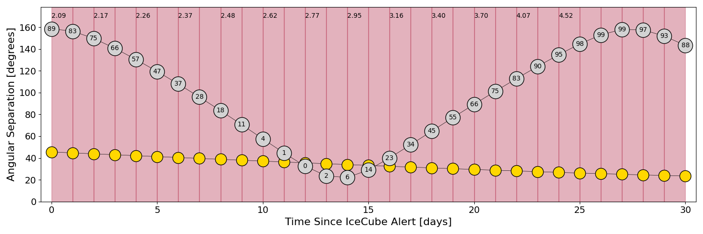
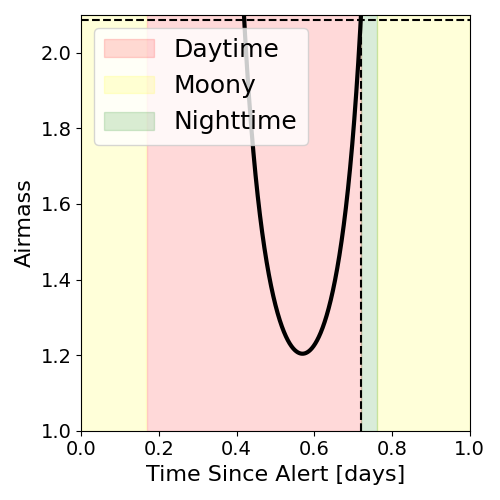
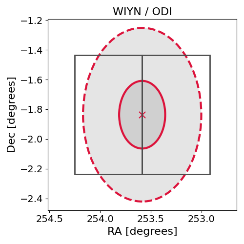

# IC211023A (135832_55176071)

### IceCube Data

| Rev | Type | Time (UTC) | Energy (TeV) | Signalness | FAR (#/yr) | 90% Area (sq. deg.) |
| --- | --- | --- | --- | --- | --- | --- |
| 0 | BRONZE | 10/23/2021  08:31:18 | 120.640 | 0.326 | 3.204800 | 1.07 |

<a href="https://gcn.gsfc.nasa.gov/gcn/notices_amon_g_b/135832_55176071.amon" target="_blank">Link to IceCube Alert Details</a>

<a href="https://rmorgan10.github.io/AlertMonitoring/IC211023A_0/CTIO_skymap.png" target="_blank">
  
</a>


## CTIO Report

**Observations Start at**  `2021/10/23 19:03:30`  **Madison Time**

<a href="https://github.com/rmorgan10/AlertMonitoring/blob/main/IC211023A_0/CTIO.json" target="_blank">Link to Observing Scripts

### Alert Diagnostics

```Event
  Event ID = IC211023A
  (ra, dec) = (253.5841, -1.8364)
Date
  Now = 2021/10/23 08:42:16 (UTC)
  Search time = 2021/10/23 08:31:18 (UTC)
  Optimal time = 2021/10/24 00:03:31 (UTC)
  Airmass at optimal time = 3.04
Sun
  Angular separation = 45.61 (deg)
  Next rising = 2021/10/23 09:56:01 (UTC)
  Next setting = 2021/10/23 22:59:25 (UTC)
Moon
  Illumination = 0.90
  Angular separation = 158.39 (deg)
  Next rising = 2021/10/24 01:56:16 (UTC)
  Next setting = 2021/10/23 11:43:20 (UTC)
  Next new moon = 2021/11/4 21:14:34 (UTC)
  Next full moon = 2021/11/19 08:57:26 (UTC)
Galactic
  (l, b) = (16.8474, 24.8583)
  E(B-V) = 0.04
```
### Observability Plots

<a href="https://rmorgan10.github.io/AlertMonitoring/IC211023A_0/CTIO_forecast.png" target="_blank">
  
</a>

<a href="https://rmorgan10.github.io/AlertMonitoring/IC211023A_0/CTIO_airmass.png" target="_blank">
  
</a>
<a href="https://rmorgan10.github.io/AlertMonitoring/IC211023A_0/CTIO_fov.png" target="_blank">
  
</a>


## KPNO Report

**Observations Start at**  `2021/10/23 20:47:46`  **Madison Time**

<a href="https://github.com/rmorgan10/AlertMonitoring/blob/main/IC211023A_0/KPNO.json" target="_blank">Link to Observing Scripts

### Alert Diagnostics

```Event
  Event ID = IC211023A
  (ra, dec) = (253.5841, -1.8364)
Date
  Now = 2021/10/23 08:42:16 (UTC)
  Search time = 2021/10/23 08:31:18 (UTC)
  Optimal time = 2021/10/24 01:47:47 (UTC)
  Airmass at optimal time = 2.09
Sun
  Angular separation = 45.55 (deg)
  Next rising = 2021/10/23 13:35:47 (UTC)
  Next setting = 2021/10/24 00:45:03 (UTC)
Moon
  Illumination = 0.89
  Angular separation = 158.47 (deg)
  Next rising = 2021/10/24 02:45:38 (UTC)
  Next setting = 2021/10/23 16:21:22 (UTC)
  Next new moon = 2021/11/4 21:14:34 (UTC)
  Next full moon = 2021/11/19 08:57:26 (UTC)
Galactic
  (l, b) = (16.8474, 24.8583)
  E(B-V) = 0.04
```
### Observability Plots

<a href="https://rmorgan10.github.io/AlertMonitoring/IC211023A_0/KPNO_forecast.png" target="_blank">
  
</a>

<a href="https://rmorgan10.github.io/AlertMonitoring/IC211023A_0/KPNO_airmass.png" target="_blank">
  
</a>
<a href="https://rmorgan10.github.io/AlertMonitoring/IC211023A_0/KPNO_fov.png" target="_blank">
  
</a>

