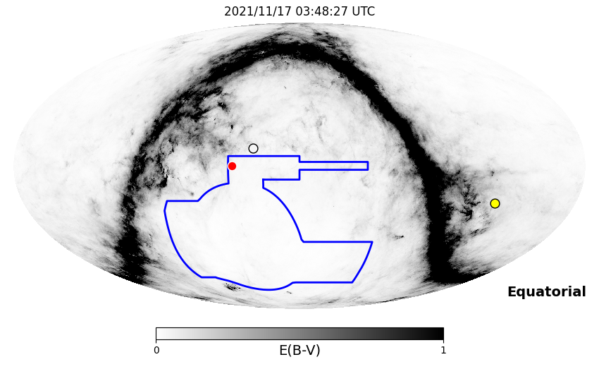
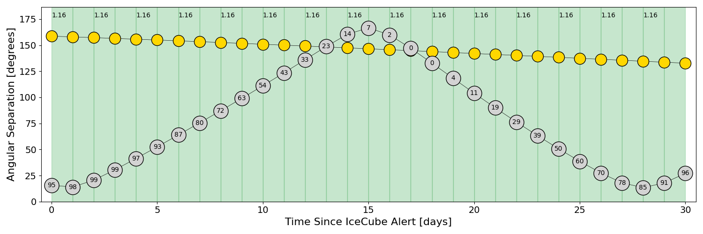
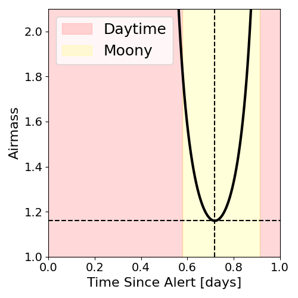
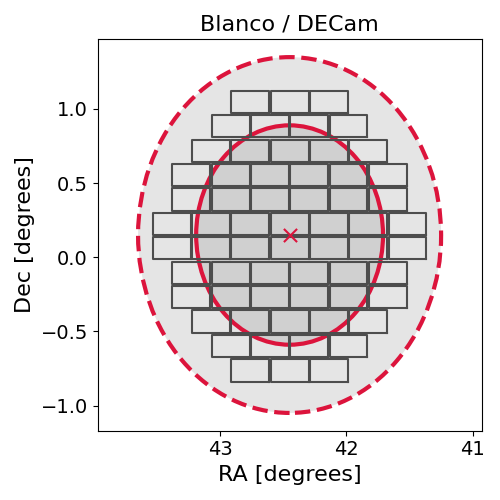
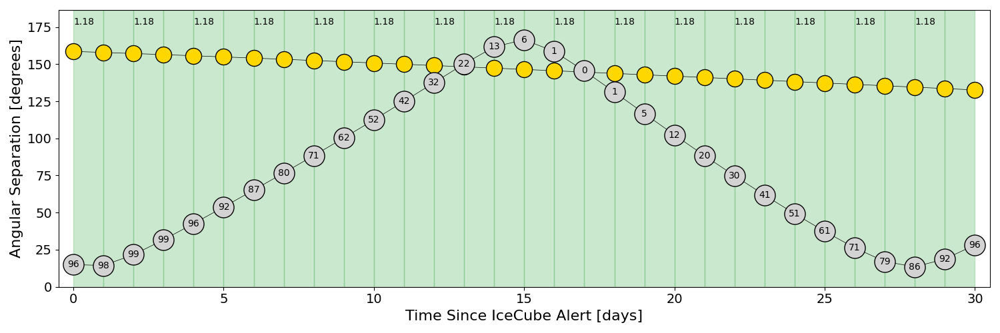
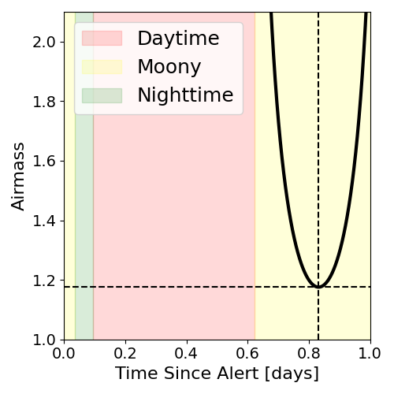
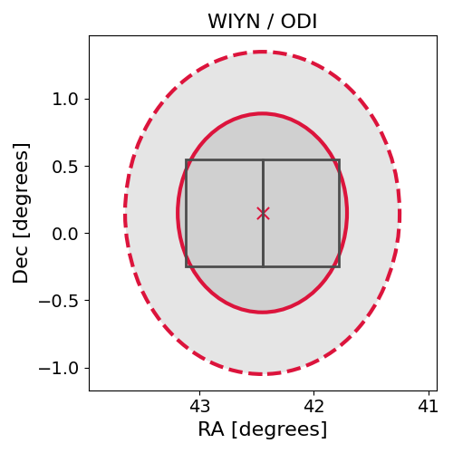

# IC211116A (135906_30719293)

### IceCube Data

| Rev | Type | Time (UTC) | Energy (TeV) | Signalness | FAR (#/yr) | 90% Area (sq. deg.) |
| --- | --- | --- | --- | --- | --- | --- |
| 1 | BRONZE | 11/16/2021  10:33:16 | 161.320 | 0.402 | 1.940400 | 4.52 |

<a href="https://gcn.gsfc.nasa.gov/gcn/notices_amon_g_b/135906_30719293.amon" target="_blank">Link to IceCube Alert Details</a>

<a href="https://rmorgan10.github.io/AlertMonitoring/IC211116A_1/CTIO_skymap.png" target="_blank">
  
</a>


## CTIO Report

**Observations Start at**  `2021/11/16 22:48:26`  **Madison Time**

<a href="https://github.com/rmorgan10/AlertMonitoring/blob/main/IC211116A_1/CTIO.json" target="_blank">Link to Observing Scripts

### Alert Diagnostics

```Event
  Event ID = IC211116A
  (ra, dec) = (42.4500, 0.1499)
Date
  Now = 2021/11/16 13:27:12 (UTC)
  Search time = 2021/11/16 10:33:16 (UTC)
  Optimal time = 2021/11/17 03:48:27 (UTC)
  Airmass at optimal time = 1.16
Sun
  Angular separation = 158.64 (deg)
  Next rising = 2021/11/17 09:37:22 (UTC)
  Next setting = 2021/11/16 23:18:40 (UTC)
Moon
  Illumination = 0.96
  Angular separation = 15.66 (deg)
  Next rising = 2021/11/16 21:02:51 (UTC)
  Next setting = 2021/11/17 08:39:56 (UTC)
  Next new moon = 2021/12/4 07:42:59 (UTC)
  Next full moon = 2021/11/19 08:57:26 (UTC)
Galactic
  (l, b) = (174.0041, -50.5985)
  E(B-V) = 0.06
```
### Observability Plots

<a href="https://rmorgan10.github.io/AlertMonitoring/IC211116A_1/CTIO_forecast.png" target="_blank">
  
</a>

<a href="https://rmorgan10.github.io/AlertMonitoring/IC211116A_1/CTIO_airmass.png" target="_blank">
  
</a>
<a href="https://rmorgan10.github.io/AlertMonitoring/IC211116A_1/CTIO_fov.png" target="_blank">
  
</a>


## KPNO Report

**Observations Start at**  `2021/11/17 01:31:10`  **Madison Time**

<a href="https://github.com/rmorgan10/AlertMonitoring/blob/main/IC211116A_1/KPNO.json" target="_blank">Link to Observing Scripts

### Alert Diagnostics

```Event
  Event ID = IC211116A
  (ra, dec) = (42.4500, 0.1499)
Date
  Now = 2021/11/16 13:27:12 (UTC)
  Search time = 2021/11/16 10:33:16 (UTC)
  Optimal time = 2021/11/17 06:31:11 (UTC)
  Airmass at optimal time = 1.18
Sun
  Angular separation = 158.56 (deg)
  Next rising = 2021/11/16 13:55:57 (UTC)
  Next setting = 2021/11/17 00:26:14 (UTC)
Moon
  Illumination = 0.96
  Angular separation = 15.01 (deg)
  Next rising = 2021/11/16 23:10:52 (UTC)
  Next setting = 2021/11/16 11:25:24 (UTC)
  Next new moon = 2021/12/4 07:42:59 (UTC)
  Next full moon = 2021/11/19 08:57:26 (UTC)
Galactic
  (l, b) = (174.0041, -50.5985)
  E(B-V) = 0.06
```
### Observability Plots

<a href="https://rmorgan10.github.io/AlertMonitoring/IC211116A_1/KPNO_forecast.png" target="_blank">
  
</a>

<a href="https://rmorgan10.github.io/AlertMonitoring/IC211116A_1/KPNO_airmass.png" target="_blank">
  
</a>
<a href="https://rmorgan10.github.io/AlertMonitoring/IC211116A_1/KPNO_fov.png" target="_blank">
  
</a>

