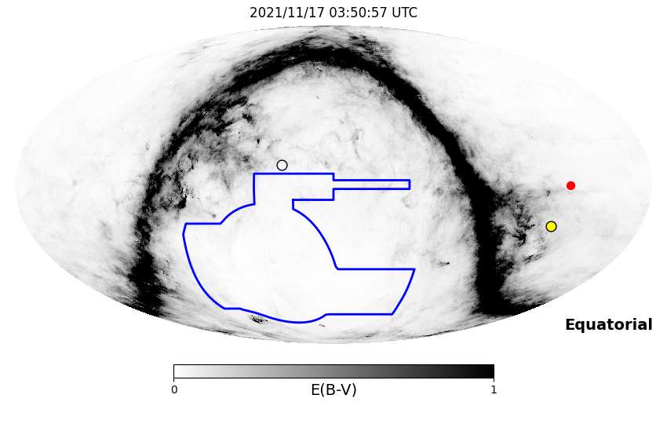
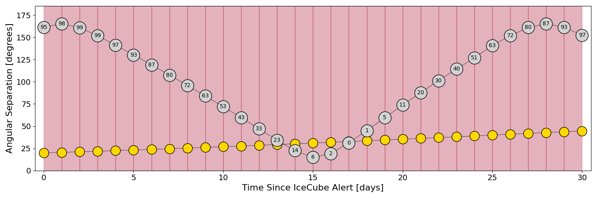
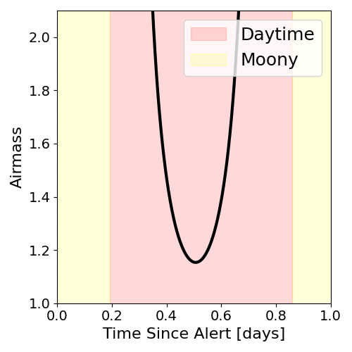
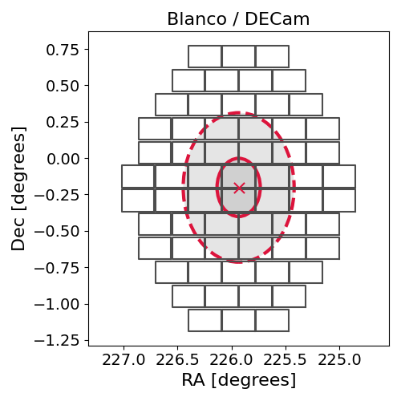
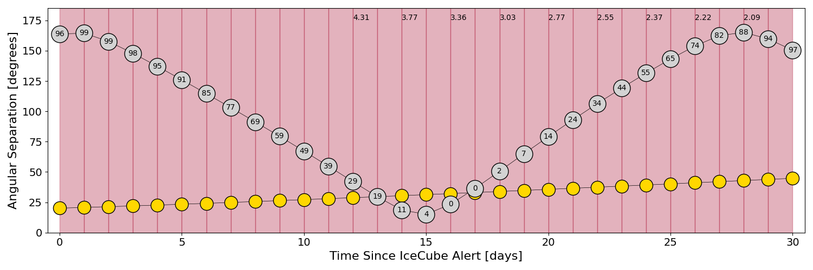
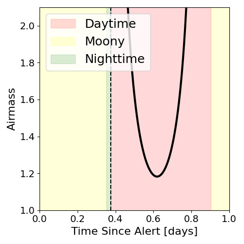
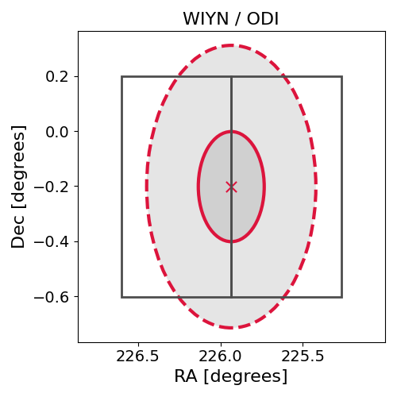

# IC211117A (135908_43512334)

### IceCube Data

| Rev | Type | Time (UTC) | Energy (TeV) | Signalness | FAR (#/yr) | 90% Area (sq. deg.) |
| --- | --- | --- | --- | --- | --- | --- |
| 0 | GOLD | 11/17/2021  03:50:57 | 195.030 | 0.526 | 1.165500 | 0.83 |

<a href="https://gcn.gsfc.nasa.gov/gcn/notices_amon_g_b/135908_43512334.amon" target="_blank">Link to IceCube Alert Details</a>

<a href="https://rmorgan10.github.io/AlertMonitoring/IC211117A_0/CTIO_skymap.png" target="_blank">
  
</a>


## CTIO Report

**Observations Start at**  `2021/11/16 22:50:57`  **Madison Time**

<a href="https://github.com/rmorgan10/AlertMonitoring/blob/main/IC211117A_0/CTIO.json" target="_blank">Link to Observing Scripts

### Alert Diagnostics

```Event
  Event ID = IC211117A
  (ra, dec) = (225.9338, -0.2016)
Date
  Now = 2021/11/17 04:02:15 (UTC)
  Search time = 2021/11/17 03:50:57 (UTC)
  Optimal time = 2021/11/17 03:50:57 (UTC)
  Airmass at optimal time = 999.00
Sun
  Angular separation = 19.94 (deg)
  Next rising = 2021/11/17 09:37:22 (UTC)
  Next setting = 2021/11/17 23:19:31 (UTC)
Moon
  Illumination = 0.96
  Angular separation = 161.44 (deg)
  Next rising = 2021/11/17 21:57:44 (UTC)
  Next setting = 2021/11/17 08:39:56 (UTC)
  Next new moon = 2021/12/4 07:42:59 (UTC)
  Next full moon = 2021/11/19 08:57:26 (UTC)
Galactic
  (l, b) = (357.7136, 48.0877)
  E(B-V) = 0.04
```
### Observability Plots

<a href="https://rmorgan10.github.io/AlertMonitoring/IC211117A_0/CTIO_forecast.png" target="_blank">
  
</a>

<a href="https://rmorgan10.github.io/AlertMonitoring/IC211117A_0/CTIO_airmass.png" target="_blank">
  
</a>
<a href="https://rmorgan10.github.io/AlertMonitoring/IC211117A_0/CTIO_fov.png" target="_blank">
  
</a>


## KPNO Report

**Observations Start at**  `2021/11/17 07:51:43`  **Madison Time**

<a href="https://github.com/rmorgan10/AlertMonitoring/blob/main/IC211117A_0/KPNO.json" target="_blank">Link to Observing Scripts

### Alert Diagnostics

```Event
  Event ID = IC211117A
  (ra, dec) = (225.9338, -0.2016)
Date
  Now = 2021/11/17 04:02:15 (UTC)
  Search time = 2021/11/17 03:50:57 (UTC)
  Optimal time = 2021/11/17 12:51:44 (UTC)
  Airmass at optimal time = 38.70
Sun
  Angular separation = 20.15 (deg)
  Next rising = 2021/11/17 13:56:49 (UTC)
  Next setting = 2021/11/18 00:25:45 (UTC)
Moon
  Illumination = 0.97
  Angular separation = 163.79 (deg)
  Next rising = 2021/11/17 23:39:30 (UTC)
  Next setting = 2021/11/17 12:21:09 (UTC)
  Next new moon = 2021/12/4 07:42:59 (UTC)
  Next full moon = 2021/11/19 08:57:26 (UTC)
Galactic
  (l, b) = (357.7136, 48.0877)
  E(B-V) = 0.04
```
### Observability Plots

<a href="https://rmorgan10.github.io/AlertMonitoring/IC211117A_0/KPNO_forecast.png" target="_blank">
  
</a>

<a href="https://rmorgan10.github.io/AlertMonitoring/IC211117A_0/KPNO_airmass.png" target="_blank">
  
</a>
<a href="https://rmorgan10.github.io/AlertMonitoring/IC211117A_0/KPNO_fov.png" target="_blank">
  
</a>

