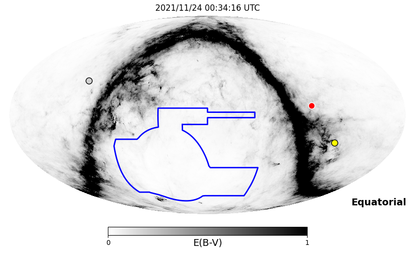
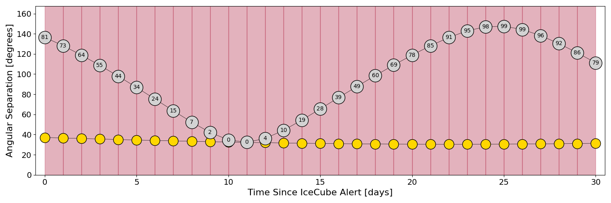
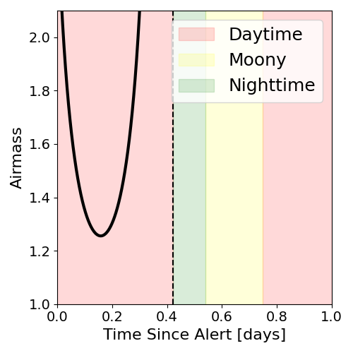
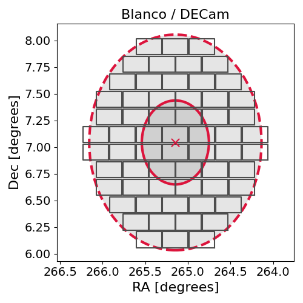
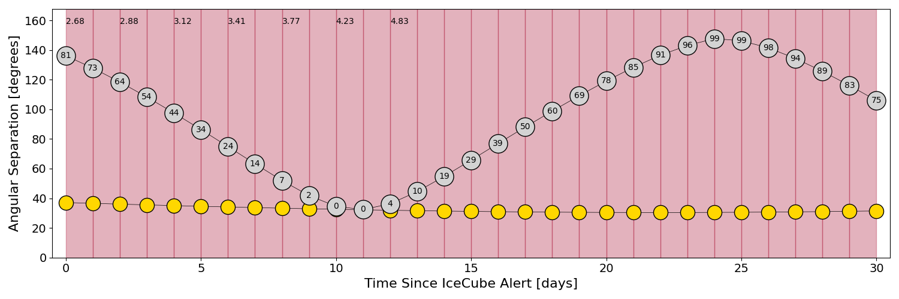
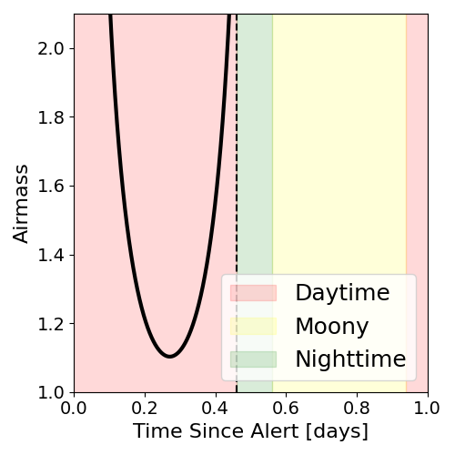
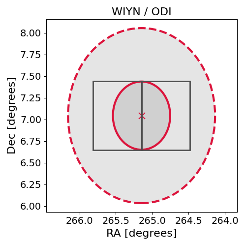

# IC211123A (135930_15193553)

### IceCube Data

| Rev | Type | Time (UTC) | Energy (TeV) | Signalness | FAR (#/yr) | 90% Area (sq. deg.) |
| --- | --- | --- | --- | --- | --- | --- |
| 0 | BRONZE | 11/23/2021  14:25:22 | 142.070 | 0.356 | 2.566800 | 3.21 |

<a href="https://gcn.gsfc.nasa.gov/gcn/notices_amon_g_b/135930_15193553.amon" target="_blank">Link to IceCube Alert Details</a>

<a href="https://rmorgan10.github.io/AlertMonitoring/IC211123A_0/CTIO_skymap.png" target="_blank">
  
</a>


## CTIO Report

**Observations Start at**  `2021/11/23 19:34:16`  **Madison Time**

<a href="https://github.com/rmorgan10/AlertMonitoring/blob/main/IC211123A_0/CTIO.json" target="_blank">Link to Observing Scripts

### Alert Diagnostics

```Event
  Event ID = IC211123A
  (ra, dec) = (265.1466, 7.0443)
Date
  Now = 2021/11/23 16:37:15 (UTC)
  Search time = 2021/11/23 14:25:23 (UTC)
  Optimal time = 2021/11/24 00:34:16 (UTC)
  Airmass at optimal time = 999.00
Sun
  Angular separation = 37.15 (deg)
  Next rising = 2021/11/24 09:34:52 (UTC)
  Next setting = 2021/11/23 23:24:37 (UTC)
Moon
  Illumination = 0.82
  Angular separation = 136.43 (deg)
  Next rising = 2021/11/24 03:19:50 (UTC)
  Next setting = 2021/11/24 13:33:32 (UTC)
  Next new moon = 2021/12/4 07:42:59 (UTC)
  Next full moon = 2021/12/19 04:35:29 (UTC)
Galactic
  (l, b) = (31.2028, 18.9445)
  E(B-V) = 0.06
```
### Observability Plots

<a href="https://rmorgan10.github.io/AlertMonitoring/IC211123A_0/CTIO_forecast.png" target="_blank">
  
</a>

<a href="https://rmorgan10.github.io/AlertMonitoring/IC211123A_0/CTIO_airmass.png" target="_blank">
  
</a>
<a href="https://rmorgan10.github.io/AlertMonitoring/IC211123A_0/CTIO_fov.png" target="_blank">
  
</a>


## KPNO Report

**Observations Start at**  `2021/11/23 20:29:16`  **Madison Time**

<a href="https://github.com/rmorgan10/AlertMonitoring/blob/main/IC211123A_0/KPNO.json" target="_blank">Link to Observing Scripts

### Alert Diagnostics

```Event
  Event ID = IC211123A
  (ra, dec) = (265.1466, 7.0443)
Date
  Now = 2021/11/23 16:37:15 (UTC)
  Search time = 2021/11/23 14:25:23 (UTC)
  Optimal time = 2021/11/24 01:29:17 (UTC)
  Airmass at optimal time = 2.68
Sun
  Angular separation = 37.13 (deg)
  Next rising = 2021/11/24 14:02:58 (UTC)
  Next setting = 2021/11/24 00:23:28 (UTC)
Moon
  Illumination = 0.82
  Angular separation = 136.14 (deg)
  Next rising = 2021/11/24 03:50:38 (UTC)
  Next setting = 2021/11/23 17:49:33 (UTC)
  Next new moon = 2021/12/4 07:42:59 (UTC)
  Next full moon = 2021/12/19 04:35:29 (UTC)
Galactic
  (l, b) = (31.2028, 18.9445)
  E(B-V) = 0.06
```
### Observability Plots

<a href="https://rmorgan10.github.io/AlertMonitoring/IC211123A_0/KPNO_forecast.png" target="_blank">
  
</a>

<a href="https://rmorgan10.github.io/AlertMonitoring/IC211123A_0/KPNO_airmass.png" target="_blank">
  
</a>
<a href="https://rmorgan10.github.io/AlertMonitoring/IC211123A_0/KPNO_fov.png" target="_blank">
  
</a>

