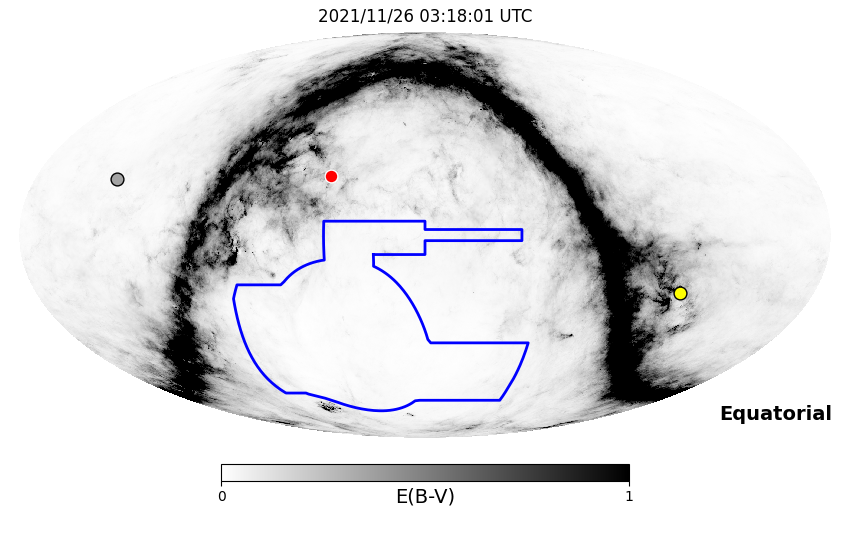
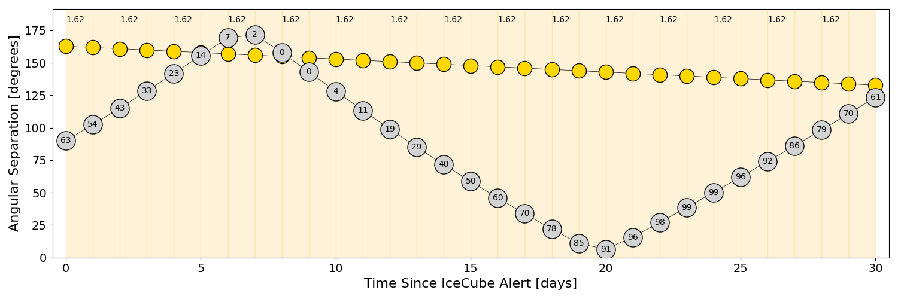
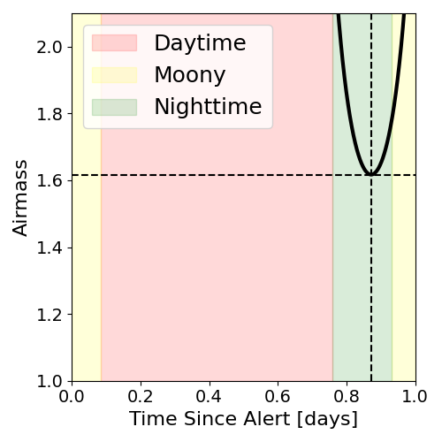
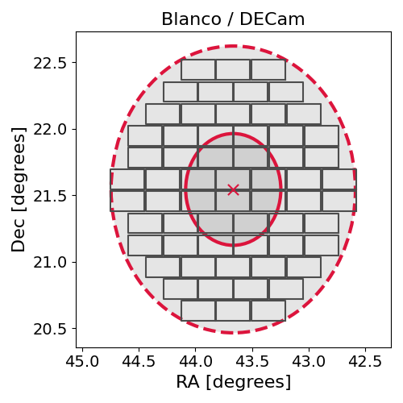
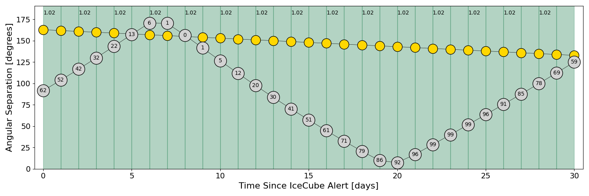
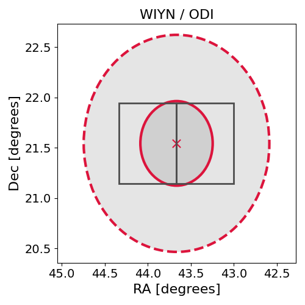

# IC211125A (135936_74588253)

### IceCube Data

| Rev | Type | Time (UTC) | Energy (TeV) | Signalness | FAR (#/yr) | 90% Area (sq. deg.) |
| --- | --- | --- | --- | --- | --- | --- |
| 0 | BRONZE | 11/25/2021  06:22:21 | 117.490 | 0.390 | 1.972900 | 3.65 |

<a href="https://gcn.gsfc.nasa.gov/gcn/notices_amon_g_b/135936_74588253.amon" target="_blank">Link to IceCube Alert Details</a>

<a href="https://rmorgan10.github.io/AlertMonitoring/IC211125A_0/CTIO_skymap.png" target="_blank">
  
</a>


## CTIO Report

**Observations Start at**  `2021/11/25 22:18:01`  **Madison Time**

<a href="https://github.com/rmorgan10/AlertMonitoring/blob/main/IC211125A_0/CTIO.json" target="_blank">Link to Observing Scripts

### Alert Diagnostics

```Event
  Event ID = IC211125A
  (ra, dec) = (43.6660, 21.5423)
Date
  Now = 2021/11/25 06:32:13 (UTC)
  Search time = 2021/11/25 06:22:22 (UTC)
  Optimal time = 2021/11/26 03:18:01 (UTC)
  Airmass at optimal time = 1.62
Sun
  Angular separation = 162.84 (deg)
  Next rising = 2021/11/25 09:34:37 (UTC)
  Next setting = 2021/11/25 23:26:18 (UTC)
Moon
  Illumination = 0.64
  Angular separation = 90.05 (deg)
  Next rising = 2021/11/26 04:42:49 (UTC)
  Next setting = 2021/11/25 14:30:45 (UTC)
  Next new moon = 2021/12/4 07:42:59 (UTC)
  Next full moon = 2021/12/19 04:35:29 (UTC)
Galactic
  (l, b) = (157.5106, -32.9279)
  E(B-V) = 0.03
```
### Observability Plots

<a href="https://rmorgan10.github.io/AlertMonitoring/IC211125A_0/CTIO_forecast.png" target="_blank">
  
</a>

<a href="https://rmorgan10.github.io/AlertMonitoring/IC211125A_0/CTIO_airmass.png" target="_blank">
  
</a>
<a href="https://rmorgan10.github.io/AlertMonitoring/IC211125A_0/CTIO_fov.png" target="_blank">
  
</a>


## KPNO Report

**Observations Start at**  `2021/11/26 01:00:45`  **Madison Time**

<a href="https://github.com/rmorgan10/AlertMonitoring/blob/main/IC211125A_0/KPNO.json" target="_blank">Link to Observing Scripts

### Alert Diagnostics

```Event
  Event ID = IC211125A
  (ra, dec) = (43.6660, 21.5423)
Date
  Now = 2021/11/25 06:32:13 (UTC)
  Search time = 2021/11/25 06:22:22 (UTC)
  Optimal time = 2021/11/26 06:00:45 (UTC)
  Airmass at optimal time = 1.02
Sun
  Angular separation = 162.73 (deg)
  Next rising = 2021/11/25 14:03:50 (UTC)
  Next setting = 2021/11/26 00:22:56 (UTC)
Moon
  Illumination = 0.63
  Angular separation = 91.45 (deg)
  Next rising = 2021/11/26 05:46:33 (UTC)
  Next setting = 2021/11/25 19:14:45 (UTC)
  Next new moon = 2021/12/4 07:42:59 (UTC)
  Next full moon = 2021/12/19 04:35:29 (UTC)
Galactic
  (l, b) = (157.5106, -32.9279)
  E(B-V) = 0.03
```
### Observability Plots

<a href="https://rmorgan10.github.io/AlertMonitoring/IC211125A_0/KPNO_forecast.png" target="_blank">
  
</a>

<a href="https://rmorgan10.github.io/AlertMonitoring/IC211125A_0/KPNO_airmass.png" target="_blank">
  
</a>
<a href="https://rmorgan10.github.io/AlertMonitoring/IC211125A_0/KPNO_fov.png" target="_blank">
  
</a>

