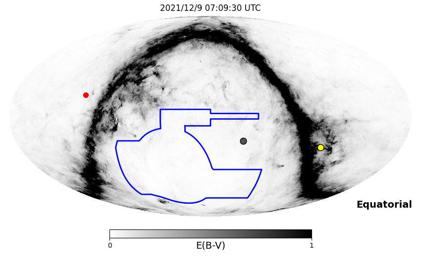
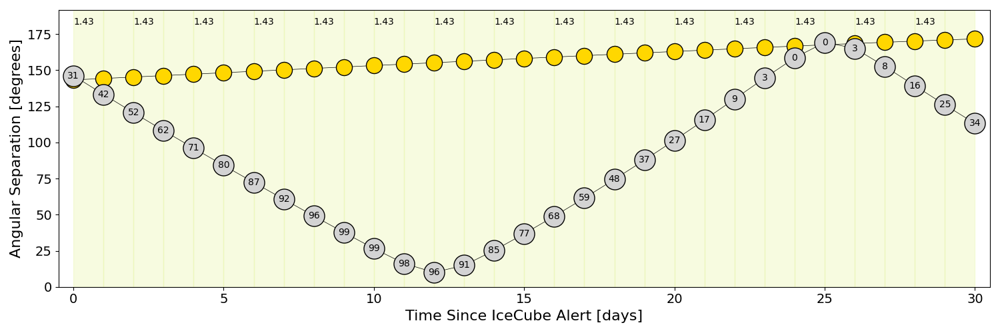
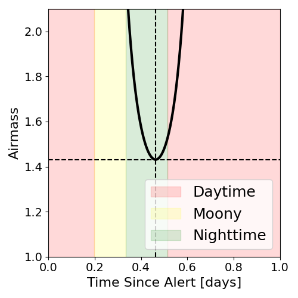
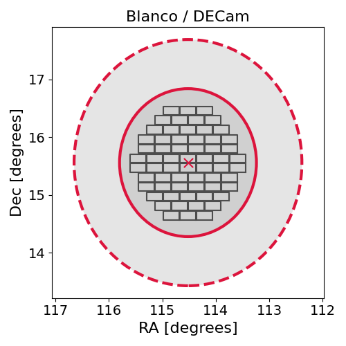
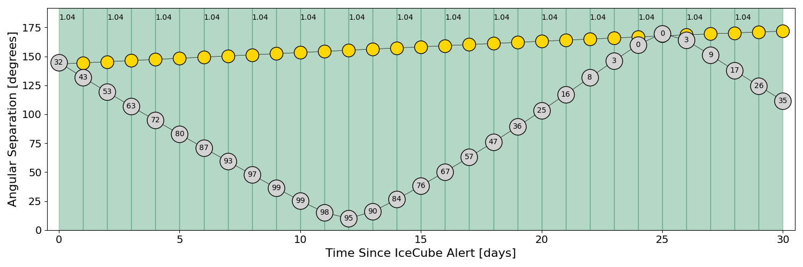
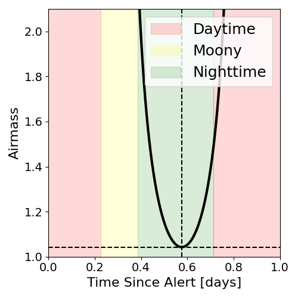
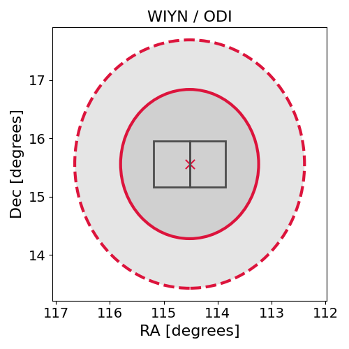

# IC211208A (136015_21306805)

### IceCube Data

| Rev | Type | Time (UTC) | Energy (TeV) | Signalness | FAR (#/yr) | 90% Area (sq. deg.) |
| --- | --- | --- | --- | --- | --- | --- |
| 1 | BRONZE | 12/08/2021  20:02:51 | 171.080 | 0.502 | 1.196500 | 14.25 |

<a href="https://gcn.gsfc.nasa.gov/gcn/notices_amon_g_b/136015_21306805.amon" target="_blank">Link to IceCube Alert Details</a>

<a href="https://rmorgan10.github.io/AlertMonitoring/IC211208A_1/CTIO_skymap.png" target="_blank">
  
</a>


## CTIO Report

**Observations Start at**  `2021/12/09 02:09:29`  **Madison Time**

<a href="https://github.com/rmorgan10/AlertMonitoring/blob/main/IC211208A_1/CTIO.json" target="_blank">Link to Observing Scripts

### Alert Diagnostics

```Event
  Event ID = IC211208A
  (ra, dec) = (114.5199, 15.5600)
Date
  Now = 2021/12/8 21:42:12 (UTC)
  Search time = 2021/12/8 20:02:51 (UTC)
  Optimal time = 2021/12/9 07:09:30 (UTC)
  Airmass at optimal time = 1.43
Sun
  Angular separation = 143.31 (deg)
  Next rising = 2021/12/9 09:34:15 (UTC)
  Next setting = 2021/12/8 23:36:38 (UTC)
Moon
  Illumination = 0.32
  Angular separation = 146.27 (deg)
  Next rising = 2021/12/9 15:06:36 (UTC)
  Next setting = 2021/12/9 04:07:05 (UTC)
  Next new moon = 2022/1/2 18:33:28 (UTC)
  Next full moon = 2021/12/19 04:35:29 (UTC)
Galactic
  (l, b) = (203.9008, 17.1935)
  E(B-V) = 0.12
```
### Observability Plots

<a href="https://rmorgan10.github.io/AlertMonitoring/IC211208A_1/CTIO_forecast.png" target="_blank">
  
</a>

<a href="https://rmorgan10.github.io/AlertMonitoring/IC211208A_1/CTIO_airmass.png" target="_blank">
  
</a>
<a href="https://rmorgan10.github.io/AlertMonitoring/IC211208A_1/CTIO_fov.png" target="_blank">
  
</a>


## KPNO Report

**Observations Start at**  `2021/12/09 04:52:13`  **Madison Time**

<a href="https://github.com/rmorgan10/AlertMonitoring/blob/main/IC211208A_1/KPNO.json" target="_blank">Link to Observing Scripts

### Alert Diagnostics

```Event
  Event ID = IC211208A
  (ra, dec) = (114.5199, 15.5600)
Date
  Now = 2021/12/8 21:42:12 (UTC)
  Search time = 2021/12/8 20:02:51 (UTC)
  Optimal time = 2021/12/9 09:52:14 (UTC)
  Airmass at optimal time = 1.04
Sun
  Angular separation = 143.43 (deg)
  Next rising = 2021/12/9 14:15:10 (UTC)
  Next setting = 2021/12/9 00:22:26 (UTC)
Moon
  Illumination = 0.33
  Angular separation = 144.80 (deg)
  Next rising = 2021/12/9 19:17:21 (UTC)
  Next setting = 2021/12/9 05:20:26 (UTC)
  Next new moon = 2022/1/2 18:33:28 (UTC)
  Next full moon = 2021/12/19 04:35:29 (UTC)
Galactic
  (l, b) = (203.9008, 17.1935)
  E(B-V) = 0.12
```
### Observability Plots

<a href="https://rmorgan10.github.io/AlertMonitoring/IC211208A_1/KPNO_forecast.png" target="_blank">
  
</a>

<a href="https://rmorgan10.github.io/AlertMonitoring/IC211208A_1/KPNO_airmass.png" target="_blank">
  
</a>
<a href="https://rmorgan10.github.io/AlertMonitoring/IC211208A_1/KPNO_fov.png" target="_blank">
  
</a>

