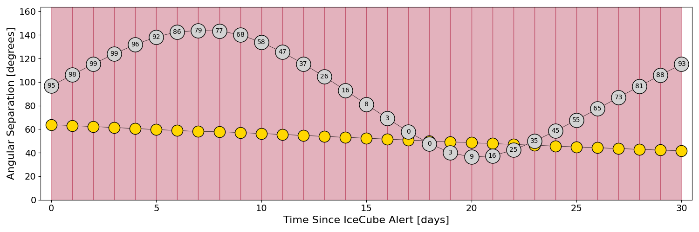
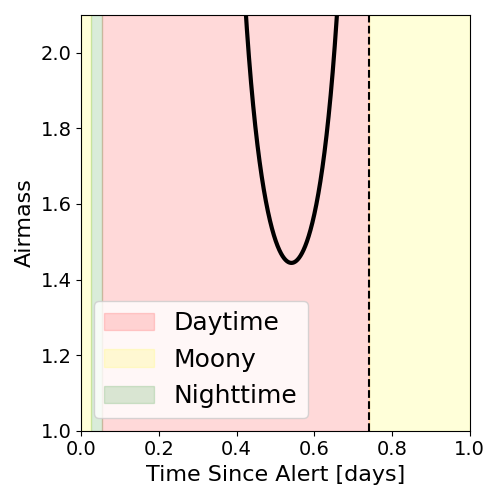
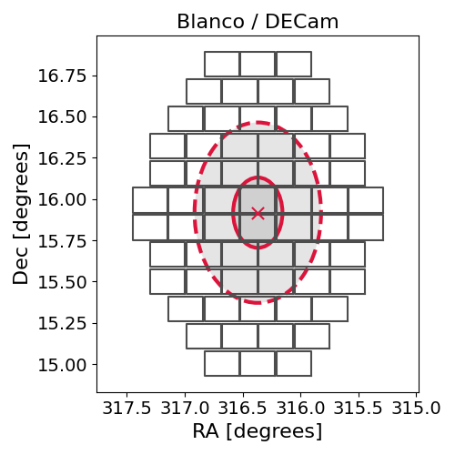
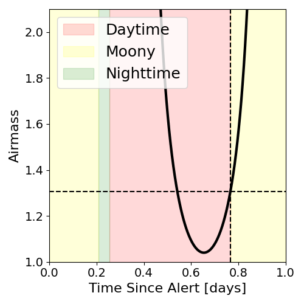

# IC211216A (136055_348073)

### IceCube Data

| Rev | Type | Time (UTC) | Energy (TeV) | Signalness | FAR (#/yr) | 90% Area (sq. deg.) |
| --- | --- | --- | --- | --- | --- | --- |
| 0 | BRONZE | 12/16/2021  07:07:38 | 113.010 | 0.344 | 2.369200 | 0.94 |

<a href="https://gcn.gsfc.nasa.gov/gcn/notices_amon_g_b/136055_348073.amon" target="_blank">Link to IceCube Alert Details</a>

<a href="https://rmorgan10.github.io/AlertMonitoring/IC211216A_0/CTIO_skymap.png" target="_blank">
  
</a>


## CTIO Report

**Observations Start at**  `2021/12/16 19:54:21`  **Madison Time**

<a href="https://github.com/rmorgan10/AlertMonitoring/blob/main/IC211216A_0/CTIO.json" target="_blank">Link to Observing Scripts

### Alert Diagnostics

```Event
  Event ID = IC211216A
  (ra, dec) = (316.3685, 15.9172)
Date
  Now = 2021/12/16 07:17:15 (UTC)
  Search time = 2021/12/16 07:07:38 (UTC)
  Optimal time = 2021/12/17 00:54:21 (UTC)
  Airmass at optimal time = 8.49
Sun
  Angular separation = 63.84 (deg)
  Next rising = 2021/12/16 09:36:09 (UTC)
  Next setting = 2021/12/16 23:41:57 (UTC)
Moon
  Illumination = 0.96
  Angular separation = 96.61 (deg)
  Next rising = 2021/12/16 21:43:07 (UTC)
  Next setting = 2021/12/16 07:44:37 (UTC)
  Next new moon = 2022/1/2 18:33:28 (UTC)
  Next full moon = 2021/12/19 04:35:29 (UTC)
Galactic
  (l, b) = (64.1609, -20.3310)
  E(B-V) = 0.04
```
### Observability Plots

<a href="https://rmorgan10.github.io/AlertMonitoring/IC211216A_0/CTIO_forecast.png" target="_blank">
  
</a>

<a href="https://rmorgan10.github.io/AlertMonitoring/IC211216A_0/CTIO_airmass.png" target="_blank">
  
</a>
<a href="https://rmorgan10.github.io/AlertMonitoring/IC211216A_0/CTIO_fov.png" target="_blank">
  
</a>


## KPNO Report

**Observations Start at**  `2021/12/16 20:31:47`  **Madison Time**

<a href="https://github.com/rmorgan10/AlertMonitoring/blob/main/IC211216A_0/KPNO.json" target="_blank">Link to Observing Scripts

### Alert Diagnostics

```Event
  Event ID = IC211216A
  (ra, dec) = (316.3685, 15.9172)
Date
  Now = 2021/12/16 07:17:15 (UTC)
  Search time = 2021/12/16 07:07:38 (UTC)
  Optimal time = 2021/12/17 01:31:48 (UTC)
  Airmass at optimal time = 1.31
Sun
  Angular separation = 63.82 (deg)
  Next rising = 2021/12/16 14:19:51 (UTC)
  Next setting = 2021/12/17 00:24:34 (UTC)
Moon
  Illumination = 0.96
  Angular separation = 96.86 (deg)
  Next rising = 2021/12/16 22:45:36 (UTC)
  Next setting = 2021/12/16 12:07:48 (UTC)
  Next new moon = 2022/1/2 18:33:28 (UTC)
  Next full moon = 2021/12/19 04:35:29 (UTC)
Galactic
  (l, b) = (64.1609, -20.3310)
  E(B-V) = 0.04
```
### Observability Plots

<a href="https://rmorgan10.github.io/AlertMonitoring/IC211216A_0/KPNO_forecast.png" target="_blank">
  
</a>

<a href="https://rmorgan10.github.io/AlertMonitoring/IC211216A_0/KPNO_airmass.png" target="_blank">
  
</a>
<a href="https://rmorgan10.github.io/AlertMonitoring/IC211216A_0/KPNO_fov.png" target="_blank">
  
</a>

