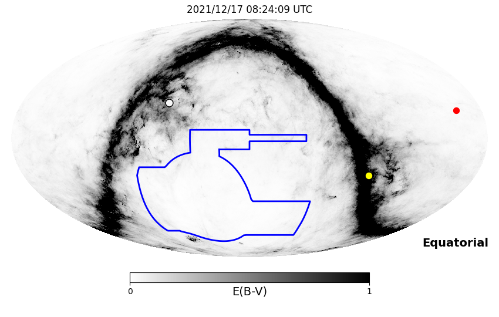
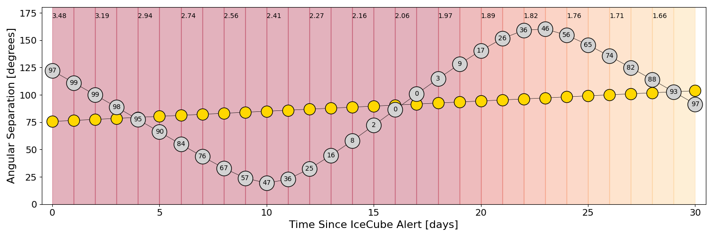
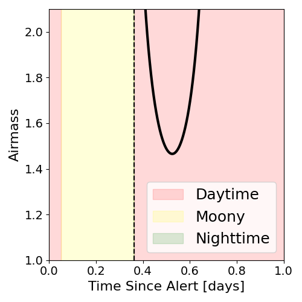
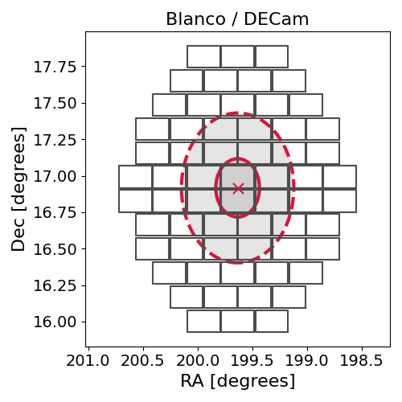
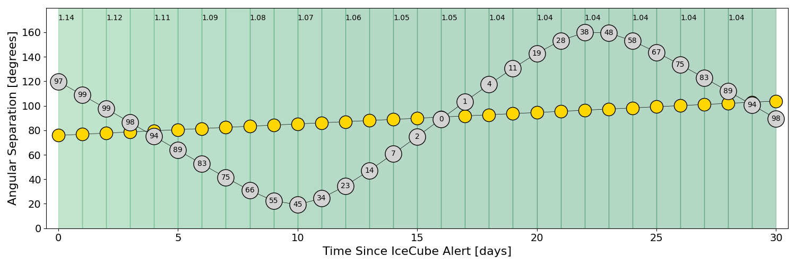
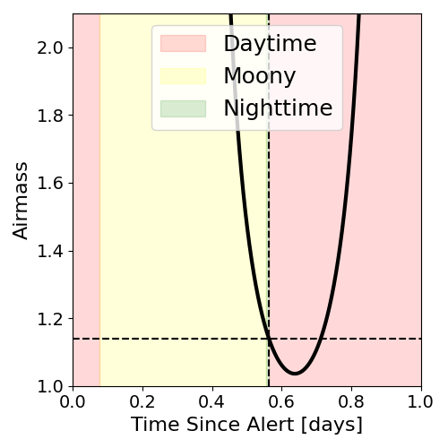
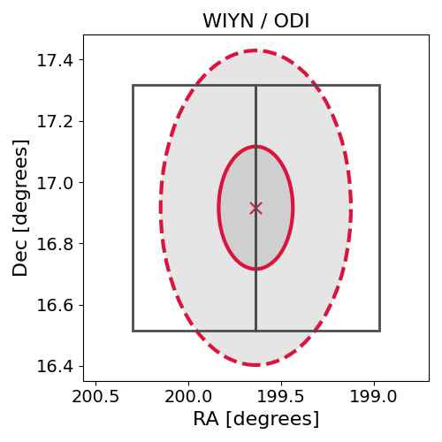

# IC211216B (136057_6147475)

### IceCube Data

| Rev | Type | Time (UTC) | Energy (TeV) | Signalness | FAR (#/yr) | 90% Area (sq. deg.) |
| --- | --- | --- | --- | --- | --- | --- |
| 0 | BRONZE | 12/16/2021  23:41:13 | 112.540 | 0.346 | 2.392800 | 0.83 |

<a href="https://gcn.gsfc.nasa.gov/gcn/notices_amon_g_b/136057_6147475.amon" target="_blank">Link to IceCube Alert Details</a>

<a href="https://rmorgan10.github.io/AlertMonitoring/IC211216B_0/CTIO_skymap.png" target="_blank">
  
</a>


## CTIO Report

**Observations Start at**  `2021/12/17 03:24:08`  **Madison Time**

<a href="https://github.com/rmorgan10/AlertMonitoring/blob/main/IC211216B_0/CTIO.json" target="_blank">Link to Observing Scripts

### Alert Diagnostics

```Event
  Event ID = IC211216B
  (ra, dec) = (199.6358, 16.9163)
Date
  Now = 2021/12/16 23:52:13 (UTC)
  Search time = 2021/12/16 23:41:14 (UTC)
  Optimal time = 2021/12/17 08:24:09 (UTC)
  Airmass at optimal time = 3.48
Sun
  Angular separation = 75.66 (deg)
  Next rising = 2021/12/17 09:36:32 (UTC)
  Next setting = 2021/12/16 23:41:57 (UTC)
Moon
  Illumination = 0.97
  Angular separation = 122.07 (deg)
  Next rising = 2021/12/17 22:39:02 (UTC)
  Next setting = 2021/12/17 08:19:59 (UTC)
  Next new moon = 2022/1/2 18:33:28 (UTC)
  Next full moon = 2021/12/19 04:35:29 (UTC)
Galactic
  (l, b) = (335.8703, 78.0174)
  E(B-V) = 0.22
```
### Observability Plots

<a href="https://rmorgan10.github.io/AlertMonitoring/IC211216B_0/CTIO_forecast.png" target="_blank">
  
</a>

<a href="https://rmorgan10.github.io/AlertMonitoring/IC211216B_0/CTIO_airmass.png" target="_blank">
  
</a>
<a href="https://rmorgan10.github.io/AlertMonitoring/IC211216B_0/CTIO_fov.png" target="_blank">
  
</a>


## KPNO Report

**Observations Start at**  `2021/12/17 08:13:11`  **Madison Time**

<a href="https://github.com/rmorgan10/AlertMonitoring/blob/main/IC211216B_0/KPNO.json" target="_blank">Link to Observing Scripts

### Alert Diagnostics

```Event
  Event ID = IC211216B
  (ra, dec) = (199.6358, 16.9163)
Date
  Now = 2021/12/16 23:52:13 (UTC)
  Search time = 2021/12/16 23:41:14 (UTC)
  Optimal time = 2021/12/17 13:13:11 (UTC)
  Airmass at optimal time = 1.14
Sun
  Angular separation = 75.84 (deg)
  Next rising = 2021/12/17 14:20:27 (UTC)
  Next setting = 2021/12/17 00:24:34 (UTC)
Moon
  Illumination = 0.98
  Angular separation = 119.88 (deg)
  Next rising = 2021/12/17 23:22:54 (UTC)
  Next setting = 2021/12/17 13:04:26 (UTC)
  Next new moon = 2022/1/2 18:33:28 (UTC)
  Next full moon = 2021/12/19 04:35:29 (UTC)
Galactic
  (l, b) = (335.8703, 78.0174)
  E(B-V) = 0.22
```
### Observability Plots

<a href="https://rmorgan10.github.io/AlertMonitoring/IC211216B_0/KPNO_forecast.png" target="_blank">
  
</a>

<a href="https://rmorgan10.github.io/AlertMonitoring/IC211216B_0/KPNO_airmass.png" target="_blank">
  
</a>
<a href="https://rmorgan10.github.io/AlertMonitoring/IC211216B_0/KPNO_fov.png" target="_blank">
  
</a>

