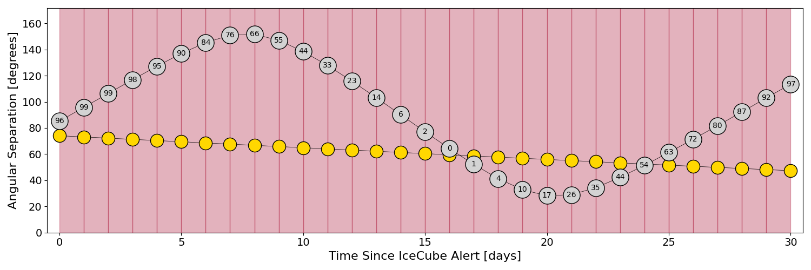

# IC220115A (136170_48281000)

### IceCube Data

| Rev | Type | Time (UTC) | Energy (TeV) | Signalness | FAR (#/yr) | 90% Area (sq. deg.) |
| --- | --- | --- | --- | --- | --- | --- |
| 1 | BRONZE | 01/15/2022  12:11:39 | 109.950 | 0.370 | 2.089300 | 4.75 |

<a href="https://gcn.gsfc.nasa.gov/gcn/notices_amon_g_b/136170_48281000.amon" target="_blank">Link to IceCube Alert Details</a>

<a href="https://rmorgan10.github.io/AlertMonitoring/IC220115A_1/CTIO_skymap.png" target="_blank">
  
</a>


## CTIO Report

**Observations Start at**  `2022/01/15 19:58:49`  **Madison Time**

<a href="https://github.com/rmorgan10/AlertMonitoring/blob/main/IC220115A_1/CTIO.json" target="_blank">Link to Observing Scripts

### Alert Diagnostics

```Event
  Event ID = IC220115A
  (ra, dec) = (357.4499, 25.2800)
Date
  Now = 2022/1/15 14:32:13 (UTC)
  Search time = 2022/1/15 12:11:40 (UTC)
  Optimal time = 2022/1/16 00:58:50 (UTC)
  Airmass at optimal time = 6.43
Sun
  Angular separation = 74.08 (deg)
  Next rising = 2022/1/16 09:57:05 (UTC)
  Next setting = 2022/1/15 23:48:51 (UTC)
Moon
  Illumination = 0.97
  Angular separation = 85.18 (deg)
  Next rising = 2022/1/15 22:22:04 (UTC)
  Next setting = 2022/1/16 08:29:14 (UTC)
  Next new moon = 2022/2/1 05:45:58 (UTC)
  Next full moon = 2022/1/17 23:48:24 (UTC)
Galactic
  (l, b) = (105.7604, -35.5280)
  E(B-V) = 0.14
```
### Observability Plots

<a href="https://rmorgan10.github.io/AlertMonitoring/IC220115A_1/CTIO_forecast.png" target="_blank">
  
</a>

<a href="https://rmorgan10.github.io/AlertMonitoring/IC220115A_1/CTIO_airmass.png" target="_blank">
  
</a>
<a href="https://rmorgan10.github.io/AlertMonitoring/IC220115A_1/CTIO_fov.png" target="_blank">
  
</a>


## KPNO Report

**Observations Start at**  `2022/01/15 20:51:14`  **Madison Time**

<a href="https://github.com/rmorgan10/AlertMonitoring/blob/main/IC220115A_1/KPNO.json" target="_blank">Link to Observing Scripts

### Alert Diagnostics

```Event
  Event ID = IC220115A
  (ra, dec) = (357.4499, 25.2800)
Date
  Now = 2022/1/15 14:32:13 (UTC)
  Search time = 2022/1/15 12:11:40 (UTC)
  Optimal time = 2022/1/16 01:51:15 (UTC)
  Airmass at optimal time = 1.16
Sun
  Angular separation = 74.04 (deg)
  Next rising = 2022/1/15 14:26:46 (UTC)
  Next setting = 2022/1/16 00:45:14 (UTC)
Moon
  Illumination = 0.97
  Angular separation = 85.56 (deg)
  Next rising = 2022/1/15 22:48:22 (UTC)
  Next setting = 2022/1/15 12:49:16 (UTC)
  Next new moon = 2022/2/1 05:45:58 (UTC)
  Next full moon = 2022/1/17 23:48:24 (UTC)
Galactic
  (l, b) = (105.7604, -35.5280)
  E(B-V) = 0.14
```
### Observability Plots

<a href="https://rmorgan10.github.io/AlertMonitoring/IC220115A_1/KPNO_forecast.png" target="_blank">
  
</a>

<a href="https://rmorgan10.github.io/AlertMonitoring/IC220115A_1/KPNO_airmass.png" target="_blank">
  
</a>
<a href="https://rmorgan10.github.io/AlertMonitoring/IC220115A_1/KPNO_fov.png" target="_blank">
  
</a>

