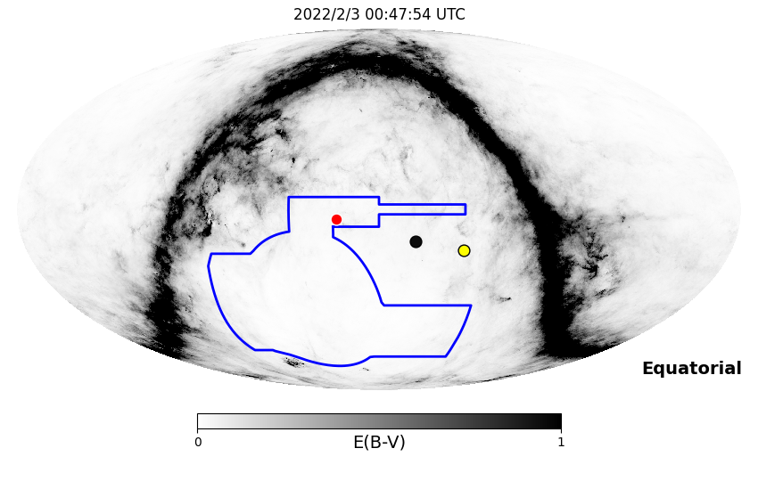
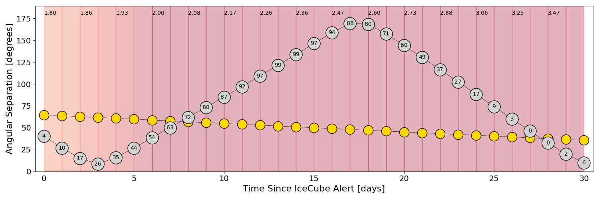
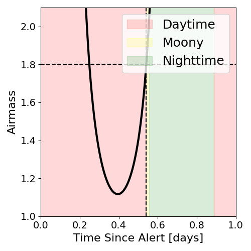
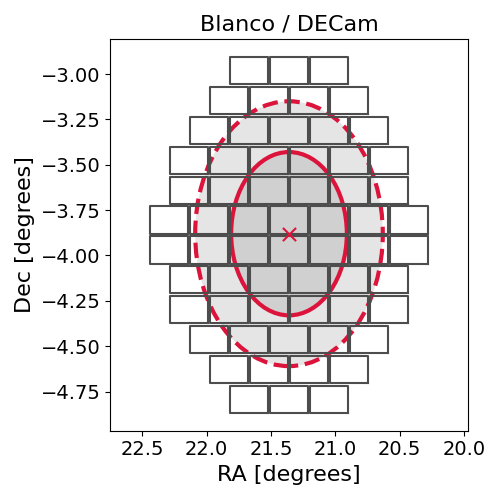
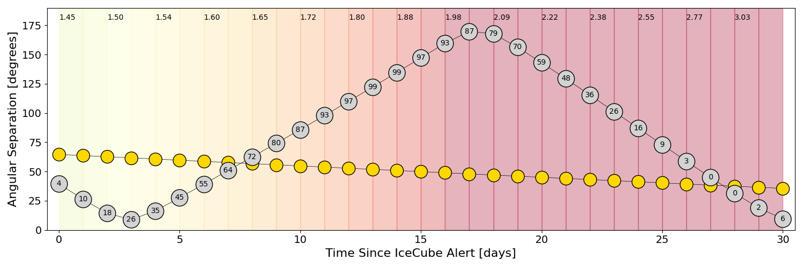
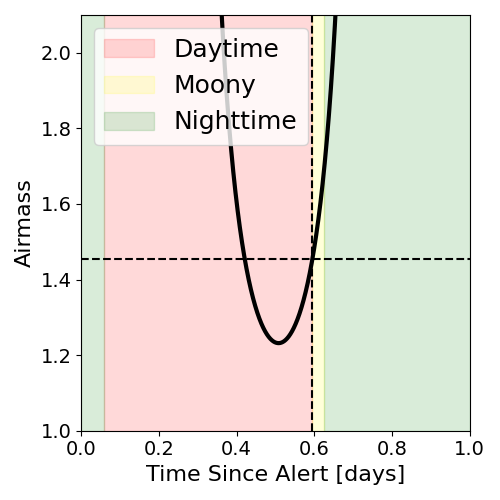
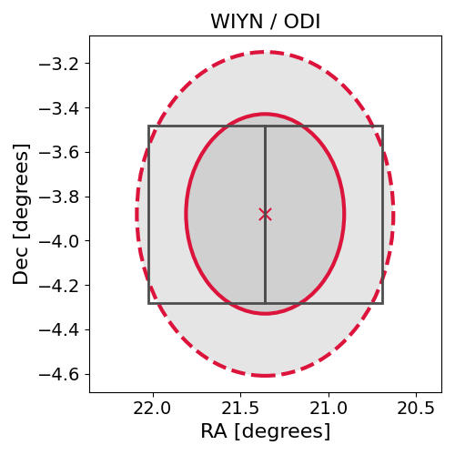

# IC220202A (136241_22093816)

### IceCube Data

| Rev | Type | Time (UTC) | Energy (TeV) | Signalness | FAR (#/yr) | 90% Area (sq. deg.) |
| --- | --- | --- | --- | --- | --- | --- |
| 1 | GOLD | 02/02/2022  11:48:38 | 150.940 | 0.206 | 1.925300 | 1.67 |

<a href="https://gcn.gsfc.nasa.gov/gcn/notices_amon_g_b/136241_22093816.amon" target="_blank">Link to IceCube Alert Details</a>

<a href="https://rmorgan10.github.io/AlertMonitoring/IC220202A_1/CTIO_skymap.png" target="_blank">
  
</a>


## CTIO Report

**Observations Start at**  `2022/02/02 19:47:54`  **Madison Time**

<a href="https://github.com/rmorgan10/AlertMonitoring/blob/main/IC220202A_1/CTIO.json" target="_blank">Link to Observing Scripts

### Alert Diagnostics

```Event
  Event ID = IC220202A
  (ra, dec) = (21.3599, -3.8799)
Date
  Now = 2022/2/2 14:32:21 (UTC)
  Search time = 2022/2/2 11:48:39 (UTC)
  Optimal time = 2022/2/3 00:47:54 (UTC)
  Airmass at optimal time = 1.80
Sun
  Angular separation = 64.70 (deg)
  Next rising = 2022/2/3 10:13:04 (UTC)
  Next setting = 2022/2/2 23:41:13 (UTC)
Moon
  Illumination = 0.05
  Angular separation = 40.22 (deg)
  Next rising = 2022/2/3 12:37:09 (UTC)
  Next setting = 2022/2/3 01:08:29 (UTC)
  Next new moon = 2022/3/2 17:34:43 (UTC)
  Next full moon = 2022/2/16 16:56:28 (UTC)
Galactic
  (l, b) = (143.6596, -65.3742)
  E(B-V) = 0.05
```
### Observability Plots

<a href="https://rmorgan10.github.io/AlertMonitoring/IC220202A_1/CTIO_forecast.png" target="_blank">
  
</a>

<a href="https://rmorgan10.github.io/AlertMonitoring/IC220202A_1/CTIO_airmass.png" target="_blank">
  
</a>
<a href="https://rmorgan10.github.io/AlertMonitoring/IC220202A_1/CTIO_fov.png" target="_blank">
  
</a>


## KPNO Report

**Observations Start at**  `2022/02/02 21:05:49`  **Madison Time**

<a href="https://github.com/rmorgan10/AlertMonitoring/blob/main/IC220202A_1/KPNO.json" target="_blank">Link to Observing Scripts

### Alert Diagnostics

```Event
  Event ID = IC220202A
  (ra, dec) = (21.3599, -3.8799)
Date
  Now = 2022/2/2 14:32:21 (UTC)
  Search time = 2022/2/2 11:48:39 (UTC)
  Optimal time = 2022/2/3 02:05:49 (UTC)
  Airmass at optimal time = 1.45
Sun
  Angular separation = 64.65 (deg)
  Next rising = 2022/2/2 14:18:48 (UTC)
  Next setting = 2022/2/3 01:01:45 (UTC)
Moon
  Illumination = 0.05
  Angular separation = 39.48 (deg)
  Next rising = 2022/2/2 15:40:56 (UTC)
  Next setting = 2022/2/3 02:52:11 (UTC)
  Next new moon = 2022/3/2 17:34:43 (UTC)
  Next full moon = 2022/2/16 16:56:28 (UTC)
Galactic
  (l, b) = (143.6596, -65.3742)
  E(B-V) = 0.05
```
### Observability Plots

<a href="https://rmorgan10.github.io/AlertMonitoring/IC220202A_1/KPNO_forecast.png" target="_blank">
  
</a>

<a href="https://rmorgan10.github.io/AlertMonitoring/IC220202A_1/KPNO_airmass.png" target="_blank">
  
</a>
<a href="https://rmorgan10.github.io/AlertMonitoring/IC220202A_1/KPNO_fov.png" target="_blank">
  
</a>

