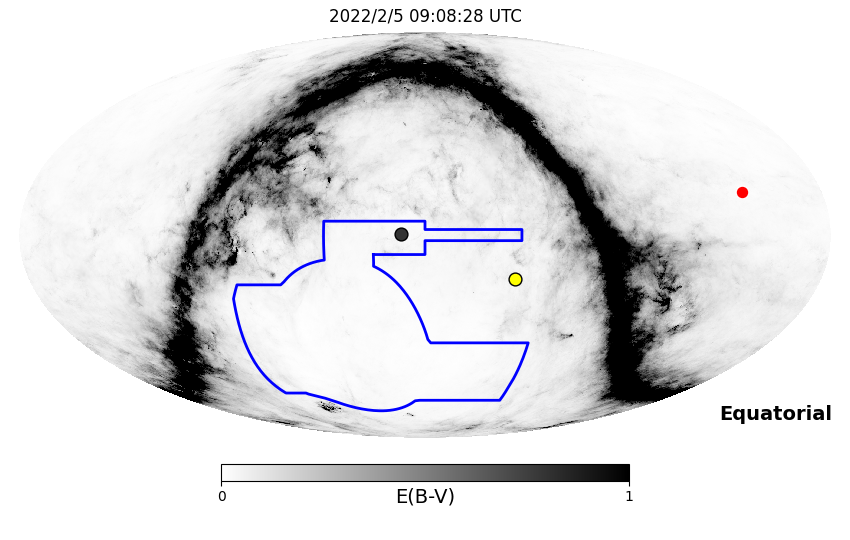
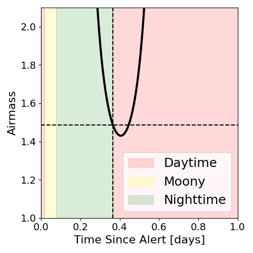
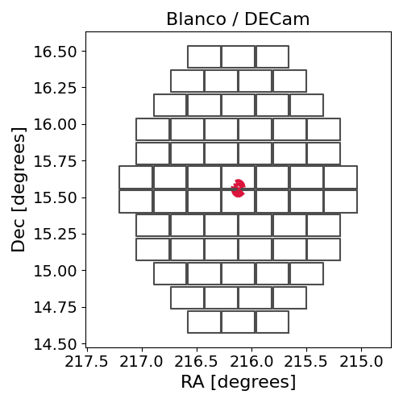
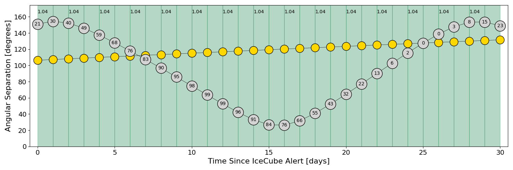
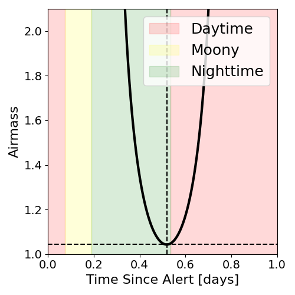
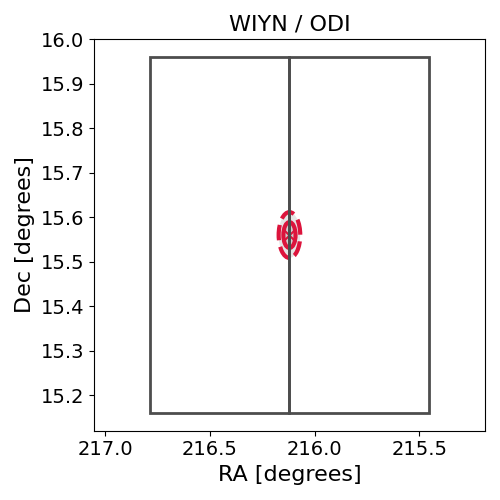

# IC220205A (136249_27650203)

### IceCube Data

| Rev | Type | Time (UTC) | Energy (TeV) | Signalness | FAR (#/yr) | 90% Area (sq. deg.) |
| --- | --- | --- | --- | --- | --- | --- |
| 1 | BRONZE | 02/05/2022  00:22:39 | 109.580 | 0.322 | 2.524200 | 0.01 |

<a href="https://gcn.gsfc.nasa.gov/gcn/notices_amon_g_b/136249_27650203.amon" target="_blank">Link to IceCube Alert Details</a>

<a href="https://rmorgan10.github.io/AlertMonitoring/IC220205A_1/CTIO_skymap.png" target="_blank">
  
</a>


## CTIO Report

**Observations Start at**  `2022/02/05 04:08:27`  **Madison Time**

<a href="https://github.com/rmorgan10/AlertMonitoring/blob/main/IC220205A_1/CTIO.json" target="_blank">Link to Observing Scripts

### Alert Diagnostics

```Event
  Event ID = IC220205A
  (ra, dec) = (216.1200, 15.5600)
Date
  Now = 2022/2/8 00:32:14 (UTC)
  Search time = 2022/2/5 00:22:40 (UTC)
  Optimal time = 2022/2/5 09:08:28 (UTC)
  Airmass at optimal time = 1.49
Sun
  Angular separation = 106.25 (deg)
  Next rising = 2022/2/5 10:14:48 (UTC)
  Next setting = 2022/2/5 23:39:10 (UTC)
Moon
  Illumination = 0.20
  Angular separation = 150.16 (deg)
  Next rising = 2022/2/5 14:38:16 (UTC)
  Next setting = 2022/2/5 02:13:55 (UTC)
  Next new moon = 2022/3/2 17:34:43 (UTC)
  Next full moon = 2022/2/16 16:56:28 (UTC)
Galactic
  (l, b) = (9.5066, 65.5051)
  E(B-V) = 0.06
```
### Observability Plots

<a href="https://rmorgan10.github.io/AlertMonitoring/IC220205A_1/CTIO_forecast.png" target="_blank">
  
</a>

<a href="https://rmorgan10.github.io/AlertMonitoring/IC220205A_1/CTIO_airmass.png" target="_blank">
  
</a>
<a href="https://rmorgan10.github.io/AlertMonitoring/IC220205A_1/CTIO_fov.png" target="_blank">
  
</a>


## KPNO Report

**Observations Start at**  `2022/02/05 07:49:22`  **Madison Time**

<a href="https://github.com/rmorgan10/AlertMonitoring/blob/main/IC220205A_1/KPNO.json" target="_blank">Link to Observing Scripts

### Alert Diagnostics

```Event
  Event ID = IC220205A
  (ra, dec) = (216.1200, 15.5600)
Date
  Now = 2022/2/8 00:32:14 (UTC)
  Search time = 2022/2/5 00:22:40 (UTC)
  Optimal time = 2022/2/5 12:49:23 (UTC)
  Airmass at optimal time = 1.04
Sun
  Angular separation = 106.38 (deg)
  Next rising = 2022/2/5 14:16:39 (UTC)
  Next setting = 2022/2/5 01:03:34 (UTC)
Moon
  Illumination = 0.22
  Angular separation = 151.11 (deg)
  Next rising = 2022/2/5 17:15:37 (UTC)
  Next setting = 2022/2/5 04:58:04 (UTC)
  Next new moon = 2022/3/2 17:34:43 (UTC)
  Next full moon = 2022/2/16 16:56:28 (UTC)
Galactic
  (l, b) = (9.5066, 65.5051)
  E(B-V) = 0.06
```
### Observability Plots

<a href="https://rmorgan10.github.io/AlertMonitoring/IC220205A_1/KPNO_forecast.png" target="_blank">
  
</a>

<a href="https://rmorgan10.github.io/AlertMonitoring/IC220205A_1/KPNO_airmass.png" target="_blank">
  
</a>
<a href="https://rmorgan10.github.io/AlertMonitoring/IC220205A_1/KPNO_fov.png" target="_blank">
  
</a>

