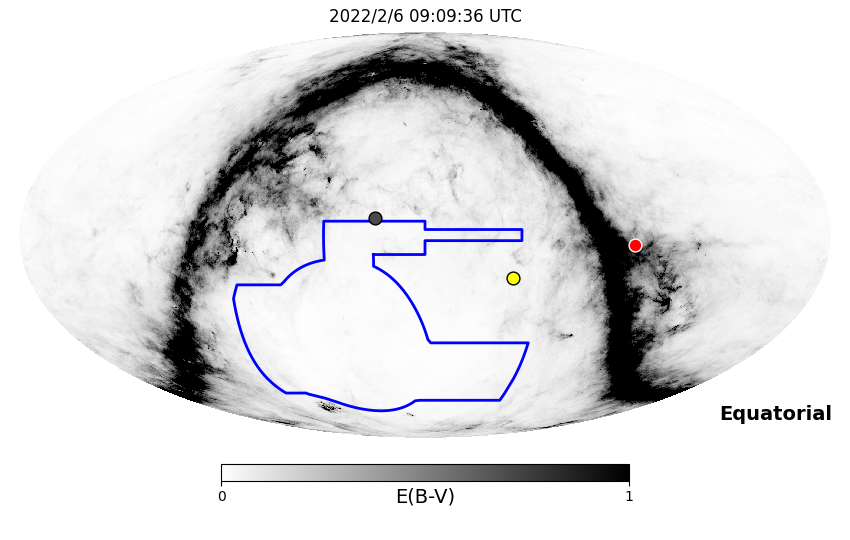
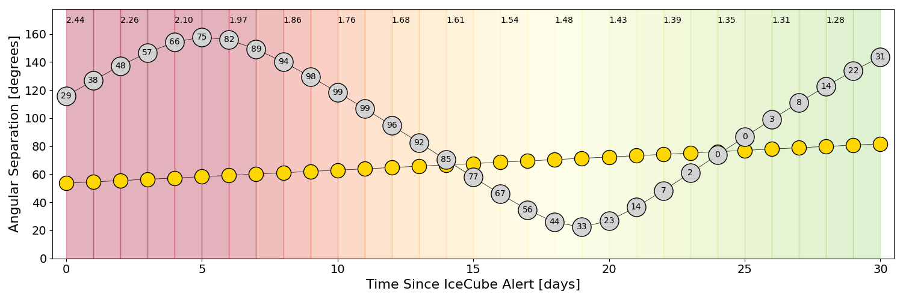
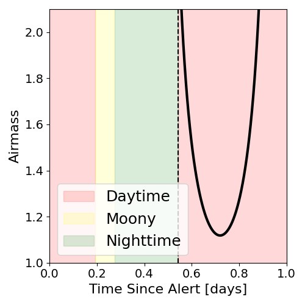
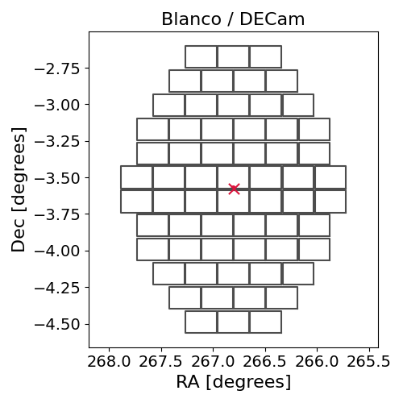
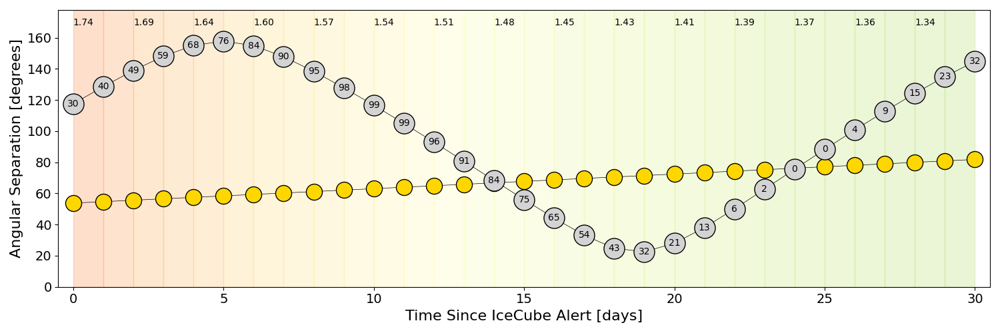
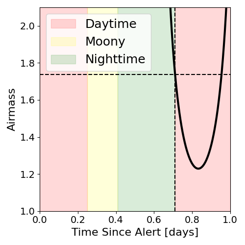
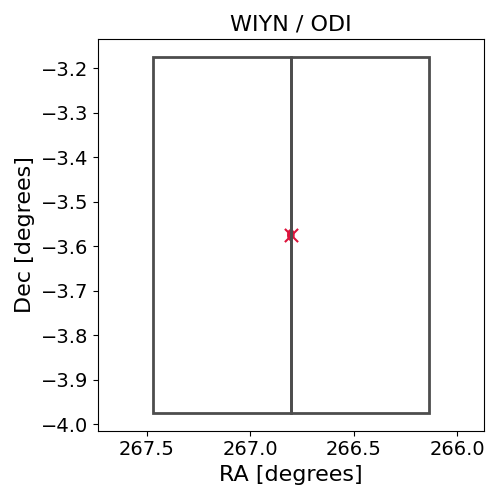

# IC220205B (136260_4895987)

### IceCube Data

| Rev | Type | Time (UTC) | Energy (TeV) | Signalness | FAR (#/yr) | 90% Area (sq. deg.) |
| --- | --- | --- | --- | --- | --- | --- |
| 0 | GOLD | 02/05/2022  20:08:10 | 215.880 | 0.592 | 0.734400 | 0.00 |

<a href="https://gcn.gsfc.nasa.gov/gcn/notices_amon_g_b/136260_4895987.amon" target="_blank">Link to IceCube Alert Details</a>

<a href="https://rmorgan10.github.io/AlertMonitoring/IC220205B_0/CTIO_skymap.png" target="_blank">
  
</a>


## CTIO Report

**Observations Start at**  `2022/02/06 04:09:35`  **Madison Time**

<a href="https://github.com/rmorgan10/AlertMonitoring/blob/main/IC220205B_0/CTIO.json" target="_blank">Link to Observing Scripts

### Alert Diagnostics

```Event
  Event ID = IC220205B
  (ra, dec) = (266.8044, -3.5749)
Date
  Now = 2022/2/8 00:39:27 (UTC)
  Search time = 2022/2/5 20:08:11 (UTC)
  Optimal time = 2022/2/6 09:09:36 (UTC)
  Airmass at optimal time = 2.44
Sun
  Angular separation = 53.64 (deg)
  Next rising = 2022/2/6 10:15:40 (UTC)
  Next setting = 2022/2/5 23:39:10 (UTC)
Moon
  Illumination = 0.29
  Angular separation = 115.63 (deg)
  Next rising = 2022/2/6 15:35:32 (UTC)
  Next setting = 2022/2/6 02:43:41 (UTC)
  Next new moon = 2022/3/2 17:34:43 (UTC)
  Next full moon = 2022/2/16 16:56:28 (UTC)
Galactic
  (l, b) = (22.2246, 12.5461)
  E(B-V) = 0.96
```
### Observability Plots

<a href="https://rmorgan10.github.io/AlertMonitoring/IC220205B_0/CTIO_forecast.png" target="_blank">
  
</a>

<a href="https://rmorgan10.github.io/AlertMonitoring/IC220205B_0/CTIO_airmass.png" target="_blank">
  
</a>
<a href="https://rmorgan10.github.io/AlertMonitoring/IC220205B_0/CTIO_fov.png" target="_blank">
  
</a>


## KPNO Report

**Observations Start at**  `2022/02/06 08:12:07`  **Madison Time**

<a href="https://github.com/rmorgan10/AlertMonitoring/blob/main/IC220205B_0/KPNO.json" target="_blank">Link to Observing Scripts

### Alert Diagnostics

```Event
  Event ID = IC220205B
  (ra, dec) = (266.8044, -3.5749)
Date
  Now = 2022/2/8 00:39:27 (UTC)
  Search time = 2022/2/5 20:08:11 (UTC)
  Optimal time = 2022/2/6 13:12:07 (UTC)
  Airmass at optimal time = 1.74
Sun
  Angular separation = 53.80 (deg)
  Next rising = 2022/2/6 14:15:54 (UTC)
  Next setting = 2022/2/6 01:04:28 (UTC)
Moon
  Illumination = 0.31
  Angular separation = 117.56 (deg)
  Next rising = 2022/2/6 17:44:07 (UTC)
  Next setting = 2022/2/6 05:57:04 (UTC)
  Next new moon = 2022/3/2 17:34:43 (UTC)
  Next full moon = 2022/2/16 16:56:28 (UTC)
Galactic
  (l, b) = (22.2246, 12.5461)
  E(B-V) = 0.96
```
### Observability Plots

<a href="https://rmorgan10.github.io/AlertMonitoring/IC220205B_0/KPNO_forecast.png" target="_blank">
  
</a>

<a href="https://rmorgan10.github.io/AlertMonitoring/IC220205B_0/KPNO_airmass.png" target="_blank">
  
</a>
<a href="https://rmorgan10.github.io/AlertMonitoring/IC220205B_0/KPNO_fov.png" target="_blank">
  
</a>

