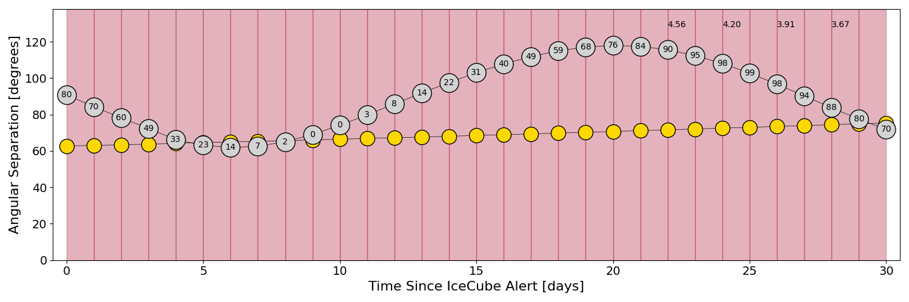

# IC220221A (136348_65788242)

### IceCube Data

| Rev | Type | Time (UTC) | Energy (TeV) | Signalness | FAR (#/yr) | 90% Area (sq. deg.) |
| --- | --- | --- | --- | --- | --- | --- |
| 0 | GOLD | 02/21/2022  00:42:19 | 157.430 | 0.673 | 0.359600 | 170.67 |

<a href="https://gcn.gsfc.nasa.gov/gcn/notices_amon_g_b/136348_65788242.amon" target="_blank">Link to IceCube Alert Details</a>

<a href="https://rmorgan10.github.io/AlertMonitoring/IC220221A_0/CTIO_skymap.png" target="_blank">
  
</a>


## CTIO Report

**Observations Start at**  `2022/02/20 19:42:19`  **Madison Time**

<a href="https://github.com/rmorgan10/AlertMonitoring/blob/main/IC220221A_0/CTIO.json" target="_blank">Link to Observing Scripts

### Alert Diagnostics

```Event
  Event ID = IC220221A
  (ra, dec) = (289.8533, 36.0981)
Date
  Now = 2022/2/21 00:52:22 (UTC)
  Search time = 2022/2/21 00:42:19 (UTC)
  Optimal time = 2022/2/21 00:42:19 (UTC)
  Airmass at optimal time = 999.00
Sun
  Angular separation = 62.75 (deg)
  Next rising = 2022/2/21 10:27:53 (UTC)
  Next setting = 2022/2/21 23:25:11 (UTC)
Moon
  Illumination = 0.80
  Angular separation = 90.78 (deg)
  Next rising = 2022/2/21 02:01:31 (UTC)
  Next setting = 2022/2/21 15:09:16 (UTC)
  Next new moon = 2022/3/2 17:34:43 (UTC)
  Next full moon = 2022/3/18 07:17:31 (UTC)
Galactic
  (l, b) = (68.2971, 10.4333)
  E(B-V) = 0.63
```
### Observability Plots

<a href="https://rmorgan10.github.io/AlertMonitoring/IC220221A_0/CTIO_forecast.png" target="_blank">
  
</a>

<a href="https://rmorgan10.github.io/AlertMonitoring/IC220221A_0/CTIO_airmass.png" target="_blank">
  
</a>
<a href="https://rmorgan10.github.io/AlertMonitoring/IC220221A_0/CTIO_fov.png" target="_blank">
  
</a>


## KPNO Report

**Observations Start at**  `2022/02/21 07:59:40`  **Madison Time**

<a href="https://github.com/rmorgan10/AlertMonitoring/blob/main/IC220221A_0/KPNO.json" target="_blank">Link to Observing Scripts

### Alert Diagnostics

```Event
  Event ID = IC220221A
  (ra, dec) = (289.8533, 36.0981)
Date
  Now = 2022/2/21 00:52:22 (UTC)
  Search time = 2022/2/21 00:42:19 (UTC)
  Optimal time = 2022/2/21 12:59:40 (UTC)
  Airmass at optimal time = 1.42
Sun
  Angular separation = 62.91 (deg)
  Next rising = 2022/2/21 14:02:03 (UTC)
  Next setting = 2022/2/21 01:17:24 (UTC)
Moon
  Illumination = 0.76
  Angular separation = 87.49 (deg)
  Next rising = 2022/2/21 05:30:29 (UTC)
  Next setting = 2022/2/21 17:02:16 (UTC)
  Next new moon = 2022/3/2 17:34:43 (UTC)
  Next full moon = 2022/3/18 07:17:31 (UTC)
Galactic
  (l, b) = (68.2971, 10.4333)
  E(B-V) = 0.63
```
### Observability Plots

<a href="https://rmorgan10.github.io/AlertMonitoring/IC220221A_0/KPNO_forecast.png" target="_blank">
  
</a>

<a href="https://rmorgan10.github.io/AlertMonitoring/IC220221A_0/KPNO_airmass.png" target="_blank">
  
</a>
<a href="https://rmorgan10.github.io/AlertMonitoring/IC220221A_0/KPNO_fov.png" target="_blank">
  
</a>

