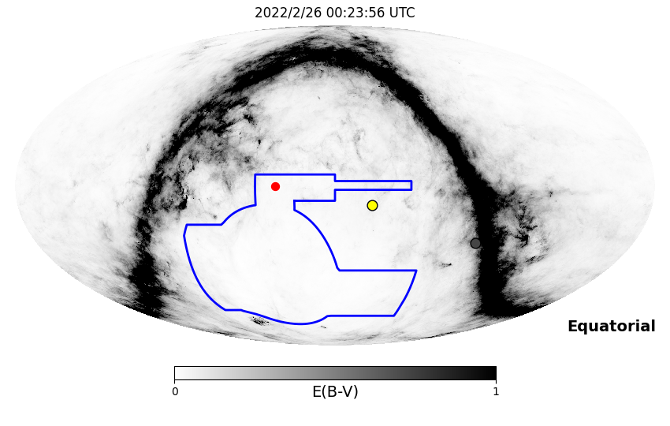
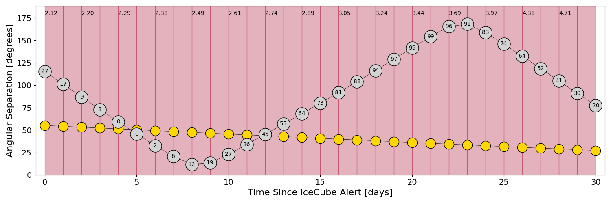
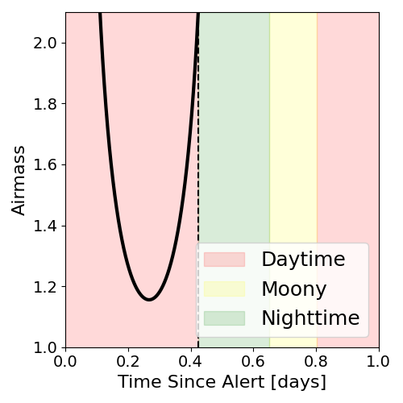
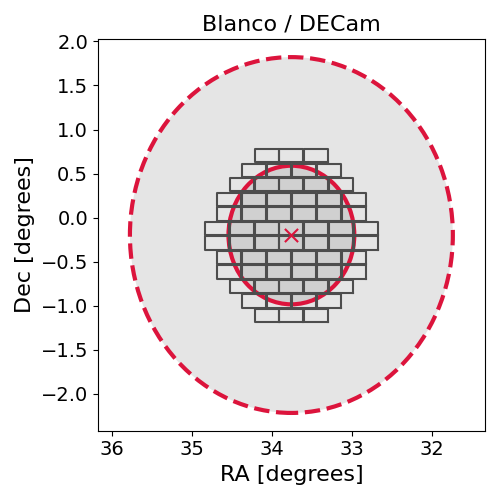
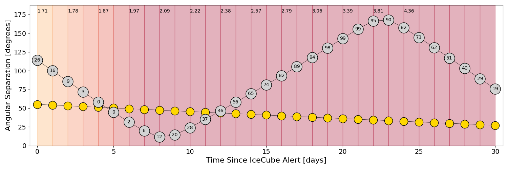
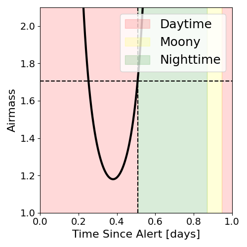
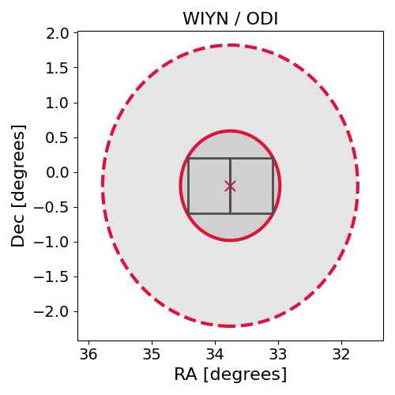

# IC220225A (136366_14203460)

### IceCube Data

| Rev | Type | Time (UTC) | Energy (TeV) | Signalness | FAR (#/yr) | 90% Area (sq. deg.) |
| --- | --- | --- | --- | --- | --- | --- |
| 0 | BRONZE | 02/25/2022  14:12:00 | 153.570 | 0.378 | 2.329200 | 12.80 |

<a href="https://gcn.gsfc.nasa.gov/gcn/notices_amon_g_b/136366_14203460.amon" target="_blank">Link to IceCube Alert Details</a>

<a href="https://rmorgan10.github.io/AlertMonitoring/IC220225A_0/CTIO_skymap.png" target="_blank">
  
</a>


## CTIO Report

**Observations Start at**  `2022/02/25 19:23:55`  **Madison Time**

<a href="https://github.com/rmorgan10/AlertMonitoring/blob/main/IC220225A_0/CTIO.json" target="_blank">Link to Observing Scripts

### Alert Diagnostics

```Event
  Event ID = IC220225A
  (ra, dec) = (33.7618, -0.1969)
Date
  Now = 2022/2/25 14:22:17 (UTC)
  Search time = 2022/2/25 14:12:01 (UTC)
  Optimal time = 2022/2/26 00:23:56 (UTC)
  Airmass at optimal time = 2.12
Sun
  Angular separation = 55.13 (deg)
  Next rising = 2022/2/26 10:31:38 (UTC)
  Next setting = 2022/2/25 23:21:02 (UTC)
Moon
  Illumination = 0.27
  Angular separation = 115.17 (deg)
  Next rising = 2022/2/26 05:47:28 (UTC)
  Next setting = 2022/2/25 19:35:26 (UTC)
  Next new moon = 2022/3/2 17:34:43 (UTC)
  Next full moon = 2022/3/18 07:17:31 (UTC)
Galactic
  (l, b) = (163.0831, -56.4061)
  E(B-V) = 0.75
```
### Observability Plots

<a href="https://rmorgan10.github.io/AlertMonitoring/IC220225A_0/CTIO_forecast.png" target="_blank">
  
</a>

<a href="https://rmorgan10.github.io/AlertMonitoring/IC220225A_0/CTIO_airmass.png" target="_blank">
  
</a>
<a href="https://rmorgan10.github.io/AlertMonitoring/IC220225A_0/CTIO_fov.png" target="_blank">
  
</a>


## KPNO Report

**Observations Start at**  `2022/02/25 21:23:44`  **Madison Time**

<a href="https://github.com/rmorgan10/AlertMonitoring/blob/main/IC220225A_0/KPNO.json" target="_blank">Link to Observing Scripts

### Alert Diagnostics

```Event
  Event ID = IC220225A
  (ra, dec) = (33.7618, -0.1969)
Date
  Now = 2022/2/25 14:22:17 (UTC)
  Search time = 2022/2/25 14:12:01 (UTC)
  Optimal time = 2022/2/26 02:23:45 (UTC)
  Airmass at optimal time = 1.71
Sun
  Angular separation = 55.05 (deg)
  Next rising = 2022/2/26 13:56:36 (UTC)
  Next setting = 2022/2/26 01:21:25 (UTC)
Moon
  Illumination = 0.26
  Angular separation = 114.00 (deg)
  Next rising = 2022/2/26 11:04:01 (UTC)
  Next setting = 2022/2/25 20:00:31 (UTC)
  Next new moon = 2022/3/2 17:34:43 (UTC)
  Next full moon = 2022/3/18 07:17:31 (UTC)
Galactic
  (l, b) = (163.0831, -56.4061)
  E(B-V) = 0.75
```
### Observability Plots

<a href="https://rmorgan10.github.io/AlertMonitoring/IC220225A_0/KPNO_forecast.png" target="_blank">
  
</a>

<a href="https://rmorgan10.github.io/AlertMonitoring/IC220225A_0/KPNO_airmass.png" target="_blank">
  
</a>
<a href="https://rmorgan10.github.io/AlertMonitoring/IC220225A_0/KPNO_fov.png" target="_blank">
  
</a>

