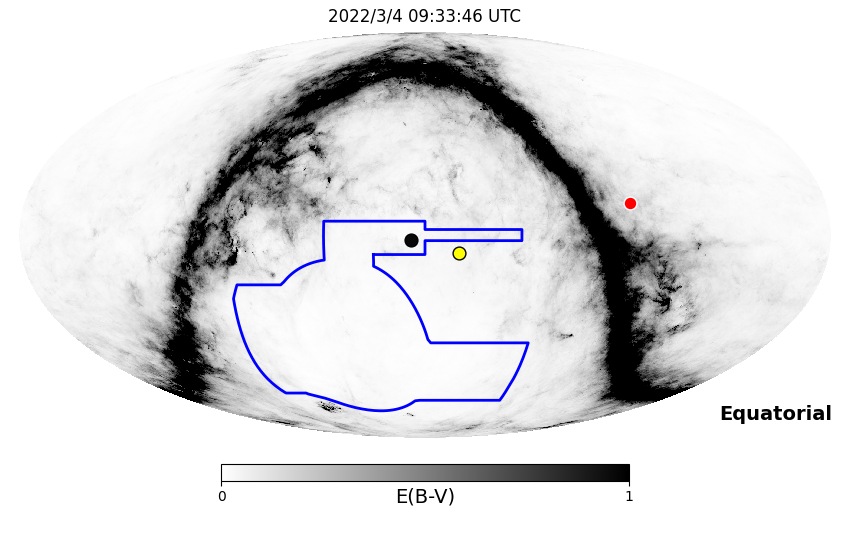
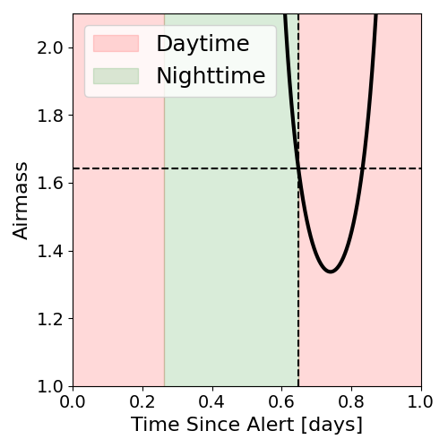
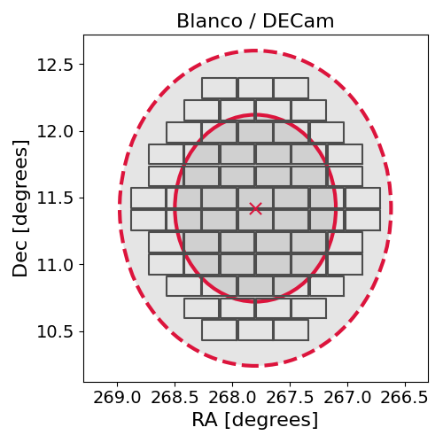
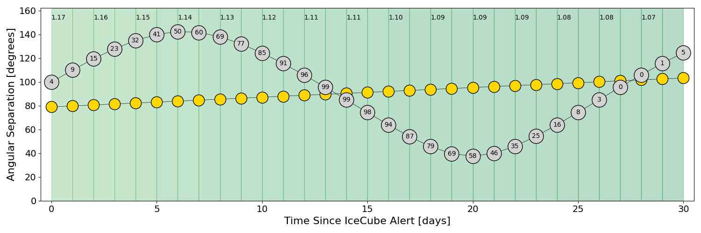
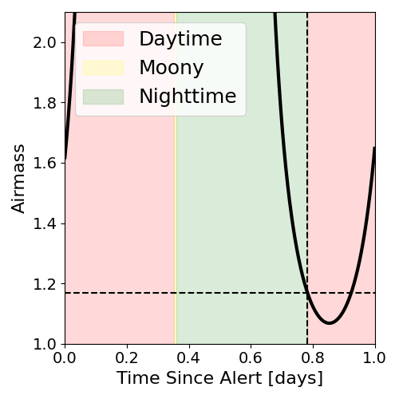
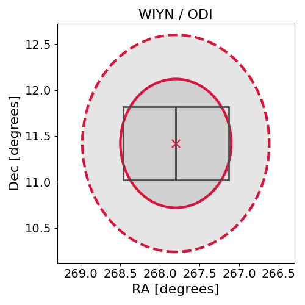

# IC220303A (136385_7450363)

### IceCube Data

| Rev | Type | Time (UTC) | Energy (TeV) | Signalness | FAR (#/yr) | 90% Area (sq. deg.) |
| --- | --- | --- | --- | --- | --- | --- |
| 1 | GOLD | 03/03/2022  18:00:07 | 398.110 | 0.764 | 0.540800 | 4.37 |

<a href="https://gcn.gsfc.nasa.gov/gcn/notices_amon_g_b/136385_7450363.amon" target="_blank">Link to IceCube Alert Details</a>

<a href="https://rmorgan10.github.io/AlertMonitoring/IC220303A_1/CTIO_skymap.png" target="_blank">
  
</a>


## CTIO Report

**Observations Start at**  `2022/03/04 04:33:46`  **Madison Time**

<a href="https://github.com/rmorgan10/AlertMonitoring/blob/main/IC220303A_1/CTIO.json" target="_blank">Link to Observing Scripts

### Alert Diagnostics

```Event
  Event ID = IC220303A
  (ra, dec) = (267.8000, 11.4199)
Date
  Now = 2022/3/3 20:57:17 (UTC)
  Search time = 2022/3/3 18:00:08 (UTC)
  Optimal time = 2022/3/4 09:33:46 (UTC)
  Airmass at optimal time = 1.64
Sun
  Angular separation = 78.88 (deg)
  Next rising = 2022/3/4 10:35:55 (UTC)
  Next setting = 2022/3/3 23:14:28 (UTC)
Moon
  Illumination = 0.03
  Angular separation = 98.36 (deg)
  Next rising = 2022/3/4 12:22:00 (UTC)
  Next setting = 2022/3/4 00:10:18 (UTC)
  Next new moon = 2022/4/1 06:24:21 (UTC)
  Next full moon = 2022/3/18 07:17:31 (UTC)
Galactic
  (l, b) = (36.5642, 18.4782)
  E(B-V) = 0.13
```
### Observability Plots

<a href="https://rmorgan10.github.io/AlertMonitoring/IC220303A_1/CTIO_forecast.png" target="_blank">
  
</a>

<a href="https://rmorgan10.github.io/AlertMonitoring/IC220303A_1/CTIO_airmass.png" target="_blank">
  
</a>
<a href="https://rmorgan10.github.io/AlertMonitoring/IC220303A_1/CTIO_fov.png" target="_blank">
  
</a>


## KPNO Report

**Observations Start at**  `2022/03/04 07:47:45`  **Madison Time**

<a href="https://github.com/rmorgan10/AlertMonitoring/blob/main/IC220303A_1/KPNO.json" target="_blank">Link to Observing Scripts

### Alert Diagnostics

```Event
  Event ID = IC220303A
  (ra, dec) = (267.8000, 11.4199)
Date
  Now = 2022/3/3 20:57:17 (UTC)
  Search time = 2022/3/3 18:00:08 (UTC)
  Optimal time = 2022/3/4 12:47:46 (UTC)
  Airmass at optimal time = 1.17
Sun
  Angular separation = 78.99 (deg)
  Next rising = 2022/3/4 13:49:40 (UTC)
  Next setting = 2022/3/4 01:26:04 (UTC)
Moon
  Illumination = 0.04
  Angular separation = 99.77 (deg)
  Next rising = 2022/3/4 15:13:03 (UTC)
  Next setting = 2022/3/4 02:40:30 (UTC)
  Next new moon = 2022/4/1 06:24:21 (UTC)
  Next full moon = 2022/3/18 07:17:31 (UTC)
Galactic
  (l, b) = (36.5642, 18.4782)
  E(B-V) = 0.13
```
### Observability Plots

<a href="https://rmorgan10.github.io/AlertMonitoring/IC220303A_1/KPNO_forecast.png" target="_blank">
  
</a>

<a href="https://rmorgan10.github.io/AlertMonitoring/IC220303A_1/KPNO_airmass.png" target="_blank">
  
</a>
<a href="https://rmorgan10.github.io/AlertMonitoring/IC220303A_1/KPNO_fov.png" target="_blank">
  
</a>

