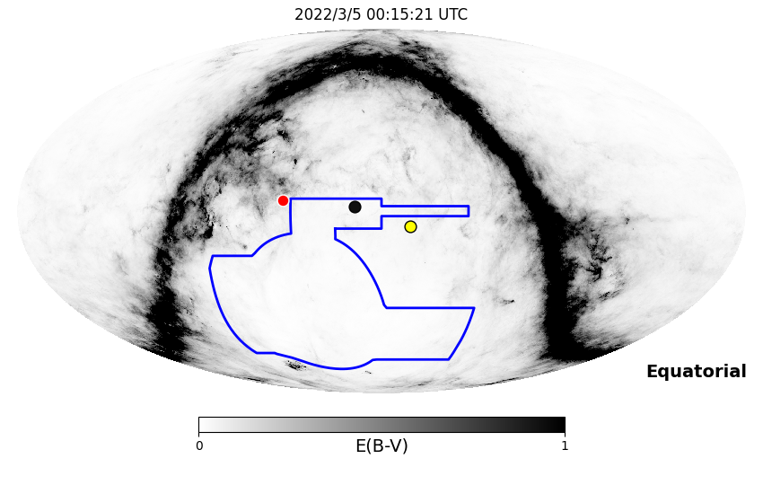
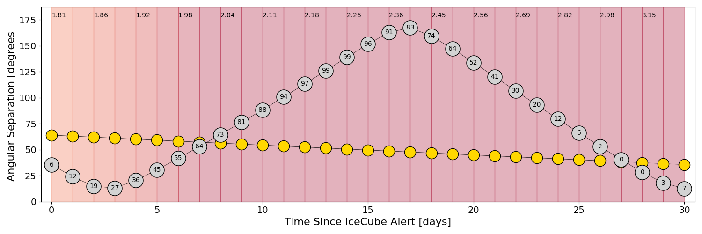
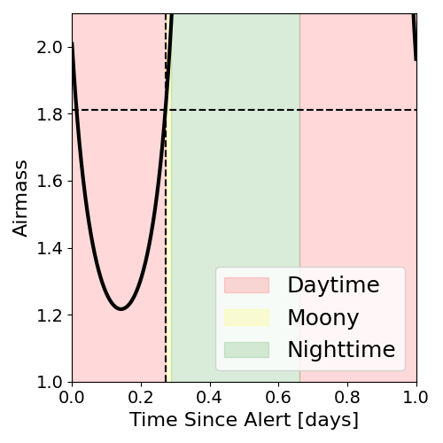
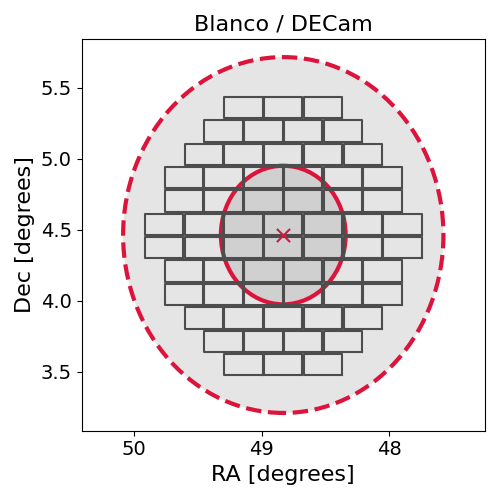
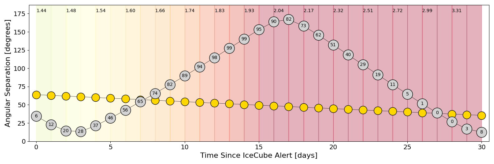
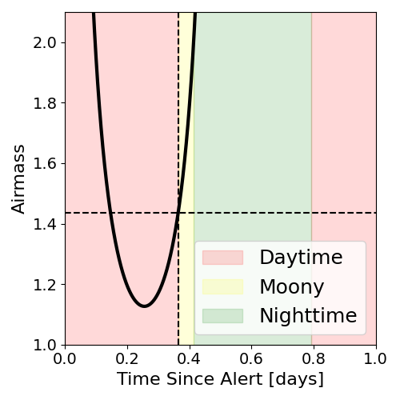
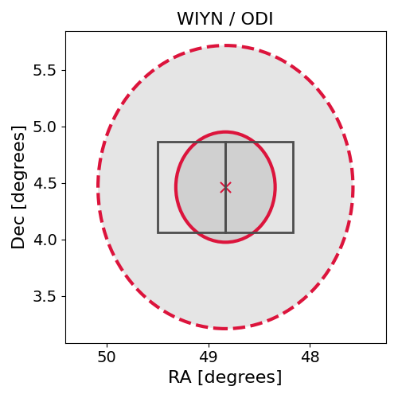

# IC220304A (136388_4701751)

### IceCube Data

| Rev | Type | Time (UTC) | Energy (TeV) | Signalness | FAR (#/yr) | 90% Area (sq. deg.) |
| --- | --- | --- | --- | --- | --- | --- |
| 0 | GOLD | 03/04/2022  17:44:12 | 263.210 | 0.631 | 0.578000 | 4.93 |

<a href="https://gcn.gsfc.nasa.gov/gcn/notices_amon_g_b/136388_4701751.amon" target="_blank">Link to IceCube Alert Details</a>

<a href="https://rmorgan10.github.io/AlertMonitoring/IC220304A_0/CTIO_skymap.png" target="_blank">
  
</a>


## CTIO Report

**Observations Start at**  `2022/03/04 19:15:20`  **Madison Time**

<a href="https://github.com/rmorgan10/AlertMonitoring/blob/main/IC220304A_0/CTIO.json" target="_blank">Link to Observing Scripts

### Alert Diagnostics

```Event
  Event ID = IC220304A
  (ra, dec) = (48.8300, 4.4643)
Date
  Now = 2022/3/4 17:57:30 (UTC)
  Search time = 2022/3/4 17:44:12 (UTC)
  Optimal time = 2022/3/5 00:15:21 (UTC)
  Airmass at optimal time = 1.81
Sun
  Angular separation = 63.99 (deg)
  Next rising = 2022/3/5 10:36:37 (UTC)
  Next setting = 2022/3/4 23:13:20 (UTC)
Moon
  Illumination = 0.06
  Angular separation = 35.61 (deg)
  Next rising = 2022/3/5 13:21:01 (UTC)
  Next setting = 2022/3/5 00:40:49 (UTC)
  Next new moon = 2022/4/1 06:24:21 (UTC)
  Next full moon = 2022/3/18 07:17:31 (UTC)
Galactic
  (l, b) = (176.1874, -43.0477)
  E(B-V) = 0.02
```
### Observability Plots

<a href="https://rmorgan10.github.io/AlertMonitoring/IC220304A_0/CTIO_forecast.png" target="_blank">
  
</a>

<a href="https://rmorgan10.github.io/AlertMonitoring/IC220304A_0/CTIO_airmass.png" target="_blank">
  
</a>
<a href="https://rmorgan10.github.io/AlertMonitoring/IC220304A_0/CTIO_fov.png" target="_blank">
  
</a>


## KPNO Report

**Observations Start at**  `2022/03/04 21:28:50`  **Madison Time**

<a href="https://github.com/rmorgan10/AlertMonitoring/blob/main/IC220304A_0/KPNO.json" target="_blank">Link to Observing Scripts

### Alert Diagnostics

```Event
  Event ID = IC220304A
  (ra, dec) = (48.8300, 4.4643)
Date
  Now = 2022/3/4 17:57:30 (UTC)
  Search time = 2022/3/4 17:44:12 (UTC)
  Optimal time = 2022/3/5 02:28:51 (UTC)
  Airmass at optimal time = 1.44
Sun
  Angular separation = 63.90 (deg)
  Next rising = 2022/3/5 13:48:28 (UTC)
  Next setting = 2022/3/5 01:26:49 (UTC)
Moon
  Illumination = 0.07
  Angular separation = 34.48 (deg)
  Next rising = 2022/3/5 15:41:58 (UTC)
  Next setting = 2022/3/5 03:41:22 (UTC)
  Next new moon = 2022/4/1 06:24:21 (UTC)
  Next full moon = 2022/3/18 07:17:31 (UTC)
Galactic
  (l, b) = (176.1874, -43.0477)
  E(B-V) = 0.02
```
### Observability Plots

<a href="https://rmorgan10.github.io/AlertMonitoring/IC220304A_0/KPNO_forecast.png" target="_blank">
  
</a>

<a href="https://rmorgan10.github.io/AlertMonitoring/IC220304A_0/KPNO_airmass.png" target="_blank">
  
</a>
<a href="https://rmorgan10.github.io/AlertMonitoring/IC220304A_0/KPNO_fov.png" target="_blank">
  
</a>

