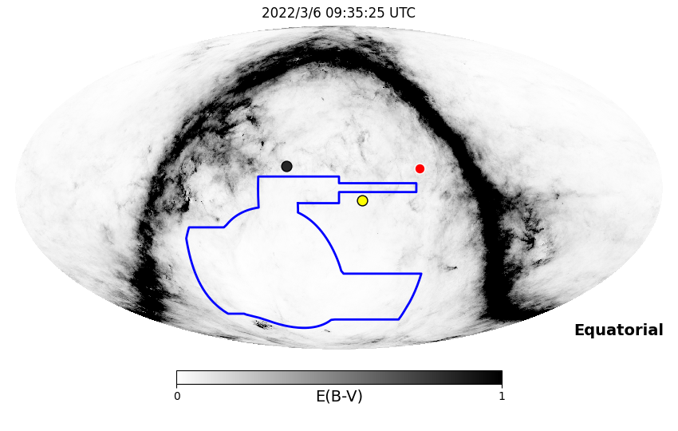
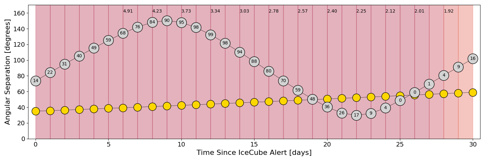
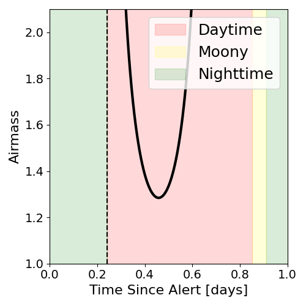
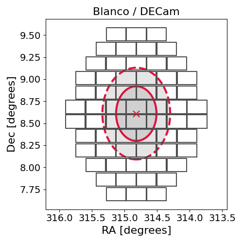
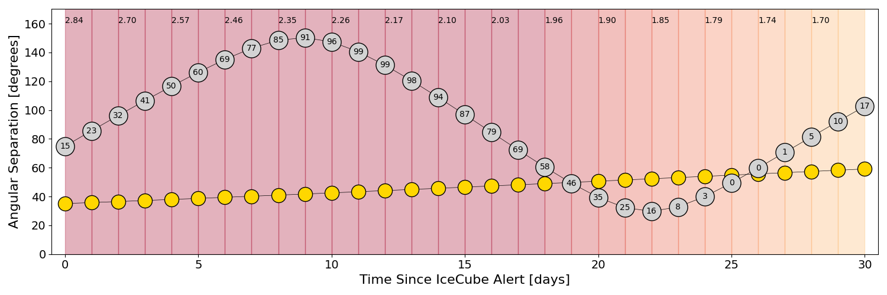
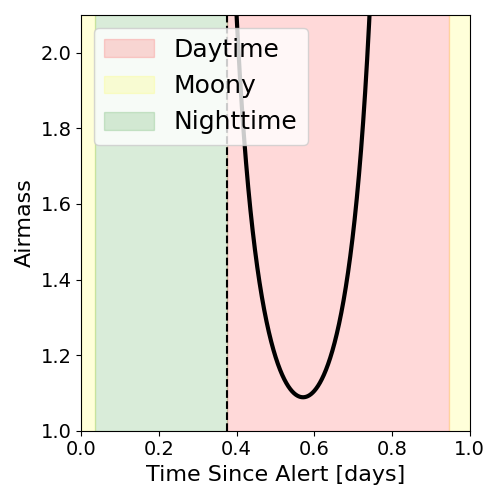
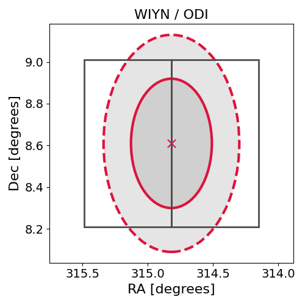

# IC220306A (136392_25495567)

### IceCube Data

| Rev | Type | Time (UTC) | Energy (TeV) | Signalness | FAR (#/yr) | 90% Area (sq. deg.) |
| --- | --- | --- | --- | --- | --- | --- |
| 1 | GOLD | 03/06/2022  03:46:37 | 413.050 | 0.774 | 0.453900 | 0.85 |

<a href="https://gcn.gsfc.nasa.gov/gcn/notices_amon_g_b/136392_25495567.amon" target="_blank">Link to IceCube Alert Details</a>

<a href="https://rmorgan10.github.io/AlertMonitoring/IC220306A_1/CTIO_skymap.png" target="_blank">
  
</a>


## CTIO Report

**Observations Start at**  `2022/03/06 04:35:25`  **Madison Time**

<a href="https://github.com/rmorgan10/AlertMonitoring/blob/main/IC220306A_1/CTIO.json" target="_blank">Link to Observing Scripts

### Alert Diagnostics

```Event
  Event ID = IC220306A
  (ra, dec) = (314.8199, 8.6099)
Date
  Now = 2022/3/6 05:22:17 (UTC)
  Search time = 2022/3/6 03:46:37 (UTC)
  Optimal time = 2022/3/6 09:35:25 (UTC)
  Airmass at optimal time = 9.75
Sun
  Angular separation = 35.02 (deg)
  Next rising = 2022/3/6 10:37:18 (UTC)
  Next setting = 2022/3/6 23:11:03 (UTC)
Moon
  Illumination = 0.15
  Angular separation = 73.51 (deg)
  Next rising = 2022/3/6 14:18:54 (UTC)
  Next setting = 2022/3/7 01:41:31 (UTC)
  Next new moon = 2022/4/1 06:24:21 (UTC)
  Next full moon = 2022/3/18 07:17:31 (UTC)
Galactic
  (l, b) = (56.8408, -23.4237)
  E(B-V) = 0.08
```
### Observability Plots

<a href="https://rmorgan10.github.io/AlertMonitoring/IC220306A_1/CTIO_forecast.png" target="_blank">
  
</a>

<a href="https://rmorgan10.github.io/AlertMonitoring/IC220306A_1/CTIO_airmass.png" target="_blank">
  
</a>
<a href="https://rmorgan10.github.io/AlertMonitoring/IC220306A_1/CTIO_fov.png" target="_blank">
  
</a>


## KPNO Report

**Observations Start at**  `2022/03/06 07:45:22`  **Madison Time**

<a href="https://github.com/rmorgan10/AlertMonitoring/blob/main/IC220306A_1/KPNO.json" target="_blank">Link to Observing Scripts

### Alert Diagnostics

```Event
  Event ID = IC220306A
  (ra, dec) = (314.8199, 8.6099)
Date
  Now = 2022/3/6 05:22:17 (UTC)
  Search time = 2022/3/6 03:46:37 (UTC)
  Optimal time = 2022/3/6 12:45:23 (UTC)
  Airmass at optimal time = 2.84
Sun
  Angular separation = 35.11 (deg)
  Next rising = 2022/3/6 13:47:16 (UTC)
  Next setting = 2022/3/7 01:28:19 (UTC)
Moon
  Illumination = 0.16
  Angular separation = 74.94 (deg)
  Next rising = 2022/3/6 16:11:12 (UTC)
  Next setting = 2022/3/6 04:40:43 (UTC)
  Next new moon = 2022/4/1 06:24:21 (UTC)
  Next full moon = 2022/3/18 07:17:31 (UTC)
Galactic
  (l, b) = (56.8408, -23.4237)
  E(B-V) = 0.08
```
### Observability Plots

<a href="https://rmorgan10.github.io/AlertMonitoring/IC220306A_1/KPNO_forecast.png" target="_blank">
  
</a>

<a href="https://rmorgan10.github.io/AlertMonitoring/IC220306A_1/KPNO_airmass.png" target="_blank">
  
</a>
<a href="https://rmorgan10.github.io/AlertMonitoring/IC220306A_1/KPNO_fov.png" target="_blank">
  
</a>

