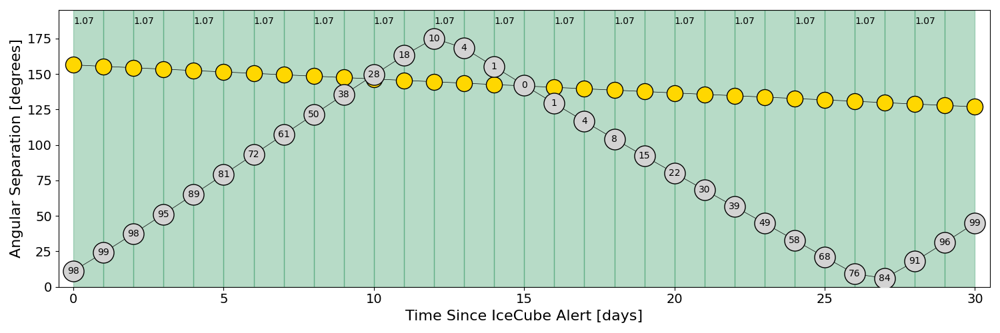

# IC220317A (136441_11435033)

### IceCube Data

| Rev | Type | Time (UTC) | Energy (TeV) | Signalness | FAR (#/yr) | 90% Area (sq. deg.) |
| --- | --- | --- | --- | --- | --- | --- |
| 0 | BRONZE | 03/17/2022  02:32:17 | 132.620 | 0.365 | 1.899300 | 1.60 |

<a href="https://gcn.gsfc.nasa.gov/gcn/notices_amon_g_b/136441_11435033.amon" target="_blank">Link to IceCube Alert Details</a>

<a href="https://rmorgan10.github.io/AlertMonitoring/IC220317A_0/CTIO_skymap.png" target="_blank">
  
</a>


## CTIO Report

**Observations Start at**  `2022/03/16 22:27:18`  **Madison Time**

<a href="https://github.com/rmorgan10/AlertMonitoring/blob/main/IC220317A_0/CTIO.json" target="_blank">Link to Observing Scripts

### Alert Diagnostics

```Event
  Event ID = IC220317A
  (ra, dec) = (155.4038, 11.3143)
Date
  Now = 2022/3/17 02:42:16 (UTC)
  Search time = 2022/3/17 02:32:18 (UTC)
  Optimal time = 2022/3/17 03:27:18 (UTC)
  Airmass at optimal time = 1.33
Sun
  Angular separation = 156.56 (deg)
  Next rising = 2022/3/17 10:44:32 (UTC)
  Next setting = 2022/3/17 22:58:01 (UTC)
Moon
  Illumination = 0.98
  Angular separation = 9.86 (deg)
  Next rising = 2022/3/17 22:59:03 (UTC)
  Next setting = 2022/3/17 09:54:35 (UTC)
  Next new moon = 2022/4/1 06:24:21 (UTC)
  Next full moon = 2022/3/18 07:17:31 (UTC)
Galactic
  (l, b) = (229.7571, 51.4646)
  E(B-V) = 0.07
```
### Observability Plots

<a href="https://rmorgan10.github.io/AlertMonitoring/IC220317A_0/CTIO_forecast.png" target="_blank">
  
</a>

<a href="https://rmorgan10.github.io/AlertMonitoring/IC220317A_0/CTIO_airmass.png" target="_blank">
  
</a>
<a href="https://rmorgan10.github.io/AlertMonitoring/IC220317A_0/CTIO_fov.png" target="_blank">
  
</a>


## KPNO Report

**Observations Start at**  `2022/03/17 01:10:02`  **Madison Time**

<a href="https://github.com/rmorgan10/AlertMonitoring/blob/main/IC220317A_0/KPNO.json" target="_blank">Link to Observing Scripts

### Alert Diagnostics

```Event
  Event ID = IC220317A
  (ra, dec) = (155.4038, 11.3143)
Date
  Now = 2022/3/17 02:42:16 (UTC)
  Search time = 2022/3/17 02:32:18 (UTC)
  Optimal time = 2022/3/17 06:10:03 (UTC)
  Airmass at optimal time = 1.07
Sun
  Angular separation = 156.44 (deg)
  Next rising = 2022/3/17 13:33:34 (UTC)
  Next setting = 2022/3/18 01:36:12 (UTC)
Moon
  Illumination = 0.99
  Angular separation = 11.24 (deg)
  Next rising = 2022/3/18 01:14:35 (UTC)
  Next setting = 2022/3/17 13:30:53 (UTC)
  Next new moon = 2022/4/1 06:24:21 (UTC)
  Next full moon = 2022/3/18 07:17:31 (UTC)
Galactic
  (l, b) = (229.7571, 51.4646)
  E(B-V) = 0.07
```
### Observability Plots

<a href="https://rmorgan10.github.io/AlertMonitoring/IC220317A_0/KPNO_forecast.png" target="_blank">
  
</a>

<a href="https://rmorgan10.github.io/AlertMonitoring/IC220317A_0/KPNO_airmass.png" target="_blank">
  
</a>
<a href="https://rmorgan10.github.io/AlertMonitoring/IC220317A_0/KPNO_fov.png" target="_blank">
  
</a>

