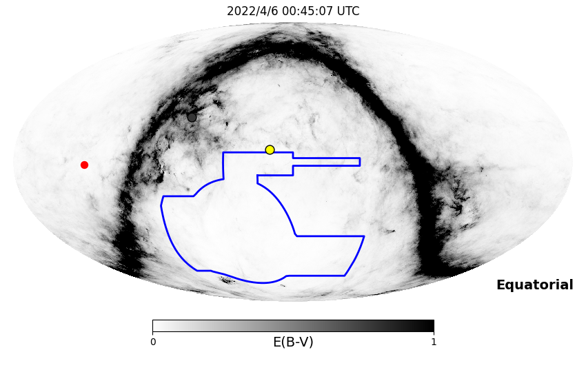
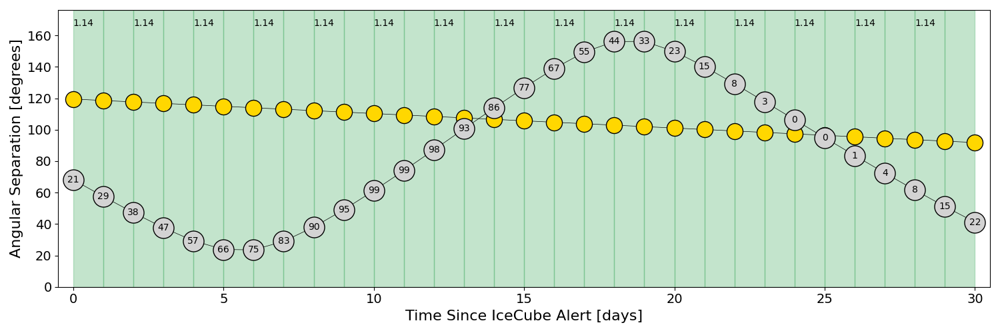
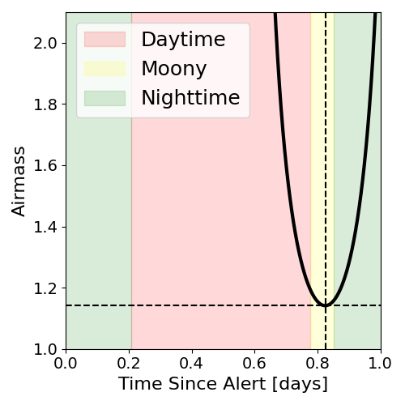
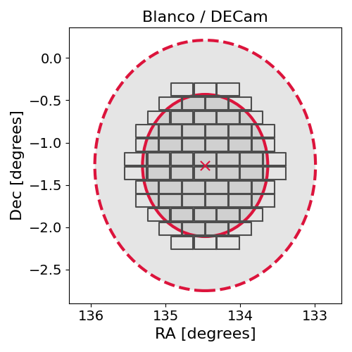
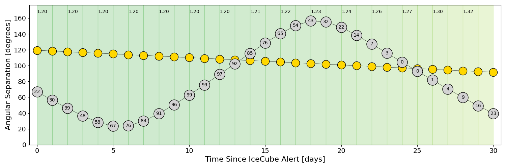
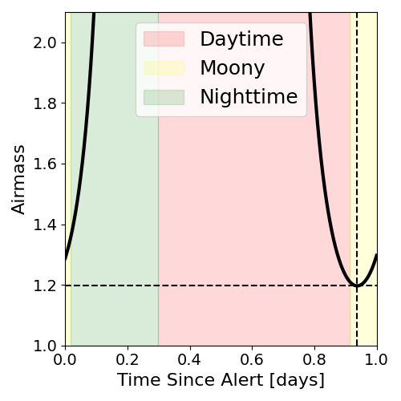
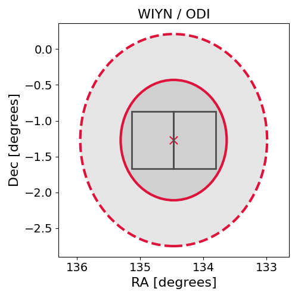

# IC220405A (136504_1833389)

### IceCube Data

| Rev | Type | Time (UTC) | Energy (TeV) | Signalness | FAR (#/yr) | 90% Area (sq. deg.) |
| --- | --- | --- | --- | --- | --- | --- |
| 1 | BRONZE | 04/05/2022  04:57:26 | 121.810 | 0.323 | 3.283200 | 6.88 |

<a href="https://gcn.gsfc.nasa.gov/gcn/notices_amon_g_b/136504_1833389.amon" target="_blank">Link to IceCube Alert Details</a>

<a href="https://rmorgan10.github.io/AlertMonitoring/IC220405A_1/CTIO_skymap.png" target="_blank">
  
</a>


## CTIO Report

**Observations Start at**  `2022/04/05 19:45:07`  **Madison Time**

<a href="https://github.com/rmorgan10/AlertMonitoring/blob/main/IC220405A_1/CTIO.json" target="_blank">Link to Observing Scripts

### Alert Diagnostics

```Event
  Event ID = IC220405A
  (ra, dec) = (134.4699, -1.2700)
Date
  Now = 2022/4/5 09:07:12 (UTC)
  Search time = 2022/4/5 04:57:26 (UTC)
  Optimal time = 2022/4/6 00:45:07 (UTC)
  Airmass at optimal time = 1.14
Sun
  Angular separation = 119.49 (deg)
  Next rising = 2022/4/5 10:56:12 (UTC)
  Next setting = 2022/4/5 22:35:07 (UTC)
Moon
  Illumination = 0.21
  Angular separation = 68.19 (deg)
  Next rising = 2022/4/5 14:58:59 (UTC)
  Next setting = 2022/4/6 01:23:57 (UTC)
  Next new moon = 2022/4/30 20:28:02 (UTC)
  Next full moon = 2022/4/16 18:54:59 (UTC)
Galactic
  (l, b) = (229.8310, 27.1459)
  E(B-V) = 0.17
```
### Observability Plots

<a href="https://rmorgan10.github.io/AlertMonitoring/IC220405A_1/CTIO_forecast.png" target="_blank">
  
</a>

<a href="https://rmorgan10.github.io/AlertMonitoring/IC220405A_1/CTIO_airmass.png" target="_blank">
  
</a>
<a href="https://rmorgan10.github.io/AlertMonitoring/IC220405A_1/CTIO_fov.png" target="_blank">
  
</a>


## KPNO Report

**Observations Start at**  `2022/04/05 22:27:42`  **Madison Time**

<a href="https://github.com/rmorgan10/AlertMonitoring/blob/main/IC220405A_1/KPNO.json" target="_blank">Link to Observing Scripts

### Alert Diagnostics

```Event
  Event ID = IC220405A
  (ra, dec) = (134.4699, -1.2700)
Date
  Now = 2022/4/5 09:07:12 (UTC)
  Search time = 2022/4/5 04:57:26 (UTC)
  Optimal time = 2022/4/6 03:27:43 (UTC)
  Airmass at optimal time = 1.20
Sun
  Angular separation = 119.39 (deg)
  Next rising = 2022/4/5 13:09:21 (UTC)
  Next setting = 2022/4/6 01:49:10 (UTC)
Moon
  Illumination = 0.22
  Angular separation = 66.96 (deg)
  Next rising = 2022/4/5 15:48:00 (UTC)
  Next setting = 2022/4/5 05:23:26 (UTC)
  Next new moon = 2022/4/30 20:28:02 (UTC)
  Next full moon = 2022/4/16 18:54:59 (UTC)
Galactic
  (l, b) = (229.8310, 27.1459)
  E(B-V) = 0.17
```
### Observability Plots

<a href="https://rmorgan10.github.io/AlertMonitoring/IC220405A_1/KPNO_forecast.png" target="_blank">
  
</a>

<a href="https://rmorgan10.github.io/AlertMonitoring/IC220405A_1/KPNO_airmass.png" target="_blank">
  
</a>
<a href="https://rmorgan10.github.io/AlertMonitoring/IC220405A_1/KPNO_fov.png" target="_blank">
  
</a>

