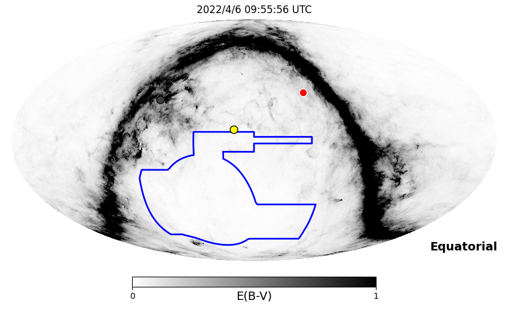
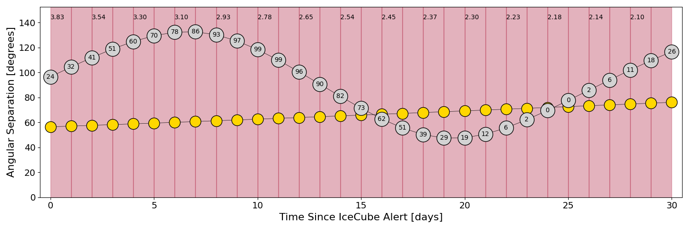
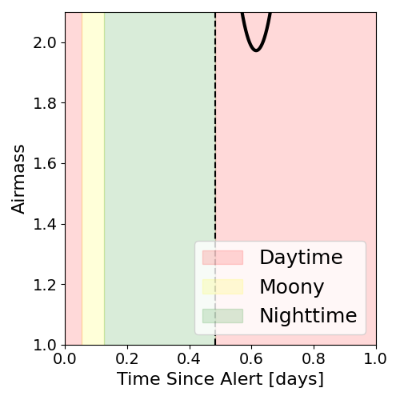
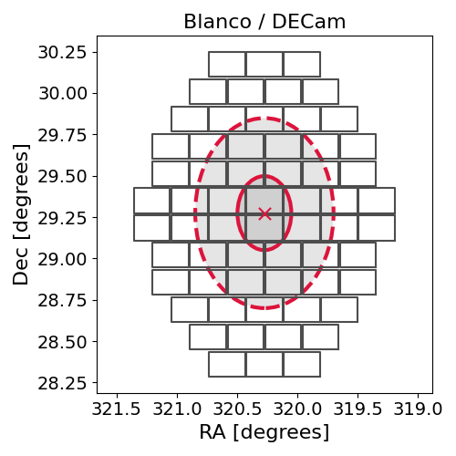
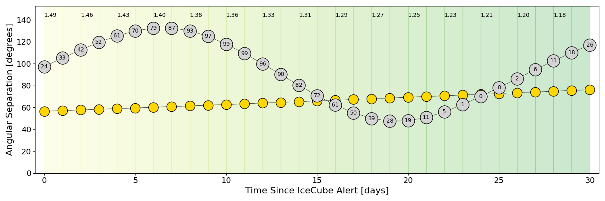
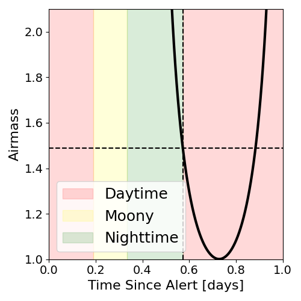
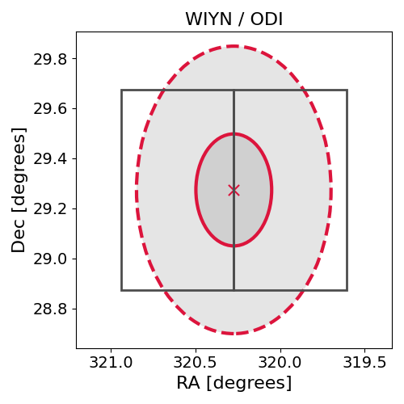

# IC220405B (136506_15341152)

### IceCube Data

| Rev | Type | Time (UTC) | Energy (TeV) | Signalness | FAR (#/yr) | 90% Area (sq. deg.) |
| --- | --- | --- | --- | --- | --- | --- |
| 0 | BRONZE | 04/05/2022  22:20:03 | 106.320 | 0.364 | 2.016000 | 1.04 |

<a href="https://gcn.gsfc.nasa.gov/gcn/notices_amon_g_b/136506_15341152.amon" target="_blank">Link to IceCube Alert Details</a>

<a href="https://rmorgan10.github.io/AlertMonitoring/IC220405B_0/CTIO_skymap.png" target="_blank">
  
</a>


## CTIO Report

**Observations Start at**  `2022/04/06 04:55:56`  **Madison Time**

<a href="https://github.com/rmorgan10/AlertMonitoring/blob/main/IC220405B_0/CTIO.json" target="_blank">Link to Observing Scripts

### Alert Diagnostics

```Event
  Event ID = IC220405B
  (ra, dec) = (320.2731, 29.2739)
Date
  Now = 2022/4/5 22:32:13 (UTC)
  Search time = 2022/4/5 22:20:03 (UTC)
  Optimal time = 2022/4/6 09:55:56 (UTC)
  Airmass at optimal time = 3.83
Sun
  Angular separation = 56.46 (deg)
  Next rising = 2022/4/6 10:56:48 (UTC)
  Next setting = 2022/4/5 22:35:07 (UTC)
Moon
  Illumination = 0.24
  Angular separation = 96.56 (deg)
  Next rising = 2022/4/6 15:55:44 (UTC)
  Next setting = 2022/4/6 01:23:57 (UTC)
  Next new moon = 2022/4/30 20:28:02 (UTC)
  Next full moon = 2022/4/16 18:54:59 (UTC)
Galactic
  (l, b) = (77.2633, -14.4007)
  E(B-V) = 0.10
```
### Observability Plots

<a href="https://rmorgan10.github.io/AlertMonitoring/IC220405B_0/CTIO_forecast.png" target="_blank">
  
</a>

<a href="https://rmorgan10.github.io/AlertMonitoring/IC220405B_0/CTIO_airmass.png" target="_blank">
  
</a>
<a href="https://rmorgan10.github.io/AlertMonitoring/IC220405B_0/CTIO_fov.png" target="_blank">
  
</a>


## KPNO Report

**Observations Start at**  `2022/04/06 07:04:40`  **Madison Time**

<a href="https://github.com/rmorgan10/AlertMonitoring/blob/main/IC220405B_0/KPNO.json" target="_blank">Link to Observing Scripts

### Alert Diagnostics

```Event
  Event ID = IC220405B
  (ra, dec) = (320.2731, 29.2739)
Date
  Now = 2022/4/5 22:32:13 (UTC)
  Search time = 2022/4/5 22:20:03 (UTC)
  Optimal time = 2022/4/6 12:04:41 (UTC)
  Airmass at optimal time = 1.49
Sun
  Angular separation = 56.51 (deg)
  Next rising = 2022/4/6 13:08:06 (UTC)
  Next setting = 2022/4/6 01:49:10 (UTC)
Moon
  Illumination = 0.25
  Angular separation = 97.28 (deg)
  Next rising = 2022/4/6 16:28:18 (UTC)
  Next setting = 2022/4/6 06:21:24 (UTC)
  Next new moon = 2022/4/30 20:28:02 (UTC)
  Next full moon = 2022/4/16 18:54:59 (UTC)
Galactic
  (l, b) = (77.2633, -14.4007)
  E(B-V) = 0.10
```
### Observability Plots

<a href="https://rmorgan10.github.io/AlertMonitoring/IC220405B_0/KPNO_forecast.png" target="_blank">
  
</a>

<a href="https://rmorgan10.github.io/AlertMonitoring/IC220405B_0/KPNO_airmass.png" target="_blank">
  
</a>
<a href="https://rmorgan10.github.io/AlertMonitoring/IC220405B_0/KPNO_fov.png" target="_blank">
  
</a>

