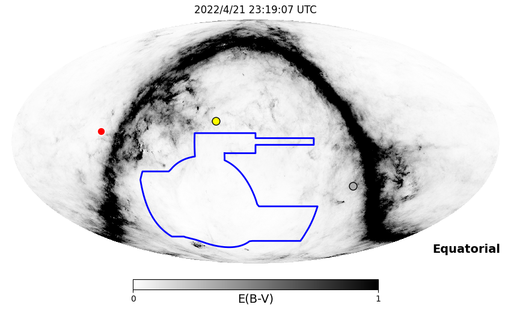
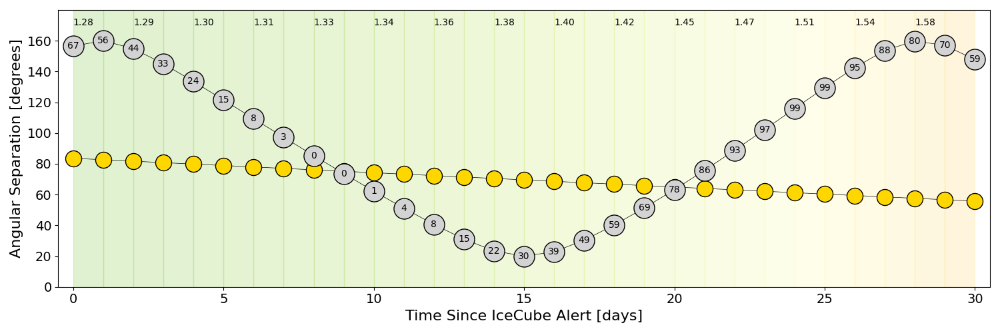
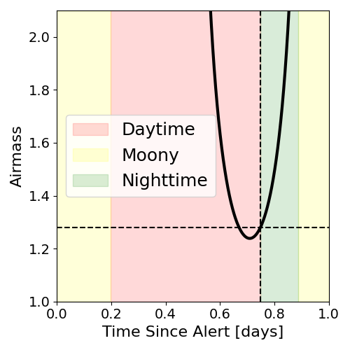
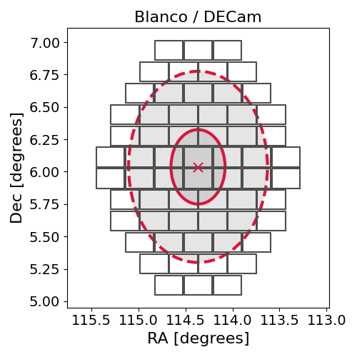
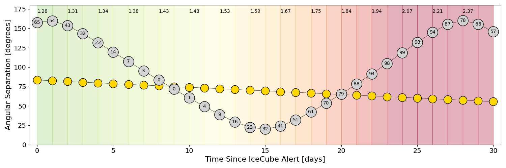
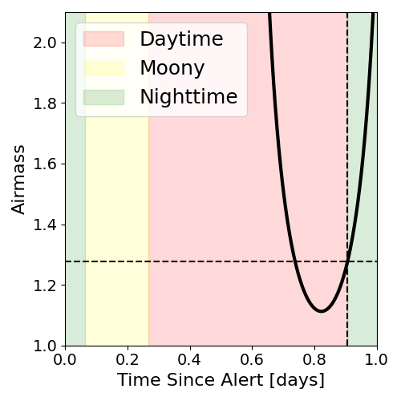
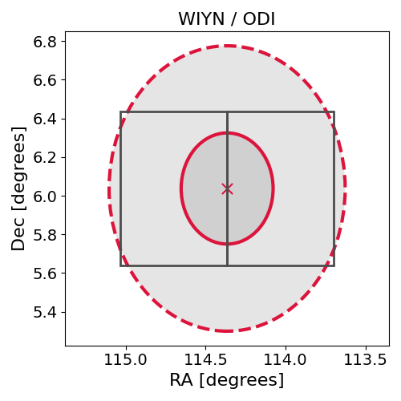

# IC220421A (136556_43687362)

### IceCube Data

| Rev | Type | Time (UTC) | Energy (TeV) | Signalness | FAR (#/yr) | 90% Area (sq. deg.) |
| --- | --- | --- | --- | --- | --- | --- |
| 0 | BRONZE | 04/21/2022  05:20:18 | 155.060 | 0.375 | 2.280900 | 1.71 |

<a href="https://gcn.gsfc.nasa.gov/gcn/notices_amon_g_b/136556_43687362.amon" target="_blank">Link to IceCube Alert Details</a>

<a href="https://rmorgan10.github.io/AlertMonitoring/IC220421A_0/CTIO_skymap.png" target="_blank">
  
</a>


## CTIO Report

**Observations Start at**  `2022/04/21 18:19:06`  **Madison Time**

<a href="https://github.com/rmorgan10/AlertMonitoring/blob/main/IC220421A_0/CTIO.json" target="_blank">Link to Observing Scripts

### Alert Diagnostics

```Event
  Event ID = IC220421A
  (ra, dec) = (114.3655, 6.0374)
Date
  Now = 2022/4/21 05:32:16 (UTC)
  Search time = 2022/4/21 05:20:18 (UTC)
  Optimal time = 2022/4/21 23:19:07 (UTC)
  Airmass at optimal time = 1.28
Sun
  Angular separation = 83.58 (deg)
  Next rising = 2022/4/21 11:05:59 (UTC)
  Next setting = 2022/4/21 22:17:26 (UTC)
Moon
  Illumination = 0.67
  Angular separation = 156.54 (deg)
  Next rising = 2022/4/22 02:35:54 (UTC)
  Next setting = 2022/4/21 16:26:19 (UTC)
  Next new moon = 2022/4/30 20:28:02 (UTC)
  Next full moon = 2022/5/16 04:14:05 (UTC)
Galactic
  (l, b) = (212.7464, 12.9736)
  E(B-V) = 1.00
```
### Observability Plots

<a href="https://rmorgan10.github.io/AlertMonitoring/IC220421A_0/CTIO_forecast.png" target="_blank">
  
</a>

<a href="https://rmorgan10.github.io/AlertMonitoring/IC220421A_0/CTIO_airmass.png" target="_blank">
  
</a>
<a href="https://rmorgan10.github.io/AlertMonitoring/IC220421A_0/CTIO_fov.png" target="_blank">
  
</a>


## KPNO Report

**Observations Start at**  `2022/04/21 22:05:56`  **Madison Time**

<a href="https://github.com/rmorgan10/AlertMonitoring/blob/main/IC220421A_0/KPNO.json" target="_blank">Link to Observing Scripts

### Alert Diagnostics

```Event
  Event ID = IC220421A
  (ra, dec) = (114.3655, 6.0374)
Date
  Now = 2022/4/21 05:32:16 (UTC)
  Search time = 2022/4/21 05:20:18 (UTC)
  Optimal time = 2022/4/22 03:05:56 (UTC)
  Airmass at optimal time = 1.28
Sun
  Angular separation = 83.43 (deg)
  Next rising = 2022/4/21 12:50:25 (UTC)
  Next setting = 2022/4/22 02:00:09 (UTC)
Moon
  Illumination = 0.66
  Angular separation = 157.62 (deg)
  Next rising = 2022/4/21 06:50:58 (UTC)
  Next setting = 2022/4/21 16:47:44 (UTC)
  Next new moon = 2022/4/30 20:28:02 (UTC)
  Next full moon = 2022/5/16 04:14:05 (UTC)
Galactic
  (l, b) = (212.7464, 12.9736)
  E(B-V) = 1.00
```
### Observability Plots

<a href="https://rmorgan10.github.io/AlertMonitoring/IC220421A_0/KPNO_forecast.png" target="_blank">
  
</a>

<a href="https://rmorgan10.github.io/AlertMonitoring/IC220421A_0/KPNO_airmass.png" target="_blank">
  
</a>
<a href="https://rmorgan10.github.io/AlertMonitoring/IC220421A_0/KPNO_fov.png" target="_blank">
  
</a>

