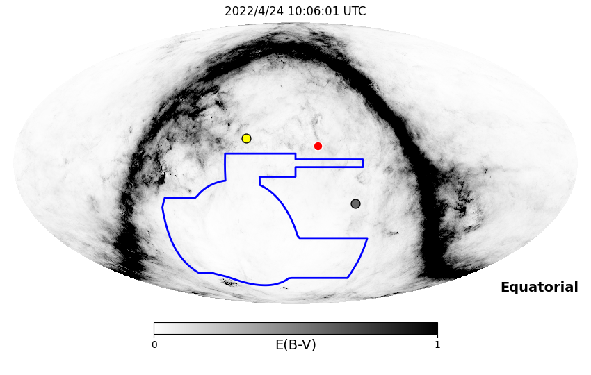
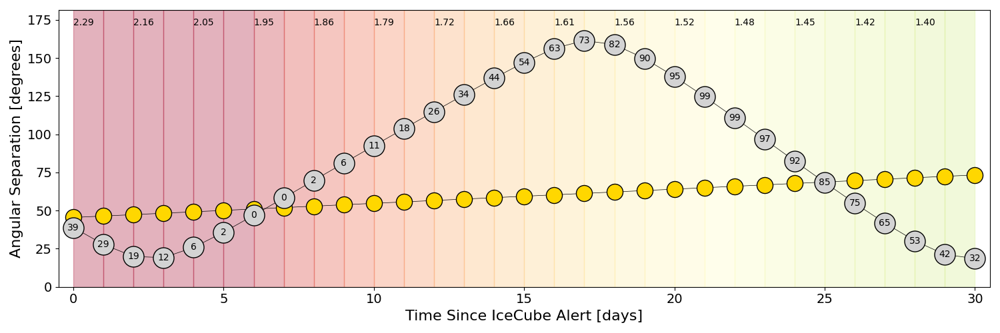
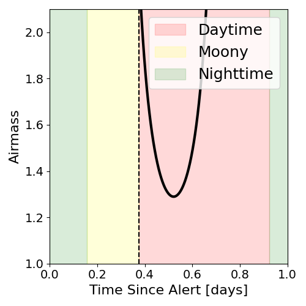
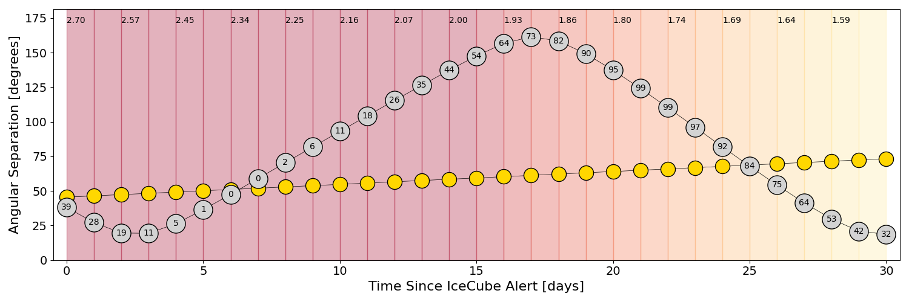
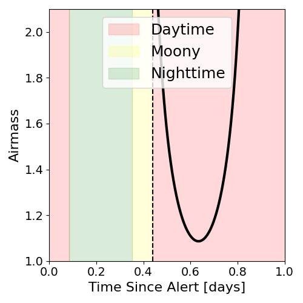
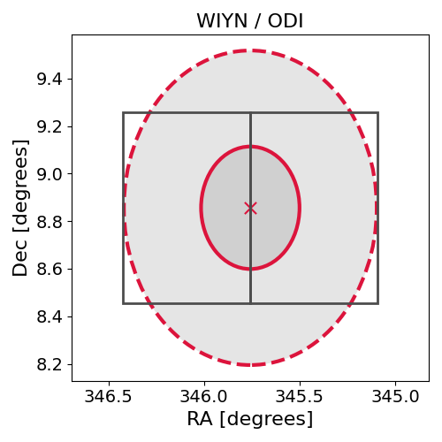

# IC220424A (136565_2186969)

### IceCube Data

| Rev | Type | Time (UTC) | Energy (TeV) | Signalness | FAR (#/yr) | 90% Area (sq. deg.) |
| --- | --- | --- | --- | --- | --- | --- |
| 0 | GOLD | 04/24/2022  01:06:24 | 183.990 | 0.497 | 1.205300 | 1.37 |

<a href="https://gcn.gsfc.nasa.gov/gcn/notices_amon_g_b/136565_2186969.amon" target="_blank">Link to IceCube Alert Details</a>

<a href="https://rmorgan10.github.io/AlertMonitoring/IC220424A_0/CTIO_skymap.png" target="_blank">
  
</a>


## CTIO Report

**Observations Start at**  `2022/04/24 05:06:01`  **Madison Time**

<a href="https://github.com/rmorgan10/AlertMonitoring/blob/main/IC220424A_0/CTIO.json" target="_blank">Link to Observing Scripts

### Alert Diagnostics

```Event
  Event ID = IC220424A
  (ra, dec) = (345.7573, 8.8562)
Date
  Now = 2022/4/24 01:17:17 (UTC)
  Search time = 2022/4/24 01:06:24 (UTC)
  Optimal time = 2022/4/24 10:06:01 (UTC)
  Airmass at optimal time = 2.29
Sun
  Angular separation = 45.49 (deg)
  Next rising = 2022/4/24 11:07:51 (UTC)
  Next setting = 2022/4/24 22:14:27 (UTC)
Moon
  Illumination = 0.40
  Angular separation = 38.91 (deg)
  Next rising = 2022/4/24 04:49:47 (UTC)
  Next setting = 2022/4/24 19:00:45 (UTC)
  Next new moon = 2022/4/30 20:28:02 (UTC)
  Next full moon = 2022/5/16 04:14:05 (UTC)
Galactic
  (l, b) = (83.0174, -45.4482)
  E(B-V) = 0.01
```
### Observability Plots

<a href="https://rmorgan10.github.io/AlertMonitoring/IC220424A_0/CTIO_forecast.png" target="_blank">
  
</a>

<a href="https://rmorgan10.github.io/AlertMonitoring/IC220424A_0/CTIO_airmass.png" target="_blank">
  
</a>
<a href="https://rmorgan10.github.io/AlertMonitoring/IC220424A_0/CTIO_fov.png" target="_blank">
  
</a>


## KPNO Report

**Observations Start at**  `2022/04/24 06:41:04`  **Madison Time**

<a href="https://github.com/rmorgan10/AlertMonitoring/blob/main/IC220424A_0/KPNO.json" target="_blank">Link to Observing Scripts

### Alert Diagnostics

```Event
  Event ID = IC220424A
  (ra, dec) = (345.7573, 8.8562)
Date
  Now = 2022/4/24 01:17:17 (UTC)
  Search time = 2022/4/24 01:06:24 (UTC)
  Optimal time = 2022/4/24 11:41:04 (UTC)
  Airmass at optimal time = 2.70
Sun
  Angular separation = 45.55 (deg)
  Next rising = 2022/4/24 12:47:11 (UTC)
  Next setting = 2022/4/24 02:01:33 (UTC)
Moon
  Illumination = 0.39
  Angular separation = 38.13 (deg)
  Next rising = 2022/4/24 09:32:49 (UTC)
  Next setting = 2022/4/24 20:09:05 (UTC)
  Next new moon = 2022/4/30 20:28:02 (UTC)
  Next full moon = 2022/5/16 04:14:05 (UTC)
Galactic
  (l, b) = (83.0174, -45.4482)
  E(B-V) = 0.01
```
### Observability Plots

<a href="https://rmorgan10.github.io/AlertMonitoring/IC220424A_0/KPNO_forecast.png" target="_blank">
  
</a>

<a href="https://rmorgan10.github.io/AlertMonitoring/IC220424A_0/KPNO_airmass.png" target="_blank">
  
</a>
<a href="https://rmorgan10.github.io/AlertMonitoring/IC220424A_0/KPNO_fov.png" target="_blank">
  
</a>

